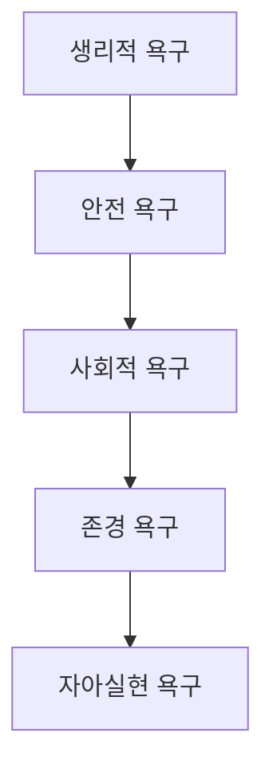

# 매슬로우의 욕구 단계 이론: 인간의 욕구 피라미드

<!-- mtoc-start -->

- [정의 및 소개](#정의-및-소개)
- [매슬로우의 욕구 단계 (생안사존자)](#매슬로우의-욕구-단계-생안사존자)
- [매슬로우 욕구 이론의 특징](#매슬로우-욕구-이론의-특징)
- [매슬로우 이론의 기대 효과](#매슬로우-이론의-기대-효과)
- [매슬로우 욕구 단계](#매슬로우-욕구-단계)
- [마무리](#마무리)
- [키워드](#키워드)

<!-- mtoc-end -->

매슬로우의 욕구 단계 이론(Maslow Hierarchy)은 인간의 욕구가 단계적으로 발전한다는 개념을 제시한 심리학 이론입니다. 이 이론은 기본적인 생리적 욕구에서부터 자아실현에 이르기까지 총 다섯 가지 욕구 단계를 설명합니다. 각 단계는 인간의 성장과 발전을 위해 중요한 역할을 하며, 낮은 단계의 욕구가 충족될 때 비로소 다음 단계의 욕구가 충족되고자 하는 동기가 형성됩니다.

## 정의 및 소개

매슬로우의 욕구 단계 이론은 인간의 다양한 욕구가 계층 구조를 이루고 있으며, 이러한 욕구들이 단계적으로 충족된다는 가설. 이 이론에 따르면, 인간은 생리적 욕구가 충족된 후에야 안전, 사회적 관계, 존경, 자아실현의 욕구를 추구하게 됩니다.

- **목적**: 인간의 욕구가 어떻게 발전하고 충족되는지 설명
- **특징**: 생리적, 심리적 욕구가 단계적으로 충족되어야 상위 단계의 욕구가 발생

## 매슬로우의 욕구 단계 (생안사존자)

1. **신체적 요인 (생리적 욕구, 안전 욕구)**

   - **생리적 욕구**: 인간의 가장 기본적인 생존 욕구로, 음식, 물, 수면 등 신체적 필요를 충족해야 함
   - **안전 욕구**: 신체적 안전과 안정성, 보호를 추구하며, 위험이나 불안정한 상황을 피하려는 욕구

2. **심리적 요인 (사회적 욕구, 존경 욕구, 자아실현 욕구)**
   - **사회적 욕구**: 친구, 가족, 연인 등과의 관계를 통해 소속감과 사랑을 느끼고자 하는 욕구
   - **존경 욕구**: 타인으로부터의 인정과 존경, 자존감을 통해 자신을 가치 있게 여기려는 욕구
   - **자아실현 욕구**: 자신의 잠재력을 최대한 발휘하고, 창의적이고 의미 있는 삶을 추구하려는 욕구

## 매슬로우 욕구 이론의 특징

- **계층 구조**: 인간의 욕구는 단계적으로 충족되며, 낮은 단계의 욕구가 만족되어야만 상위 단계의 욕구를 충족하고자 함
- **동기 부여**: 각 단계의 욕구는 인간의 행동을 동기화하는 중요한 요소로 작용하며, 특히 상위 단계로 갈수록 더 높은 수준의 동기와 성장 추구를 반영

## 매슬로우 이론의 기대 효과

- **인간 행동 이해**: 인간의 행동을 이해하고 예측하는 데 유용한 틀 제공
- **조직 관리 활용**: 기업 환경에서 직원의 동기를 부여하고, 각 개인의 욕구 충족을 통해 조직의 목표 달성에 기여

## 매슬로우 욕구 단계

- 생리적 욕구부터 자아실현 욕구에 이르는 계층 구조를 통해 인간의 욕구가 어떻게 발전하는지를 설명.

## 마무리

매슬로우의 욕구 단계 이론은 인간의 욕구가 단계적으로 발전하며, 각 단계가 충족되어야만 상위 단계의 욕구를 추구할 수 있다는 점을 강조합니다. 이 이론은 개인의 성장과 동기 부여를 이해하는 데 중요한 틀을 제공하며, 조직 관리나 심리 상담 등 다양한 분야에서 활용될 수 있습니다. 이를 통해 인간의 행동을 더 깊이 이해하고, 보다 효과적인 동기 부여 전략을 수립할 수 있습니다.

## 키워드

매슬로우, Maslow-Hierarchy, 욕구 단계, 생리적 욕구, 안전 욕구, 사회적 욕구, 존경 욕구, 자아실현, 인간 행동, 심리학, 동기 부여