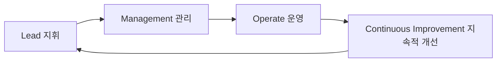

# Cyclone Model: RTE 구축을 위한 지속적 개선 프레임워크

<!-- mtoc-start -->

- [정의 및 소개](#정의-및-소개)
- [Cyclone Model 10가지 사이클 (역전 대구조반 구비자서)](#cyclone-model-10가지-사이클-역전-대구조반-구비자서)
- [Cyclone Model의 기대 효과](#cyclone-model의-기대-효과)
- [구성도](#구성도)
- [마무리](#마무리)
- [키워드](#키워드)

<!-- mtoc-end -->

Cyclone Model은 가트너(Gartner)가 제안한 실시간 기업(RTE, Real-Time Enterprise) 구축을 지원하는 프레임워크로, End-to-End 프로세스 관점에서 조직의 지휘, 관리, 운영 측면의 10가지 사이클을 지속적이고 반복적으로 개선하는 데 중점을 둡니다. 이 모델은 기업이 변화하는 시장 환경에서 민첩하게 대응할 수 있도록 지원하며, 조직의 성과를 극대화하기 위한 수평적(Horizontal) 접근 방식을 제공합니다.

## 정의 및 소개

Cyclone Model은 조직의 RTE 구축을 위해 지휘(Lead), 관리(Management), 운영(Operate)의 세 가지 측면에서 10개의 주요 사이클을 지속적으로 개선하는 프레임워크. 이를 통해 기업은 변화에 대응하고, 조직의 역량을 강화하며, 운영의 효율성을 극대화할 수 있습니다.

- **목적**: RTE 구축을 지원하기 위해 조직의 주요 사이클을 지속적으로 개선
- **특징**: End-to-End 프로세스를 기반으로 한 수평적 접근, 지속적 개선을 통한 성과 극대화

## Cyclone Model 10가지 사이클 (역전 대구조반 구비자서)

1. **지휘(Lead) 사이클(역전)**

   - **역량 (Capability)**: 조직의 핵심 역량을 강화하고 이를 기반으로 한 전략적 지휘
   - **전략 (Strategy)**: 조직의 목표와 비전을 설정하고, 이를 달성하기 위한 전략 수립

2. **관리(Management) 사이클(대구조반)**

   - **대응 (Response)**: 시장 변화에 대한 신속한 대응을 위한 계획 수립 및 실행
   - **구체화 (Formulation)**: 전략을 구체화하여 실행 가능한 계획으로 전환
   - **조직화 (Organization)**: 목표 달성을 위한 자원 및 인력의 조직화
   - **반응 (Reaction)**: 환경 변화에 맞춘 신속한 반응을 통해 문제 해결

3. **운영(Operate) 사이클(구비자서)**
   - **구매 (Procurement)**: 필요한 자원의 구매 및 조달 관리
   - **비용 처리 (Cost Handling)**: 운영 과정에서 발생하는 비용의 효율적 관리
   - **자원 요구 (Resource Request)**: 필요한 자원의 요구와 배분 관리
   - **서비스 (Service)**: 고객에게 제공되는 서비스의 품질 관리

## Cyclone Model의 기대 효과

- **지속적 개선**: 조직의 모든 프로세스를 지속적으로 개선하여 변화하는 시장 환경에 유연하게 대응
- **조직 역량 강화**: 각 사이클의 반복적 개선을 통해 조직의 역량을 강화하고, RTE 구축을 지원
- **효율적 자원 활용**: 자원의 구매, 배분, 비용 관리 등을 통해 효율적인 운영 관리 달성

## 구성도

- 지휘, 관리, 운영 사이클이 연속적으로 이어져 조직의 성과를 지속적으로 개선하는 구조.

## 마무리

Cyclone Model은 RTE 구축을 위한 체계적인 프레임워크로, 조직의 지휘, 관리, 운영 측면에서 지속적 개선을 추구합니다. 이를 통해 기업은 변화하는 시장 환경에 신속하게 대응하고, 성과를 극대화할 수 있는 역량을 갖추게 됩니다. 지속적인 사이클 개선은 조직의 경쟁력을 높이고, 안정적인 운영을 유지하는 데 중요한 역할을 합니다.

## 키워드

Cyclone Model, RTE, 실시간 기업, 가트너, End-to-End 프로세스, 지휘, 관리, 운영, 지속적 개선, 경영 프레임워크