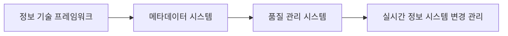

# EAMS (Enterprise Architect Management System): 실시간 정보 시스템 관리 체계

<!-- mtoc-start -->

- [정의 및 소개](#정의-및-소개)
- [EAMS의 주요 기능](#eams의-주요-기능)
- [EAMS의 기대 효과](#eams의-기대-효과)
- [구성도](#구성도)
- [마무리](#마무리)
- [키워드](#키워드)

<!-- mtoc-end -->

EAMS(Enterprise Architect Management System)는 기업의 정보 시스템 변경 내역과 구성 체계를 실시간으로 조회하고 변경할 수 있는 시스템으로, 정보 기술 프레임워크 수립, 메타데이터 시스템, 품질 관리 시스템 등 다양한 주변 시스템과 연계하여 운영됩니다. 이를 통해 기업은 정보 시스템의 효율적인 관리와 변경 사항의 추적을 통해 지속적인 품질 관리를 실현할 수 있습니다.

## 정의 및 소개

EAMS는 정보 기술 프레임워크 수립과 함께 메타데이터 시스템 및 품질 관리 시스템과의 연계를 통해 정보 시스템을 관리하는 체계. 이 시스템은 정보 시스템의 변경 내역을 실시간으로 조회하고 관리할 수 있으며, 이를 통해 기업의 정보 자산을 효과적으로 관리하고, 변화하는 비즈니스 환경에 신속하게 대응할 수 있습니다.

- **목적**: 정보 시스템의 변경 내역을 실시간으로 관리하고 구성 체계를 체계적으로 유지
- **특징**: 다양한 주변 시스템과의 연계를 통해 정보 시스템의 일관성 및 품질을 유지

## EAMS의 주요 기능

1. **정보 기술 프레임워크 수립**

   - 기업의 정보 시스템을 위한 기술적 프레임워크를 수립하여 일관된 기준 제공

2. **실시간 정보 시스템 변경 관리**

   - 정보 시스템의 변경 내역을 실시간으로 조회하고 관리하여 시스템의 신뢰성 보장

3. **메타데이터 시스템 연계**

   - 정보 시스템의 데이터를 효율적으로 관리하기 위해 메타데이터 시스템과 연계하여 데이터의 의미와 관계를 체계적으로 유지

4. **품질 관리 시스템 연계**
   - 품질 관리 시스템과 연계하여 정보 시스템의 변경과 관리가 품질 향상에 기여하도록 지원

## EAMS의 기대 효과

- **실시간 정보 조회**: 정보 시스템의 구성과 변경 사항을 실시간으로 조회할 수 있어 신속한 의사 결정 가능
- **효율적 변경 관리**: 변경 내역을 체계적으로 관리함으로써 시스템의 신뢰성을 유지하고 품질 향상 실현
- **통합적 관리 체계**: 정보 기술 프레임워크, 메타데이터 시스템, 품질 관리 시스템 등과의 연계를 통해 정보 시스템을 통합적으로 관리

## 구성도

- 정보 기술 프레임워크, 메타데이터 시스템, 품질 관리 시스템이 연계되어 정보 시스템 변경 관리를 지원.
- 각 구성 요소는 실시간 변경 관리와 품질 향상을 위해 유기적으로 연계되어 운영.

## 마무리

EAMS는 정보 시스템의 변경 내역을 실시간으로 관리하고 구성 체계를 유지하는 데 필수적인 시스템입니다. 정보 기술 프레임워크, 메타데이터 시스템, 품질 관리 시스템 등과의 연계를 통해 정보 시스템을 체계적으로 관리하며, 이를 통해 기업은 변화하는 비즈니스 환경에서도 신뢰성 있는 정보 시스템을 유지하고 운영의 효율성을 극대화할 수 있습니다.

## 키워드

EAMS, 정보 시스템 관리, 실시간 변경 관리, 정보 기술 프레임워크, 메타데이터 시스템, 품질 관리 시스템, 정보 시스템 구성, 엔터프라이즈 아키텍처