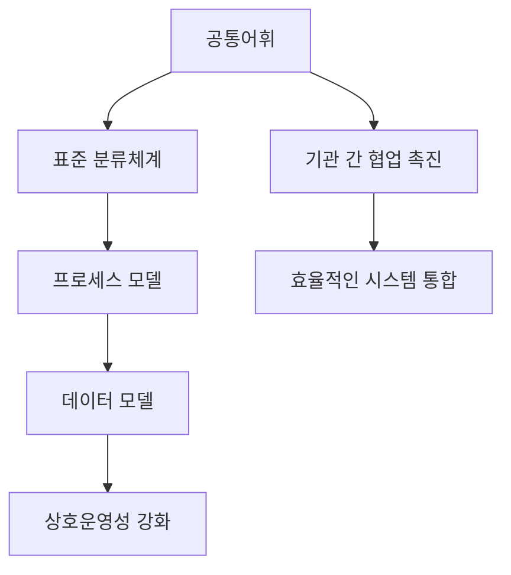

# EA 참조모델: 기관 간 협업과 상호운영을 위한 메타모델

<!-- mtoc-start -->

- [정의 및 소개](#정의-및-소개)
- [EA 참조모델의 목적](#ea-참조모델의-목적)
- [EA 참조모델의 주요 구성 요소](#ea-참조모델의-주요-구성-요소)
  - [1. 공통어휘](#1-공통어휘)
  - [2. 표준 분류체계](#2-표준-분류체계)
  - [3. 프로세스 모델](#3-프로세스-모델)
  - [4. 데이터 모델](#4-데이터-모델)
- [EA 참조모델 구성도](#ea-참조모델-구성도)
- [EA 참조모델의 기대 효과](#ea-참조모델의-기대-효과)
- [마무리](#마무리)
- [Keywords](#keywords)

<!-- mtoc-end -->

EA(Enterprise Architecture) 참조모델은 기관 간 협업과 상호운영을 촉진하기 위해 아키텍처의 공통어휘와 표준 분류체계를 제시하는 메타모델입니다. 이 참조모델은 조직 간의 원활한 의사소통과 효율적인 시스템 통합을 위해 필요한 공통의 언어와 체계를 제공함으로써, 다양한 기관들이 상호 운영성을 높이고 협업할 수 있도록 돕습니다.

## 정의 및 소개

EA 참조모델은 기관들이 협업하고 상호운영할 수 있도록 공통의 언어와 표준 체계를 제시하는 메타모델. 이를 통해 각 기관은 공통된 구조와 프로세스를 활용하여 효율적으로 아키텍처를 설계하고 관리할 수 있으며, 상호 간의 원활한 의사소통과 데이터 통합을 가능하게 합니다.

- **특징**: 공통어휘 제공, 표준화된 분류체계, 상호운영성 강화
- **필요성**: 기관 간 협업 촉진, 의사소통 효율성 향상, 시스템 통합 지원
- **목적**: 데이터 공유 촉진, 아키텍처 일관성 유지, 중복 개발 방지

## EA 참조모델의 목적

- **공통어휘 제공**: 기관 간 아키텍처 활동에서 사용하는 용어와 개념을 통일하여 의사소통을 원활하게 함
- **표준 분류체계 확립**: 각기 다른 기관들이 공통으로 활용할 수 있는 표준화된 분류체계를 제공하여 상호운영성을 강화
- **기관 간 협업 촉진**: 통일된 참조모델을 기반으로 기관 간 데이터 및 프로세스의 상호 이해와 협업을 촉진
- **시스템 통합 지원**: 표준화된 모델을 통해 다양한 시스템 간의 통합을 원활하게 하고 중복 개발을 방지

## EA 참조모델의 주요 구성 요소

### 1. 공통어휘

- **정의**: 아키텍처 내에서 사용되는 주요 용어들을 정의하여 기관 간 공통된 의미를 부여
- **활용 목적**: 용어의 혼란을 방지하고, 기관 간 일관된 의사소통을 지원

### 2. 표준 분류체계

- **기능적 분류**: 다양한 비즈니스 기능들을 체계적으로 분류하여 각 기관의 역할과 책임을 명확히 정의
- **데이터 분류**: 데이터를 구조화하고 체계적으로 분류하여 상호운영성을 지원
- **기술적 분류**: 기술 표준과 도구들을 분류하여 시스템 통합과 기술 선택의 일관성을 유지

### 3. 프로세스 모델

- **프로세스 정의**: 기관 간 공유되는 비즈니스 프로세스를 정의하고, 상호작용 방식을 명확히 함
- **프로세스 통합**: 다양한 기관 간의 프로세스를 통합하여 효율성을 높이고, 중복을 최소화

### 4. 데이터 모델

- **데이터 표준화**: 기관 간 데이터의 정의와 구조를 표준화하여 데이터의 상호운영성을 높임
- **데이터 공유**: 표준화된 데이터 모델을 통해 기관 간 원활한 데이터 공유를 지원

## EA 참조모델 구성도

- 공통어휘, 표준 분류체계, 프로세스 모델, 데이터 모델 간의 상호작용, 상호운영성 강화, 기관 간 협업 촉진

## EA 참조모델의 기대 효과

- **효율적인 협업**: 공통어휘와 표준 분류체계를 통해 기관 간 협업이 원활해지고, 의사소통 오류가 감소
- **상호운영성 강화**: 표준화된 데이터와 프로세스를 통해 다양한 시스템 간의 상호운영성이 강화됨
- **중복 개발 방지**: 기관 간 통일된 참조모델을 활용하여 시스템의 중복 개발을 방지하고 자원을 절감
- **의사결정 지원**: 표준화된 모델을 바탕으로 각 기관의 의사결정을 지원하고, 전체적인 전략 정렬을 돕음

## 마무리

EA 참조모델은 기관 간 협업과 상호운영성을 높이기 위한 필수적인 도구입니다. 공통의 어휘와 표준 분류체계를 제공함으로써, 기관 간 원활한 의사소통과 시스템 통합을 가능하게 하고, 변화하는 환경에 적응하는 데 중요한 역할을 합니다. 이를 통해 조직은 더욱 효율적으로 협업하고, 중복된 노력을 줄여 자원을 최적화할 수 있습니다.

## Keywords

EA Reference Model, Common Vocabulary, Standard Classification System, Interoperability, Organizational Collaboration, 프로세스 모델, 데이터 모델, 시스템 통합, 메타모델, 아키텍처 표준화