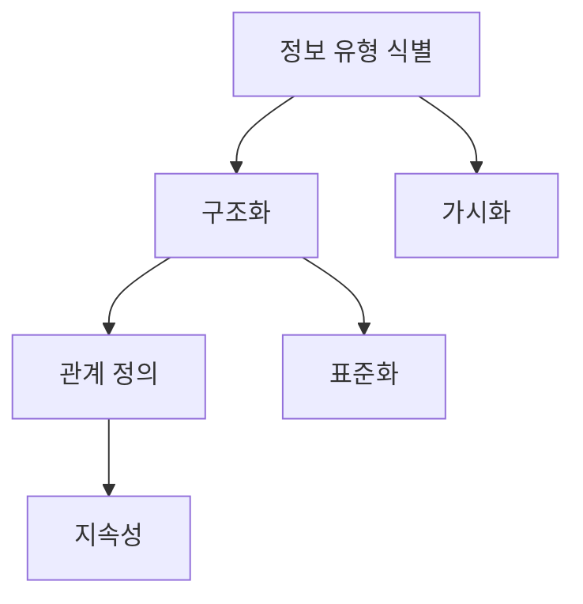

# EA 프레임워크: 전사 아키텍처 활동을 위한 전체적인 틀

<!-- mtoc-start -->

- [정의 및 소개](#정의-및-소개)
- [EA 프레임워크의 필요성](#ea-프레임워크의-필요성)
- [EA 프레임워크의 주요 구성 요소](#ea-프레임워크의-주요-구성-요소)
  - [1. 정보 유형 식별](#1-정보-유형-식별)
  - [2. 구조화](#2-구조화)
  - [3. 관계 정의](#3-관계-정의)
- [EA 프레임워크의 구성도](#ea-프레임워크의-구성도)
- [EA 프레임워크의 기대 효과](#ea-프레임워크의-기대-효과)
- [마무리](#마무리)
- [Keywords](#keywords)

<!-- mtoc-end -->

EA(Enterprise Architecture) 프레임워크는 전사 아키텍처를 기술하는 데 필요한 정보의 유형을 식별하고, 이들 정보 유형을 논리적으로 구조화하며, 정보 유형 간의 관계를 기술한 것입니다. 이는 전사 아키텍처 활동에서 얻어지는 산출물을 분류하고 조직화하며 유지 관리하기 위한 전체적인 틀로써, 조직이 아키텍처 활동을 체계적으로 수행하고 관리할 수 있도록 돕습니다.

## 정의 및 소개

EA 프레임워크는 조직의 전사 아키텍처 활동을 체계화하고 정보의 유형을 정리하는 전체적인 틀. 이를 통해 각종 산출물을 효율적으로 분류하고 유지 관리할 수 있으며, 아키텍처 정보의 논리적인 구조와 관계를 명확히 함으로써 전사 아키텍처 활동의 일관성을 높입니다.

- **특징**: 정보 유형 식별, 구조화, 관계 정의
- **필요성**: 가시화, 표준화, 지속성
- **목적**: 산출물 관리, 아키텍처 일관성 확보, 조직화된 정보 제공

## EA 프레임워크의 필요성

- **가시화**: 아키텍처 활동에서 생성되는 정보를 명확히 시각화하여 이해하기 쉽게 함
- **표준화**: 다양한 아키텍처 산출물을 표준화하여 정보 간의 일관성을 유지하고, 효율적인 의사소통을 지원
- **지속성**: 아키텍처 정보의 지속적인 유지 관리를 통해 전사 아키텍처 활동의 일관성을 보장하고 발전시킴

## EA 프레임워크의 주요 구성 요소

### 1. 정보 유형 식별

- **정의**: 전사 아키텍처에서 다루어야 할 주요 정보 유형들을 식별하고 정리
- **활용 목적**: 산출물의 명확한 정의와 관리를 통해 정보의 혼란을 방지하고 일관성을 유지

### 2. 구조화

- **논리적 구조**: 정보 유형들을 논리적으로 구조화하여 각 요소 간의 관계를 명확히 함
- **효율성**: 논리적 구조화를 통해 정보의 활용성과 관리 효율성을 높임

### 3. 관계 정의

- **정보 간 관계 기술**: 식별된 정보 유형 간의 관계를 명확히 정의하여 정보 흐름과 상호작용을 설명
- **통합성 강화**: 정보 간의 관계 정의를 통해 아키텍처 활동의 통합성과 일관성을 높임

## EA 프레임워크의 구성도

- 정보 유형 식별, 구조화, 관계 정의 간의 상호작용, 가시화 및 표준화, 지속성 유지

## EA 프레임워크의 기대 효과

- **산출물 관리 용이**: 전사 아키텍처 활동에서 생성되는 다양한 산출물을 체계적으로 관리하고, 정보의 혼란 감소
- **아키텍처 일관성 확보**: 정보 유형 간의 논리적 구조와 관계를 명확히 함으로써 아키텍처의 일관성 유지
- **조직화된 정보 제공**: 체계적으로 조직화된 정보를 통해 의사결정을 지원하고, 전사적 차원의 전략 수립 지원

## 마무리

EA 프레임워크는 전사 아키텍처 활동에서 생성되는 정보를 체계적으로 관리하고, 산출물을 조직화하여 아키텍처 활동의 일관성을 보장하는 중요한 도구입니다. 이를 통해 조직은 변화하는 비즈니스 환경에 유연하게 대응하고, 지속적인 아키텍처 발전을 이룰 수 있습니다.

## Keywords

EA Framework, Information Structuring, Standardization, Sustainability, Enterprise Architecture, 산출물 관리, 정보 유형, 가시화, 논리적 구조, 관계 정의