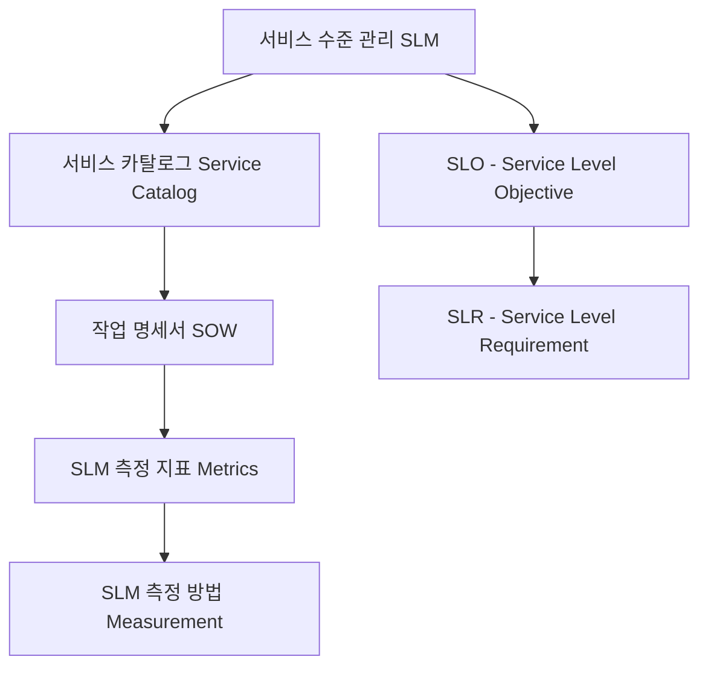

# SLA (Service Level Agreement): IT 서비스 수준 고객 협약서

<!-- mtoc-start -->

- [정의 및 소개](#정의-및-소개)
- [SLA의 주요 구성 요소](#sla의-주요-구성-요소)
  - [1. 서비스 수준 관리 (SLM)](#1-서비스-수준-관리-slm)
  - [2. 서비스 카탈로그 (Service Catalog)](#2-서비스-카탈로그-service-catalog)
  - [3. 작업 명세서 (SOW: Statement of Work)](#3-작업-명세서-sow-statement-of-work)
  - [4. SLM 측정 지표 (Metrics)](#4-slm-측정-지표-metrics)
  - [5. SLM 측정 방법 (Measurement)](#5-slm-측정-방법-measurement)
  - [6. SLO (Service Level Objective)](#6-slo-service-level-objective)
  - [7. SLR (Service Level Requirement)](#7-slr-service-level-requirement)
- [SLA의 구성도](#sla의-구성도)
- [SLA의 기대 효과](#sla의-기대-효과)
- [마무리](#마무리)
- [Keywords](#keywords)

<!-- mtoc-end -->

SLA(Service Level Agreement)는 IT 서비스 제공자와 고객 간에 합의된 정량적 서비스 수준을 정의하고 관리하기 위한 계약서입니다. 이 협약서는 IT 서비스를 제공하거나 받을 때 상호 협의한 성과 지표와 성과 관리를 명시하여, 양측 모두 서비스의 품질과 목표를 명확히 이해하고 이행할 수 있도록 합니다. SLA는 IT 서비스의 일관성을 보장하고, 고객 만족도를 유지하는 데 중요한 역할을 합니다.

## 정의 및 소개

SLA는 IT 서비스 제공과 관련된 성과 목표를 구체적으로 정의하고 이를 관리하기 위한 계약서, IT 서비스의 품질을 보장하기 위한 다양한 측정 지표와 목표를 포함합니다. 이를 통해 서비스 제공자는 고객에게 명확한 기준을 제시하며, 고객은 서비스의 기대 수준을 명확히 파악할 수 있습니다.

- **특징**: 정량적 서비스 수준 정의, 상호협의, 성과 관리
- **필요성**: 서비스 수준의 명확성, 성과 관리, 고객 만족도 향상
- **목적**: IT 서비스 품질 보장, 명확한 목표 설정, 고객과 제공자 간 신뢰 구축

## SLA의 주요 구성 요소

### 1. 서비스 수준 관리 (SLM)

- **정의**: SLA 내에서 정해진 서비스 수준을 지속적으로 관리하고, 이를 유지하기 위한 활동
- **목적**: 서비스 제공의 일관성 보장 및 지속적인 서비스 개선

### 2. 서비스 카탈로그 (Service Catalog)

- **정의**: 제공 가능한 IT 서비스 목록과 각각의 서비스에 대한 설명을 포함한 문서
- **목적**: 고객이 받을 수 있는 서비스의 종류와 범위를 명확히 제시

### 3. 작업 명세서 (SOW: Statement of Work)

- **정의**: IT 서비스 제공 시 구체적으로 수행할 작업과 그 범위를 정의한 문서
- **목적**: 서비스 제공 과정에서 발생할 수 있는 오해나 혼란을 방지

### 4. SLM 측정 지표 (Metrics)

- **정의**: 서비스 성과를 평가하기 위해 사용되는 정량적 지표들
- **목적**: 서비스의 품질을 객관적으로 측정하고 평가

### 5. SLM 측정 방법 (Measurement)

- **정의**: 서비스 수준을 측정하기 위해 사용하는 방법과 도구
- **목적**: 측정 방법의 일관성을 유지하고, 명확한 성과 분석 제공

### 6. SLO (Service Level Objective)

- **정의**: SLA에 명시된 서비스 제공자의 성과 목표
- **목적**: 구체적인 성과 목표를 설정하여 서비스 품질을 보장

### 7. SLR (Service Level Requirement)

- **정의**: 고객이 필요로 하는 서비스 수준에 대한 요구사항
- **목적**: 고객의 기대 수준을 명확히 파악하고 이를 충족하기 위한 기준 설정

## SLA의 구성도

- 서비스 수준 관리, 서비스 카탈로그, 작업 명세서, 측정 지표, 측정 방법, SLO, SLR 간의 상호작용 및 관계

## SLA의 기대 효과

- **서비스 품질 보장**: 명확하게 정의된 서비스 수준을 통해 IT 서비스의 품질을 보장
- **성과 관리 용이**: 정량적 지표와 측정 방법을 통해 서비스 성과를 객관적으로 평가하고 관리
- **고객 만족도 향상**: 서비스 수준에 대한 명확한 합의를 통해 고객의 기대치를 충족하고 만족도를 높임
- **책임 명확화**: 서비스 제공자와 고객 간의 역할과 책임을 명확히 하여 신뢰 구축

## 마무리

SLA는 IT 서비스 제공자와 고객 간의 명확한 서비스 수준을 정의하고 이를 관리하기 위한 중요한 계약서입니다. SLA를 통해 서비스 품질을 보장하고, 양측 간의 신뢰를 구축하며, IT 서비스의 효율성을 높일 수 있습니다. 이를 통해 고객과 제공자는 서로의 기대를 명확히 이해하고, 지속적인 협력 관계를 유지할 수 있습니다.

## Keywords

SLA, Service Level Agreement, Service Level Management, Service Catalog, Statement of Work, SLO, SLR, IT Service Quality, Performance Metrics, 고객 협약서