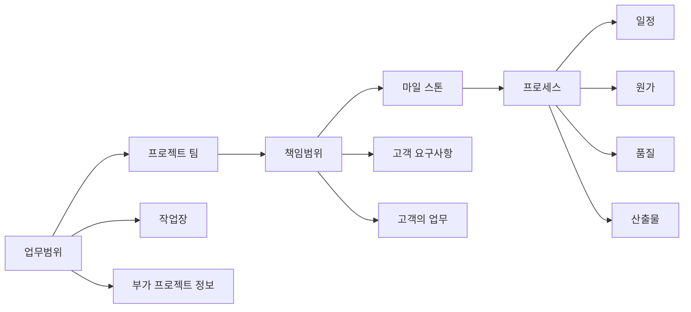

# SOW (Statement Of Work): 서비스 수준 관리를 위한 작업명세서

<!-- mtoc-start -->

- [소개 문단](#소개-문단)
- [정의 및 소개](#정의-및-소개)
- [SOW의 주요 구성 요소](#sow의-주요-구성-요소)
  - [1. 업무범위](#1-업무범위)
  - [2. 책임범위](#2-책임범위)
  - [3. 프로세스](#3-프로세스)
- [SOW의 구성도](#sow의-구성도)
- [SOW의 기대 효과](#sow의-기대-효과)
- [마무리](#마무리)
- [Keywords](#keywords)

<!-- mtoc-end -->

## 소개 문단

SOW(Statement Of Work)는 IT 서비스 수준 관리를 위해 SLA(Service Level Agreement)에 대한 세부적인 범위와 작업 내용을 규정한 작업명세서입니다. SOW는 고객이 요구하고 개발자가 동의한 작업, 서비스, 제품을 포함하는 문서로, 서비스의 구체적인 범위와 목표를 명확히 기술하여 작업의 방향성을 제시합니다. 이를 통해 서비스 제공과 관련된 모든 이해관계자들이 동일한 이해를 바탕으로 작업을 수행할 수 있습니다.

## 정의 및 소개

SOW는 IT 서비스 제공 과정에서 고객과 서비스 제공자가 동의한 작업, 서비스, 제품을 구체적으로 정의한 문서. SLA의 목표를 달성하기 위해 필요한 세부적인 작업 명세를 기술하고, 각 작업의 범위와 책임을 명확히 구분하여 서비스 품질을 보장합니다.

- **특징**: 작업의 세부 범위 규정, 고객과의 합의된 작업 내용 포함, 서비스 수준 관리
- **필요성**: 작업의 명확성 보장, 책임 분담, 서비스 품질 보장
- **목적**: 서비스 제공 과정에서의 혼란 최소화, 작업의 명확한 목표 설정, 고객과 제공자 간 신뢰 구축

## SOW의 주요 구성 요소

### 1. 업무범위

- **작업장**: 작업이 실시되는 장소를 명시하여 작업 환경을 명확히 정의
- **프로젝트 팀**: 작업을 수행하는 프로젝트 팀의 역할과 구성원 명시
- **부가 프로젝트 정보**: 작업과 관련된 부가적 참조 정보 제공

### 2. 책임범위

- **마일 스톤**: 일정상 중요한 경계를 정의하여 작업의 진행 상황을 모니터링
- **고객 요구사항**: 고객의 요구사항을 구체적으로 기술하여 명확한 작업 방향 제공
- **고객의 업무**: 고객이 직접 수행해야 하는 업무를 명시하여 역할을 분담

### 3. 프로세스

- **일정**: 작업에 필요한 전체 일정을 정의하여 작업 계획 수립
- **원가**: 작업에 필요한 전체 원가를 산출하여 예산 계획 수립
- **품질**: 서비스 품질을 정의하여 작업 결과물의 기대 수준을 설정
- **산출물**: 작업으로 인한 도출 결과물을 명시하여 작업의 목표를 명확히 설정

## SOW의 구성도

- 업무범위, 책임범위, 프로세스 간의 상호작용을 통해 전체 작업의 흐름을 구성

## SOW의 기대 효과

- **작업 명확성 보장**: 작업의 세부적인 범위와 목표를 명확히 기술하여 서비스 제공 과정에서의 혼란을 방지
- **책임과 역할의 분담**: 고객과 제공자 간의 역할과 책임을 명확히 정의하여 작업의 효율성 극대화
- **서비스 품질 보장**: 품질 기준과 산출물을 명시하여 서비스의 기대 수준을 명확히 설정하고 보장
- **프로젝트 관리 효율성 향상**: 작업 일정과 원가를 명확히 설정하여 프로젝트 관리의 효율성을 높임

## 마무리

SOW는 IT 서비스 제공 과정에서 고객과 서비스 제공자 간의 작업과 책임을 명확히 규정하는 중요한 문서입니다. 이를 통해 서비스 제공의 목표와 범위를 명확히 설정하고, 서비스 품질을 보장하며, 양측 간의 신뢰를 구축할 수 있습니다. SOW는 서비스의 명확한 방향성을 제시하고, 서비스 제공 과정에서 발생할 수 있는 혼란을 최소화하는 데 중요한 역할을 합니다.

## Keywords

SOW, Statement Of Work, SLA, 작업명세서, 서비스 수준 관리, 업무범위, 책임범위, 프로세스, IT 서비스 제공, 서비스 품질 보장