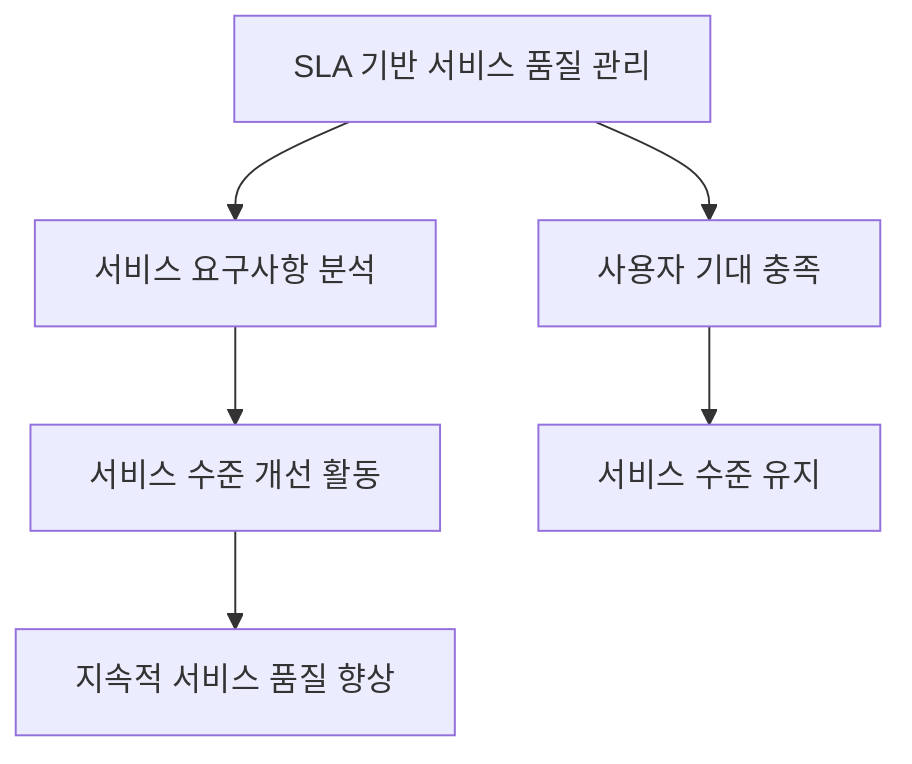

# SLM (Service Level Management): 서비스 수준 관리를 위한 체계적 관리 프로세스

<!-- mtoc-start -->

- [정의 및 소개](#정의-및-소개)
- [SLM의 주요 구성 요소](#slm의-주요-구성-요소)
  - [1. SLA 기반 서비스 품질 관리](#1-sla-기반-서비스-품질-관리)
  - [2. 서비스 요구사항 분석](#2-서비스-요구사항-분석)
  - [3. 서비스 수준 개선 활동](#3-서비스-수준-개선-활동)
- [SLM의 구성도](#slm의-구성도)
- [SLM의 기대 효과](#slm의-기대-효과)
- [마무리](#마무리)
- [Keywords](#keywords)

<!-- mtoc-end -->

SLM(Service Level Management)은 SLA(Service Level Agreement)를 체계적으로 관리하기 위한 관리 프로세스입니다. SLM은 IT 서비스 조직에서 사용자의 관점으로 서비스 요구사항을 파악하고, 서비스 수준을 개선하기 위한 우선순위를 판단하는 데 중요한 도구입니다. SLM을 통해 서비스 품질을 지속적으로 향상시키고, SLA를 기반으로 IT 서비스의 일관성을 유지하며 사용자의 기대를 충족하는 데 기여합니다.

## 정의 및 소개

SLM은 SLA 기반으로 서비스 품질을 체계적으로 관리하고 개선하는 활동을 포괄하는 관리 프로세스. IT 서비스 조직 내에서 사용자의 요구사항을 분석하고, 그에 따른 서비스 수준을 정의하며, 이를 지속적으로 모니터링하고 개선합니다. SLM을 통해 조직은 사용자의 기대 수준에 부합하는 서비스, 프로세스, 조직의 역량 및 기술을 통합적으로 관리할 수 있습니다.

- **특징**: SLA를 기반으로 한 체계적 관리, 서비스 요구사항 파악, 지속적 서비스 수준 개선
- **필요성**: 서비스 품질 향상, 고객 만족도 증대, IT 서비스의 일관성 유지
- **목적**: SLA 충족, 서비스 수준 유지 및 개선, 사용자의 기대 수준에 부합하는 서비스 제공

## SLM의 주요 구성 요소

### 1. SLA 기반 서비스 품질 관리

- **정의**: SLA에 정의된 서비스 수준 목표를 관리하고, 이를 지속적으로 모니터링 및 개선
- **목적**: 서비스 품질을 유지하고 SLA 목표를 충족

### 2. 서비스 요구사항 분석

- **정의**: 사용자의 관점에서 서비스 요구사항을 분석하고 우선순위를 설정
- **목적**: 사용자의 기대를 충족하고, 필요에 따라 서비스 수준을 조정

### 3. 서비스 수준 개선 활동

- **정의**: 서비스 수준을 지속적으로 모니터링하고, 필요시 개선 계획을 수립 및 실행
- **목적**: 서비스의 일관성을 유지하고, 고객 만족도를 높이기 위한 지속적 개선

## SLM의 구성도

- SLA 기반 서비스 품질 관리, 서비스 요구사항 분석, 서비스 수준 개선 활동 간의 상호작용을 통한 서비스 관리 프로세스.

## SLM의 기대 효과

- **서비스 품질 유지 및 개선**: SLA를 기반으로 서비스 수준을 지속적으로 유지하고 개선하여 서비스의 품질을 보장
- **고객 만족도 향상**: 사용자의 요구사항을 명확히 이해하고, 이에 따라 서비스 개선을 통해 고객 만족도를 높임
- **효율적인 IT 서비스 관리**: 서비스 요구사항 분석과 개선 활동을 통해 IT 서비스 관리의 효율성을 극대화
- **SLA 충족 보장**: 서비스 수준을 관리하여 SLA의 목표를 달성하고, 서비스의 일관성을 유지

## 마무리

SLM은 SLA를 체계적으로 관리하고, 서비스의 품질을 유지 및 개선하기 위한 중요한 관리 프로세스입니다. 이를 통해 IT 서비스 조직은 사용자의 기대 수준을 충족하고, 서비스의 일관성을 유지하며, 고객 만족도를 지속적으로 높일 수 있습니다. SLM은 IT 서비스 관리의 핵심 요소로, 서비스의 품질을 보장하고 조직의 역량을 강화하는 데 중요한 역할을 합니다.

## Keywords

SLM, Service Level Management, SLA, 서비스 수준 관리, IT 서비스 조직, 서비스 품질 향상, 서비스 요구사항 분석, 서비스 수준 개선, 고객 만족도, IT 서비스 관리