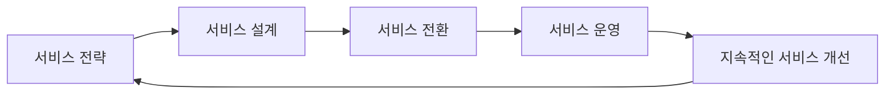

# ITIL 3.0: IT 서비스 관리를 위한 Best Practice

<!-- mtoc-start -->

- [ITIL 3.0 정의 및 소개](#itil-30-정의-및-소개)
- [ITIL 3.0의 구성 요소(전설전운지)](#itil-30의-구성-요소전설전운지)
  - [1. 서비스 전략 (SS: Service Strategy)](#1-서비스-전략-ss-service-strategy)
  - [2. 서비스 설계 (SD: Service Design)](#2-서비스-설계-sd-service-design)
  - [3. 서비스 전환 (ST: Service Transition)](#3-서비스-전환-st-service-transition)
  - [4. 서비스 운영 (SO: Service Operation)](#4-서비스-운영-so-service-operation)
  - [5. 지속적인 서비스 개선 (CSI: Continual Service Improvement)](#5-지속적인-서비스-개선-csi-continual-service-improvement)
- [ITIL 3.0의 구성도](#itil-30의-구성도)
- [주요 특징](#주요-특징)
- [ITIL 3.0의 기대 효과](#itil-30의-기대-효과)
- [ITIL 3.0 활용 사례](#itil-30-활용-사례)
- [마무리](#마무리)
- [Keywords](#keywords)

<!-- mtoc-end -->

ITIL(IT Infrastructure Library) 3.0은 IT 서비스 관리(ITSM)를 위한 Best Practice 모음집으로, ITIL V2에서 발전된 형태입니다. ITIL V3는 서비스 전략을 핵심으로 하여 서비스 설계, 운영, 전환 등 5가지 주요 구성 요소를 통해 고품질의 IT 서비스를 지속적으로 제공하기 위한 가이드라인을 제공합니다. ITIL은 대기업부터 중소기업까지 다양한 조직에서 ROI(Return on Investment)를 향상시키는 데 기여합니다.

## ITIL 3.0 정의 및 소개

ITIL 3.0은 IT 서비스 관리의 Best Practice를 집대성한 프레임워크, ITIL V2의 발전형입니다. 서비스 전략(Service Strategy)을 중심으로 설계, 전환, 운영, 개선의 전 과정을 포함하는 라이프사이클 기반 접근 방식을 채택하고 있습니다. 이를 통해 조직은 IT 서비스를 체계적으로 관리하고 비즈니스 목표를 효과적으로 달성할 수 있습니다.

- **특징**: 비즈니스 가치 중심, 생명주기 관점 강화, 정량적 ROI 제공

## ITIL 3.0의 구성 요소(전설전운지)

ITIL 3.0은 IT 서비스 라이프사이클에 따라 5가지 주요 단계로 구성됩니다:

### 1. 서비스 전략 (SS: Service Strategy)

- IT 서비스 제공의 기본 방향을 설정하고 비즈니스 목표를 달성하기 위한 전략 수립

### 2. 서비스 설계 (SD: Service Design)

- 서비스 요구사항을 충족하기 위한 IT 서비스 설계와 구현 계획 수립

### 3. 서비스 전환 (ST: Service Transition)

- 설계된 IT 서비스를 운영 환경으로 이전하여 안정적인 운영 보장

### 4. 서비스 운영 (SO: Service Operation)

- IT 서비스의 일상 운영을 관리하고 최적화하여 사용자 요구를 충족

### 5. 지속적인 서비스 개선 (CSI: Continual Service Improvement)

- IT 서비스의 품질과 성능을 지속적으로 평가하고 개선

## ITIL 3.0의 구성도

ITIL 3.0의 서비스 라이프사이클은 각 단계가 유기적으로 연결되어 서비스 품질을 지속적으로 개선하는 구조를 보여줍니다. 이러한 구성은 IT 서비스의 전반적인 흐름과 상호작용을 한눈에 이해할 수 있도록 도와줍니다.

## 주요 특징

ITIL 3.0은 아래와 같은 핵심 특징을 제공합니다:

1. **라이프사이클 기반 접근**:
   - IT 서비스의 시작부터 종료까지의 전 과정 관리
2. **서비스 가치 중심**:
   - IT 서비스가 비즈니스 목표에 미치는 영향을 중점적으로 평가
3. **서비스 포트폴리오 관리**:
   - 다양한 IT 서비스의 구성 및 제공 현황 관리
4. **서비스 지식 관리 시스템(SKM)**:
   - IT 서비스와 관련된 데이터 및 정보를 체계적으로 관리
5. **성숙도 모델**:
   - IT 서비스 관리 성숙도를 평가하여 개선 방향 제시
6. **IT Governance 지원**:
   - 조직의 IT 정책 및 규정을 준수하도록 지원

## ITIL 3.0의 기대 효과

1. **비즈니스 연계성 강화**:
   - IT와 비즈니스 목표를 일치시켜 조직의 성과 향상
2. **서비스 품질 향상**:
   - 지속적인 개선 활동을 통해 고품질 IT 서비스 제공
3. **ROI 향상**:
   - IT 서비스의 효율적인 관리와 비용 절감을 통해 투자 대비 성과 극대화
4. **IT 서비스 표준화**:
   - 명확한 프로세스와 지침을 통해 IT 서비스 관리 표준화

## ITIL 3.0 활용 사례

1. **대기업의 IT 서비스 통합 관리**:
   - 글로벌 대기업이 ITIL 기반으로 IT 서비스 관리 프로세스를 통합하여 비용 절감 및 효율성 증대
2. **중소기업의 서비스 품질 개선**:
   - 중소기업이 ITIL을 도입하여 서비스 설계 및 운영 체계를 개선하고 사용자 만족도 향상
3. **공공 기관의 IT 거버넌스 강화**:
   - ITIL을 통해 공공 서비스의 투명성과 신뢰도를 높임

## 마무리

ITIL 3.0은 IT 서비스 관리의 표준으로 자리 잡으며, 조직의 ROI 향상과 비즈니스 목표 달성을 지원합니다. IT 서비스 라이프사이클 전반에 걸쳐 지속적인 개선과 품질 관리를 통해 고품질 IT 서비스를 제공하고, 조직의 성과를 극대화하는 데 기여합니다. ITIL 3.0을 도입하여 조직의 IT 서비스 관리를 한 단계 끌어올려 보세요.

## Keywords

ITIL 3.0, IT 서비스 관리, ITSM, 서비스 전략, 서비스 설계, 서비스 운영, 지속적인 서비스 개선, ROI, IT 거버넌스, 비즈니스 가치