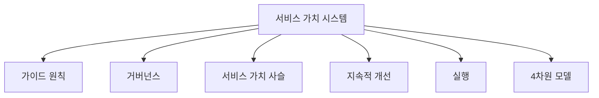
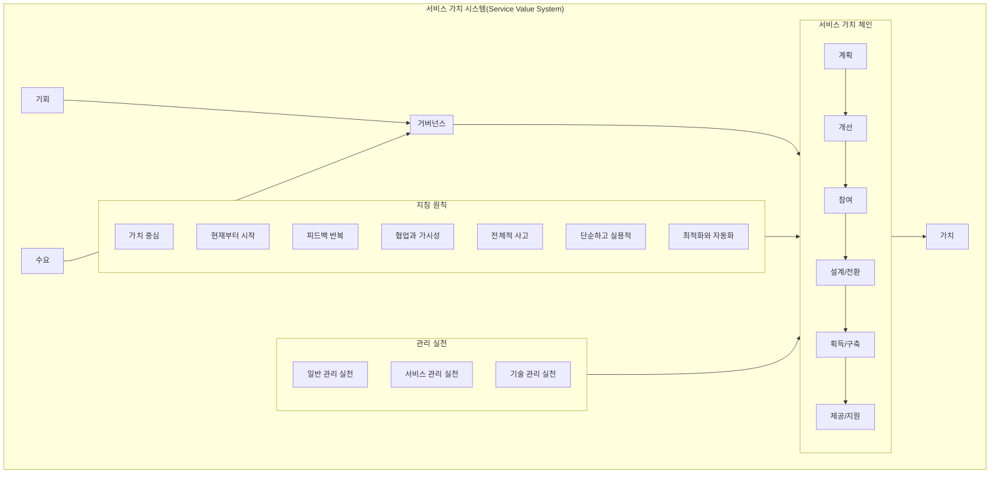
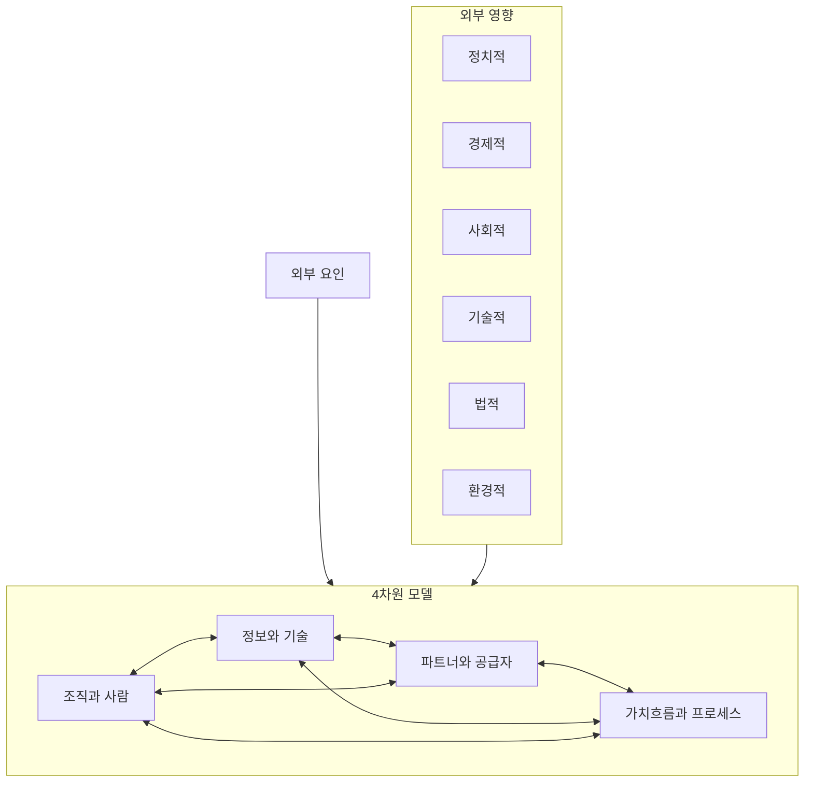
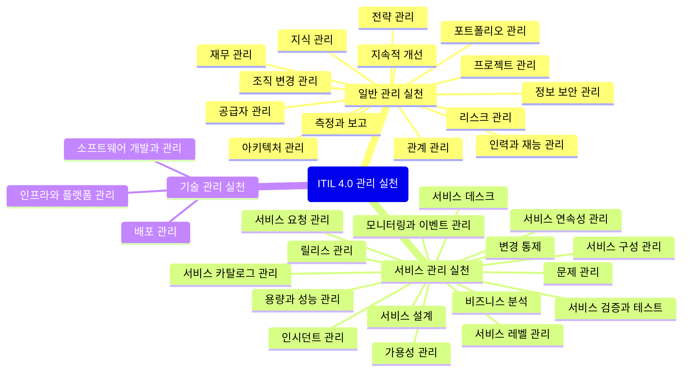
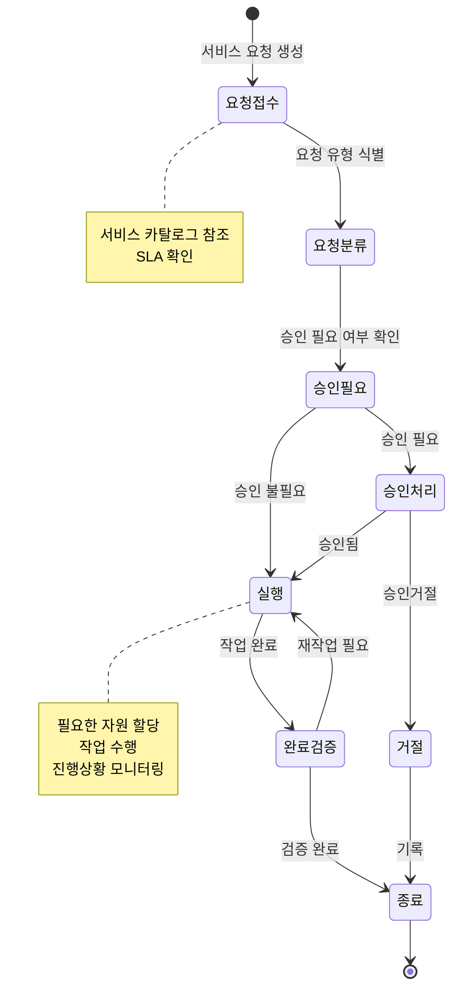

# ITIL 4.0: 서비스 관리의 새로운 표준

<!-- mtoc-start -->

- [ITIL 4.0 정의 및 소개](#itil-40-정의-및-소개)
- [ITIL 4.0의 특징](#itil-40의-특징)
- [ITIL 4.0의 구성 요소](#itil-40의-구성-요소)
  - [1. 서비스 관리 4차원 모델 (Four Dimensions Model)](#1-서비스-관리-4차원-모델-four-dimensions-model)
  - [2. 서비스 가치 시스템 (Service Value System)](#2-서비스-가치-시스템-service-value-system)
- [ITIL 4.0의 구성도](#itil-40의-구성도)
- [ITIL 4.0 Service Value System](#itil-40-service-value-system)
- [ITIL 4.0 Four Dimensions](#itil-40-four-dimensions)
- [ITIL 4.0 Management Practices](#itil-40-management-practices)
- [ITIL 4.0 Service Request Management](#itil-40-service-request-management)
- [ITIL 4.0의 기대 효과](#itil-40의-기대-효과)
- [ITIL 4.0 활용 사례](#itil-40-활용-사례)
- [마무리](#마무리)
- [Keywords](#keywords)

<!-- mtoc-end -->

ITIL 4.0은 IT 서비스 관리(ITSM)의 새로운 표준으로, 빠르게 변화하는 비즈니스 환경에 맞춰 업데이트된 Best Practice 모음집입니다. ITIL V4는 서비스 관리 4차원 모델(Four Dimensions Model)과 서비스 가치 시스템(Service Value System)을 중심으로 Agile 기반의 유연하고 효과적인 IT 서비스 관리를 제공합니다.

## ITIL 4.0 정의 및 소개

ITIL 4.0은 ITSM의 새로운 패러다임으로, 현대적인 비즈니스 환경에서 IT 서비스 관리의 표준. 서비스 관리 4차원 모델과 서비스 가치 시스템을 중심으로 조직의 ITSM 품질을 향상시키고 지속적인 개선을 도모합니다.

- 특징: 유연한 프레임워크 제공, 비즈니스 연계성 강화, 지속 가능한 가치 창출

## ITIL 4.0의 특징

1. **ITSM을 위한 Framework 제공**:
   - IT 서비스 관리를 체계적으로 구현하고 표준화하기 위한 종합적인 프레임워크 제공
2. **Agile 기반 제공**:
   - 빠르게 변화하는 비즈니스 요구에 대응할 수 있도록 Agile 철학을 반영
3. **비즈니스 가치 중심**:
   - IT 서비스가 조직의 비즈니스 성과와 가치를 증대하는 데 중점

## ITIL 4.0의 구성 요소

### 1. 서비스 관리 4차원 모델 (Four Dimensions Model)

서비스 관리를 전체적으로 접근하기 위해 고려해야 할 4가지 주요 차원:

- **조직 및 사람 (Organization and People)**:
  - 적절한 인력, 역할, 책임 정의
- **정보 및 기술 (Information and Technology)**:
  - IT 서비스 관리에 필요한 정보와 기술적 자원
- **파트너 및 공급업체 (Partner and Supplier)**:
  - 외부 파트너 및 공급망 관리
- **가치흐름 및 프로세스 (Value Streams and Process)**:
  - 가치 창출을 위한 프로세스와 워크플로우

### 2. 서비스 가치 시스템 (Service Value System)

조직의 모든 구성 요소와 활동이 가치 창출에 기여하도록 설계된 체계:

- **가이드원칙 (Guiding Principles)**:
  - IT 서비스 관리의 방향성을 제시하는 기본 원칙
- **거버넌스 (Governance)**:
  - 조직의 의사결정, 지시, 모니터링, 평가 체계
- **서비스 가치 사슬 (Service Value Chain)**:
  - 서비스 제공의 주요 6개 활동(계약, 설득, 설계, 운영전환, 지원, 개선)
- **지속적 개선 (Continual Improvement)**:
  - IT 서비스 품질과 효율성을 지속적으로 개선
- **실행 (Practices)**:
  - IT 서비스 관리를 위한 실행 가능한 활동 모음

## ITIL 4.0의 구성도

ITIL 4.0의 구성 요소들은 서로 유기적으로 작용하여 조직의 IT 서비스 관리 품질을 향상시키고, 지속적인 가치를 창출.

## ITIL 4.0 Service Value System

## ITIL 4.0 Four Dimensions

## ITIL 4.0 Management Practices

## ITIL 4.0 Service Request Management

## ITIL 4.0의 기대 효과

4. **비즈니스 민첩성 향상**:
   - Agile 기반의 접근으로 변화하는 비즈니스 요구에 신속히 대응
5. **서비스 품질과 효율성 증대**:
   - 4차원 모델과 가치 시스템을 통해 지속적인 서비스 개선
6. **ITSM 표준화**:
   - 체계적인 프레임워크로 IT 서비스 관리 프로세스 표준화
7. **ROI 증대**:
   - IT 서비스와 비즈니스 목표를 연계하여 투자 대비 성과 향상

## ITIL 4.0 활용 사례

8. **대기업의 디지털 전환 가속화**:
   - ITIL 4.0의 Agile 기반 프레임워크를 활용하여 디지털 트랜스포메이션 지원
9. **중소기업의 서비스 관리 최적화**:
   - 4차원 모델로 리소스를 효과적으로 활용하고 서비스 품질 향상
10. **공공 기관의 IT 거버넌스 강화**:
   - 서비스 가치 시스템을 통해 투명성과 신뢰도 향상

## 마무리

ITIL 4.0은 IT 서비스 관리의 현대적 요구를 반영한 프레임워크로, 조직의 ITSM 성숙도를 높이고 지속 가능한 가치를 제공합니다. ITIL 4.0을 도입하여 비즈니스 민첩성을 강화하고, 서비스 품질과 ROI를 동시에 향상시켜 보세요.

## Keywords

ITIL 4.0, IT 서비스 관리, ITSM, Agile, 서비스 가치 시스템, 4차원 모델, ROI, 비즈니스 민첩성, 지속적 개선, IT 거버넌스