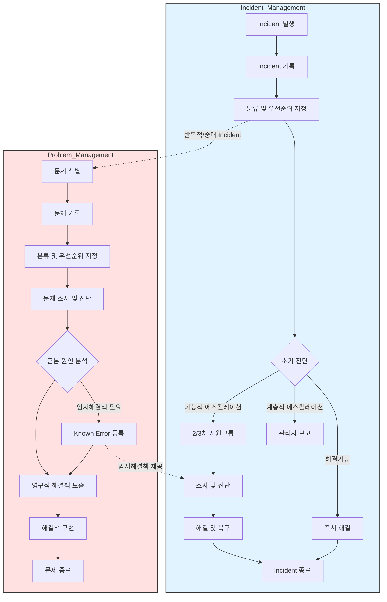

# Incident 관리와 Problem 관리: ITIL 3.0의 Service Operation 프로세스

<!-- mtoc-start -->

- [Incident 관리](#incident-관리)
  - [인시던트(Incident)란?](#인시던트incident란)
  - [Incident 관리의 주요 활동](#incident-관리의-주요-활동)
- [Problem 관리](#problem-관리)
  - [문제(Problem)란?](#문제problem란)
  - [Problem 관리의 주요 활동](#problem-관리의-주요-활동)
- [ITIL 3.0 Service Operation - Incident & Problem Management Process](#itil-30-service-operation---incident--problem-management-process)
- [Incident 관리와 Problem 관리의 차이점](#incident-관리와-problem-관리의-차이점)
- [Incident 및 Problem 관리의 기대 효과](#incident-및-problem-관리의-기대-효과)
- [마무리](#마무리)
- [Keywords](#keywords)

<!-- mtoc-end -->

IT 서비스 관리의 핵심은 문제를 신속하게 해결하고, 발생 가능한 문제를 미리 방지하여 서비스 가용성을 높이는 것입니다. ITIL 3.0의 **Service Operation 프로세스**에서는 이러한 목표를 달성하기 위해 **Incident 관리**와 **Problem 관리**를 체계적으로 다룹니다. 이 두 관리 프로세스는 IT 서비스 품질을 유지하고 비즈니스 운영의 연속성을 보장하는 데 필수적입니다.

## Incident 관리

Incident 관리의 목표는 가능한 SLA(Service Level Agreement)를 위반하지 않도록 신속히 인시던트를 해결하고, 비즈니스에 미치는 영향을 최소화하는 관리기법.

### 인시던트(Incident)란?

- **정의**: 계획되지 않은 IT 서비스의 중단 또는 IT 서비스 품질을 저하시키는 이벤트
- **예시**: 서버 다운타임, 네트워크 장애, 애플리케이션 오류

### Incident 관리의 주요 활동

1. **신속한 복구**:
   - IT 서비스의 중단 시간을 최소화하기 위해 신속히 대응
2. **SLA 준수**:
   - 서비스 수준을 유지하여 비즈니스 운영에 미치는 영향 최소화
3. **문제와의 차별화**:
   - Incident는 임시 복구가 가능하며, 근본 원인을 해결하지 않아도 SLA 준수를 목표로 함

## Problem 관리

Problem 관리의 목표는 문제의 근본 원인을 파악하고, 동일한 문제가 반복되지 않도록 예방하여 IT 서비스의 안정성을 높이는 관리기법.

### 문제(Problem)란?

- **정의**: 하나 이상의 인시던트의 근본 원인을 해결해야 하는 상황으로, 해결 방안이 아직 정의되지 않은 상태
- **예시**: 빈번한 네트워크 지연의 근본 원인, 데이터베이스 성능 저하 원인 분석

### Problem 관리의 주요 활동

4. **근본 원인 분석(RCA)**:
   - 인시던트의 반복적인 발생을 방지하기 위해 문제의 원인을 식별
5. **영구적 해결책 개발**:
   - IT 서비스 품질을 향상시키기 위해 문제를 완전히 해결
6. **재발 방지**:
   - 동일한 문제가 발생하지 않도록 예방 조치를 실행

## ITIL 3.0 Service Operation - Incident & Problem Management Process

7. Incident Management 프로세스:

   - Incident 발생부터 종료까지의 전체 흐름
   - 초기 진단 후 3가지 경로(즉시해결, 기능적/계층적 에스컬레이션)
   - 해결 및 복구 과정

8. Problem Management 프로세스:

   - 문제 식별부터 종료까지의 과정
   - 근본 원인 분석(RCA) 단계
   - Known Error 관리와 영구적 해결책 도출 과정

9. 두 프로세스 간의 연계:
   - 반복적/중대 Incident가 Problem 관리로 전환되는 경로
   - Known Error의 임시해결책이 Incident 해결에 활용되는 흐름

## Incident 관리와 Problem 관리의 차이점

| 구분          | Incident 관리            | Problem 관리                          |
| ------------- | ------------------------ | ------------------------------------- |
| **목적**      | 신속한 복구와 SLA 준수   | 근본 원인 분석 및 재발 방지           |
| **초점**      | 단기적인 해결            | 장기적인 안정성 확보                  |
| **활동 범위** | 서비스 복구에 중점       | 문제 식별, 분석, 해결 방안 도출       |
| **결과**      | 서비스의 즉각적인 정상화 | 근본 원인 제거와 서비스의 안정성 강화 |

## Incident 및 Problem 관리의 기대 효과

10. **서비스 가용성 향상**:
   - Incident 관리와 Problem 관리의 조화로운 운영을 통해 IT 서비스의 안정성과 신뢰성 증대
11. **SLA 준수 강화**:
   - 인시던트의 신속한 대응으로 SLA 위반 방지
12. **비용 절감**:
   - 문제의 근본 원인을 해결하여 동일한 인시던트 발생 방지로 운영 비용 절감
13. **사용자 만족도 향상**:
   - 빠른 문제 해결과 안정적인 IT 서비스를 통해 사용자 경험 개선

## 마무리

Incident 관리와 Problem 관리는 ITIL 3.0의 Service Operation 프로세스에서 핵심적인 역할을 합니다. 두 프로세스를 효과적으로 활용하면 IT 서비스의 가용성과 품질을 높일 수 있으며, 비즈니스 목표 달성에 기여할 수 있습니다. 조직의 IT 서비스 운영 체계를 강화하기 위해 Incident와 Problem 관리를 도입해 보세요.

## Keywords

Incident 관리, Problem 관리, ITIL 3.0, IT 서비스 관리, ITSM, SLA, 근본 원인 분석, RCA, IT 서비스 안정성, Service Operation