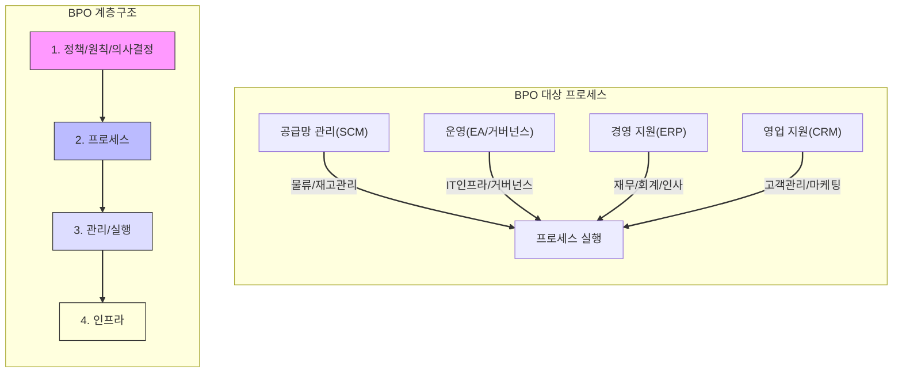
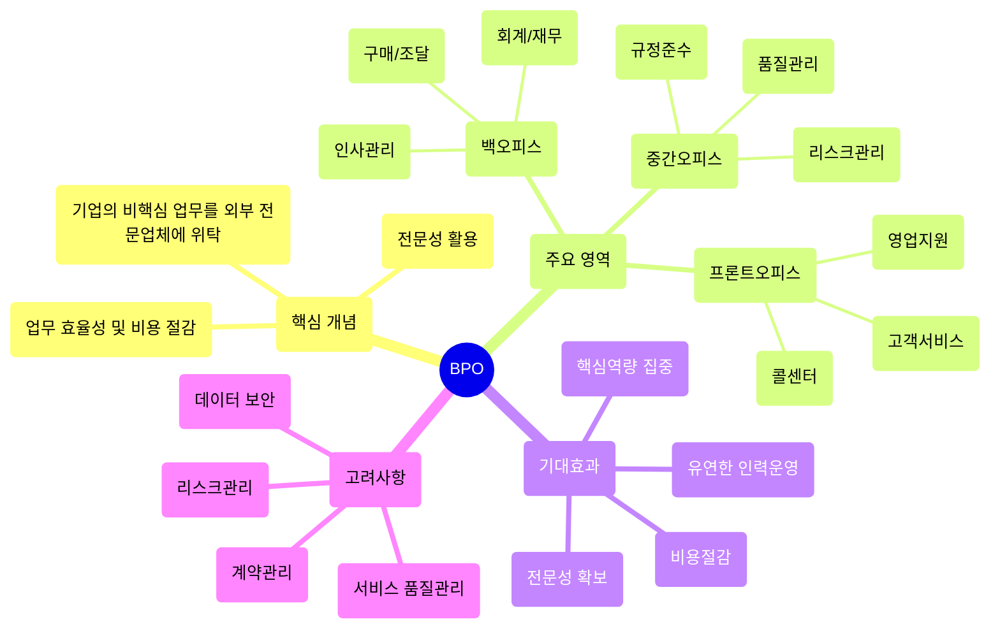

# BPO: 성과 측정 체계에 기반한 프로세스 위탁 관리

<!-- mtoc-start -->

- [BPO의 정의 및 개념](#bpo의-정의-및-개념)
- [BPO의 주요 특징](#bpo의-주요-특징)
- [BPO의 대상 프로세스](#bpo의-대상-프로세스)
- [BPO의 계층구조](#bpo의-계층구조)
- [BPO 대상 프로세스 및 계층구조도](#bpo-대상-프로세스-및-계층구조도)
- [BPO의 문제점](#bpo의-문제점)
- [BPO의 개념도](#bpo의-개념도)
- [BPO의 주요 활용 사례](#bpo의-주요-활용-사례)
  - [1. 고객 지원 서비스](#1-고객-지원-서비스)
  - [2. IT 운영 관리](#2-it-운영-관리)
  - [3. HR 및 급여 관리](#3-hr-및-급여-관리)
- [BPO 도입의 장점](#bpo-도입의-장점)
- [BPO 도입 시 고려 사항](#bpo-도입-시-고려-사항)
- [BPO의 기대 효과](#bpo의-기대-효과)
- [마무리](#마무리)
- [Keywords](#keywords)

<!-- mtoc-end -->

BPO(Business Process Outsourcing)는 기업의 특정 프로세스를 외부 전문 업체에 위탁하여 관리하는 계약 형태입니다. 성과 측정 체계를 기반으로 프로세스를 효과적으로 운영하며, 기업은 핵심 역량에 집중할 수 있도록 지원합니다. BPO는 비용 절감, 전문성 향상, 효율성 증대 등의 장점을 제공하며, 다양한 산업에서 널리 활용되고 있습니다.

## BPO의 정의 및 개념

BPO는 기업 내부에서 수행되던 프로세스를 외부의 전문 업체에 위탁하여 관리하는 기법. 이 과정에서 성과 측정 체계를 정의하여 외부 업체가 프로세스를 일정 기준에 맞춰 운영하도록 보장합니다.

- **주요 개념**:
  - **성과 측정 체계**: BPO 계약 시 외부 업체의 성과를 평가하는 기준
  - **위탁 프로세스**: 기업 내부에서 수행되던 특정 업무(예: 고객 지원, IT 운영 등)
  - **외부 전문 업체**: 해당 프로세스에 특화된 경험과 역량을 가진 조직

## BPO의 주요 특징

1. **성과 중심 운영**:
   - 사전에 정의된 성과 측정 체계로 외부 업체의 업무를 평가
   - 목표 달성을 위한 명확한 기준 제공
2. **전문성 활용**:
   - 전문 업체의 노하우와 기술력을 활용하여 프로세스 개선
3. **비용 절감**:
   - 내부 자원을 줄이고 외부 전문 업체와의 계약을 통해 운영 비용 절감

## BPO의 대상 프로세스

- **공급망 관리(SCM)**:
  - 물류, 재고 관리 등
- **운영(EA/거버넌스)**:
  - IT 인프라 관리, 거버넌스 전략
- **경영 지원(ERP)**:
  - 재무, 회계, 인사 관리
- **영업 지원(CRM)**:
  - 고객 관계 관리, 마케팅 캠페인

## BPO의 계층구조

4. **정책/원칙/의사결정**:
   - BPO의 전략적 방향과 목표 설정
5. **프로세스**:
   - 위탁 프로세스 설계 및 정의
6. **관리/실행**:
   - 위탁된 프로세스의 일상 운영 및 관리
7. **인프라**:
   - 프로세스 지원을 위한 기술 및 자원

## BPO 대상 프로세스 및 계층구조도

## BPO의 문제점

BPO는 효율성을 제공하지만, 다음과 같은 문제점 수반 가능

8. **업무 부하**:
   - 위탁 프로세스와 내부 프로세스 간의 조정 부족으로 업무 과중 발생
9. **평가 체계의 부족**:
   - 성과측정체계가 명확하지 않을 경우 외부 업체의 성과 평가 어려움
10. **내부 통제 문제**:
   - 외부 업체에 대한 통제 부족으로 데이터 보안 및 품질 문제 발생
11. **BPO 브로커의 비효율성**:
   - 중간 관리 역할을 수행하는 브로커의 비효율성 문제

## BPO의 개념도

## BPO의 주요 활용 사례

### 1. 고객 지원 서비스

기업의 고객 센터 운영을 외부 업체에 위탁하여, 전문화된 고객 응대 서비스 제공

### 2. IT 운영 관리

IT 인프라 및 애플리케이션 관리 프로세스를 외부 업체에 위탁하여, 효율적인 IT 운영 보장

### 3. HR 및 급여 관리

인사 관리 및 급여 처리 업무를 외부에 맡겨 인적 자원 관리 효율화

## BPO 도입의 장점

12. **핵심 역량 집중**:
   - 비핵심 업무를 외부에 맡겨 기업은 주요 사업에 집중 가능
13. **운영 효율성 증대**:
   - 외부 업체의 전문성을 활용하여 프로세스 효율성 향상
14. **리소스 최적화**:
   - 내부 리소스를 전략적 활동에 재배치하여 경쟁력 강화
15. **리스크 관리**:
   - 외부 전문가를 통한 리스크 최소화 및 서비스 안정성 확보

## BPO 도입 시 고려 사항

16. **성과 측정 체계 정의**:

   - 계약 전 명확한 성과 지표 설정
   - SLA(Service Level Agreement)를 통한 성과 관리

17. **외부 업체 선정**:

   - 신뢰할 수 있는 전문 업체를 선택
   - 업체의 경험, 역량, 평판 평가

18. **비용 구조 분석**:

   - 내부 운영 대비 외부 위탁의 비용 효율성 검토

19. **보안 및 데이터 보호**:
   - 위탁 과정에서의 데이터 유출 및 보안 위협 방지

## BPO의 기대 효과

20. **운영 효율성 향상**:
   - 전문업체의 역량을 활용하여 프로세스 효율 극대화
21. **비용 절감**:
   - 운영 비용 절감 및 ROI 향상
22. **품질 향상**:
   - 전문 지식을 통해 서비스 품질 및 프로세스 최적화
23. **경쟁력 강화**:
   - 핵심 업무에 집중하여 시장 경쟁 우위 확보

## 마무리

BPO는 기업이 비즈니스 환경에서 경쟁력을 강화하고, 운영 효율성을 극대화할 수 있는 강력한 도구입니다. 성과 측정 체계를 기반으로 프로세스를 외부 전문 업체에 위탁하여 비용을 절감하고, 핵심 역량에 집중함으로써 기업의 지속 가능한 성장을 도모할 수 있습니다. 성공적인 BPO 도입을 위해 명확한 목표 설정과 신뢰할 수 있는 파트너 선정이 중요합니다.

## Keywords

BPO, Business Process Outsourcing, 성과 측정 체계, 프로세스 위탁, IT 운영 관리, 고객 지원 서비스, 핵심 역량 집중, SLA, 데이터 보호, 운영 효율성, 비용 절감