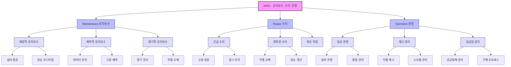

# MRO: 물류 공급 사업의 핵심 이해

<!-- mtoc-start -->

- [MRO의 정의](#mro의-정의)
- [MRO의 구매 형태](#mro의-구매-형태)
- [MRO의 비즈니스 모델](#mro의-비즈니스-모델)
- [MRO의 주요 특징](#mro의-주요-특징)
- [MRO의 개념도](#mro의-개념도)
- [MRO의 기대 효과](#mro의-기대-효과)
- [마무리](#마무리)
- [Keywords](#keywords)

<!-- mtoc-end -->

MRO(Maintenance, Repair, Operation)는 생산에 직접 소요되는 원자재를 제외한 비전략적 간접자재를 e-Marketplace를 통해 기업에 공급하는 물류 공급 사업입니다. MRO는 기업 운영에서 필수적인 소모품과 장비를 관리하며, 효율적인 공급망 관리를 가능하게 합니다. MRO의 정의, 구매 형태, 비즈니스 모델, 그리고 주요 특징에 대해 알아보겠습니다.

## MRO의 정의

MRO는 기업의 일상적인 운영과 유지 관리를 지원하기 위한 간접 자재를 다루며, e-Marketplace를 통해 공급하는 비즈니스 모델. 이러한 간접 자재는 생산 프로세스와 직접 관련되지는 않지만, 원활한 운영을 위해 필수적입니다.

- **간접 자재**: 사무용품, 공구, 소모성 자재 등
- **e-Marketplace**: 기업 간 거래를 중개하는 디지털 플랫폼을 활용한 물류 공급

## MRO의 구매 형태

1. **Maintenance(유지보수)**:
   - 장비와 시설의 유지 보수에 필요한 자재와 서비스
2. **Repair(수리)**:
   - 고장난 장비를 수리하거나 부품을 교체하기 위한 자재
3. **Operation(운영)**:
   - 기업 운영에 필요한 일상적인 소모품 및 운영 자재

## MRO의 비즈니스 모델

MRO는 다양한 비즈니스 모델을 통해 기업의 요구를 충족:

4. **중립적 Marketplace 모델**:
   - 다수의 구매자와 판매자가 참여하여 경쟁을 통해 최적의 거래 조건을 제공
5. **Customized Sales 모델**:
   - 기업의 특정 요구 사항에 맞춘 맞춤형 판매 및 공급 서비스
6. **Company Extranet 모델**:
   - 기업 내부 전용 네트워크를 활용하여 물류와 공급을 관리

## MRO의 주요 특징

7. **효율적인 자재 관리**:
   - 간접 자재의 통합 관리를 통해 비용 절감 및 운영 효율성 향상
8. **e-Marketplace 활용**:
   - 디지털 플랫폼을 통한 거래로 투명성과 접근성 증가
9. **비즈니스 유연성**:
   - 다양한 구매 형태와 비즈니스 모델을 통해 기업의 요구 충족

## MRO의 개념도

## MRO의 기대 효과

10. **운영 비용 절감**:
   - 중앙 집중식 관리를 통해 자재 구매와 재고 비용 최소화
11. **공급망 최적화**:
   - e-Marketplace를 통한 신속하고 투명한 공급망 운영
12. **비즈니스 연속성 강화**:
   - 간접 자재의 안정적인 공급으로 운영 차질 방지

## 마무리

MRO는 기업 운영의 효율성과 지속성을 보장하는 중요한 물류 공급 사업입니다. 구매 형태와 비즈니스 모델을 적절히 활용하여 간접 자재의 관리 효율성을 극대화하고, 경쟁력을 강화할 수 있습니다. 기업의 MRO 전략을 최적화하여 더 나은 성과를 실현해 보세요.

## Keywords

MRO, Maintenance, Repair, Operation, e-Marketplace, 간접 자재, 물류 공급, 비용 절감, 공급망 관리, 비즈니스 유연성