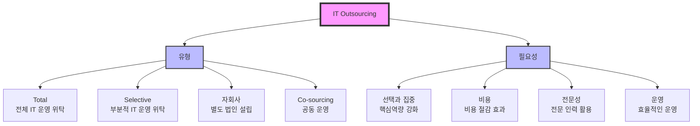

# 아웃소싱의 유형: 선택과 집중의 전략적 접근

<!-- mtoc-start -->

- [아웃소싱의 주요 유형](#아웃소싱의-주요-유형)
  - [1. Total Outsourcing](#1-total-outsourcing)
  - [2. Selective Outsourcing](#2-selective-outsourcing)
  - [3. 자회사(Subsidiary) Outsourcing](#3-자회사subsidiary-outsourcing)
  - [4. Co-sourcing](#4-co-sourcing)
- [아웃소싱의 필요성](#아웃소싱의-필요성)
- [아웃소싱의 유형과 필요성 시각화](#아웃소싱의-유형과-필요성-시각화)
- [아웃소싱 도입 시 고려사항](#아웃소싱-도입-시-고려사항)
- [마무리](#마무리)
- [Keywords](#keywords)

<!-- mtoc-end -->

아웃소싱(Outsourcing)은 기업이 특정 업무나 프로세스를 외부 전문업체에 위탁함으로써 효율성을 극대화하고 핵심 역량에 집중하는 전략입니다. 아웃소싱은 Total, Selective, 자회사(Subsidiary), Co-sourcing과 같은 다양한 유형으로 구분되며, 각각의 장점과 활용 사례를 통해 기업의 비즈니스 목표를 지원합니다. 아웃소싱의 주요 유형과 필요성을 살펴보겠습니다.

## 아웃소싱의 주요 유형

### 1. Total Outsourcing

- **정의**: 특정 프로세스나 서비스의 전체를 외부 업체에 완전히 위탁
- **장점**:
  - 운영 부담 제거
  - 고정 비용 감소 및 가변 비용으로 전환
- **활용 사례**:
  - IT 인프라 전체 관리, 물류 및 유통 전반 아웃소싱

### 2. Selective Outsourcing

- **정의**: 특정 업무나 기능을 선별적으로 외부 업체에 위탁
- **장점**:
  - 핵심 업무는 내부에서 유지하며 보조 업무만 위탁
  - 유연한 비용 구조와 위험 분산
- **활용 사례**:
  - 소프트웨어 개발 중 특정 모듈 개발, 고객 서비스 아웃소싱

### 3. 자회사(Subsidiary) Outsourcing

- **정의**: 기업이 설립한 자회사를 통해 특정 업무를 위탁
- **장점**:
  - 내부 통제 유지와 비용 절감의 균형
  - 전문성 있는 자회사 활용
- **활용 사례**:
  - 대기업의 인사 관리나 회계 처리 전담 자회사 설립

### 4. Co-sourcing

- **정의**: 내부 팀과 외부 전문업체가 공동으로 업무를 수행
- **장점**:
  - 내부 전문성 유지와 외부 전문성 활용
  - 리스크 공유 및 협력 강화
- **활용 사례**:
  - IT 보안 관리, 프로젝트 기반 협업

## 아웃소싱의 필요성

1. **선택과 집중**:
   - 비핵심 업무를 위탁하여 핵심 비즈니스에 리소스를 집중
2. **비용 절감**:
   - 고정 비용을 절감하고, 유연한 가변 비용 구조 채택
3. **전문성 강화**:
   - 외부 전문업체의 노하우와 기술 활용
4. **운영 효율성 향상**:
   - 내부 리소스를 최적화하고 생산성 극대화

## 아웃소싱의 유형과 필요성 시각화

## 아웃소싱 도입 시 고려사항

1. **위탁 대상 업무 선정**:
   - 핵심 비즈니스와의 연계성 및 전략적 중요도를 평가
2. **파트너 신뢰성 검토**:
   - 외부 업체의 전문성, 신뢰성, 안정성을 검토
3. **성과측정체계 수립**:
   - 명확한 성과 기준을 설정하여 아웃소싱 결과 평가

## 마무리

아웃소싱은 선택과 집중의 전략을 통해 기업이 경쟁력을 강화하고 효율성을 극대화하는 데 중요한 역할을 합니다. 각 유형의 장점과 필요성을 고려하여 조직의 목표에 맞는 아웃소싱 방식을 선택해 보세요. 성공적인 아웃소싱 도입은 기업의 지속 가능한 성장을 지원할 것입니다.

## Keywords

아웃소싱, Total Outsourcing, Selective Outsourcing, Subsidiary Outsourcing, Co-sourcing, 비용 절감, 전문성 강화, 운영 효율성, 성과측정체계, 핵심 역량 집중