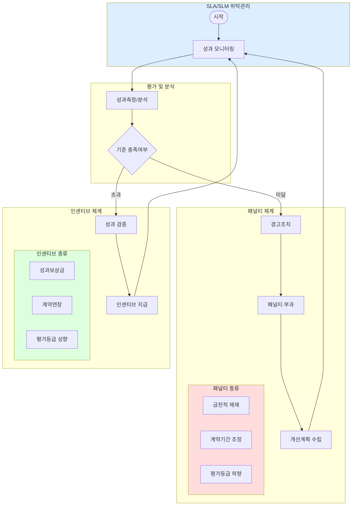

# Penalty/Incentive 관리체계: 발전적 위탁관리를 위한 접근

<!-- mtoc-start -->

- [Penalty 관리체계](#penalty-관리체계)
  - [정의](#정의)
  - [주요 특징](#주요-특징)
  - [예시](#예시)
- [Incentive 관리체계](#incentive-관리체계)
  - [정의](#정의-1)
  - [주요 특징](#주요-특징-1)
  - [예시](#예시-1)
- [Penalty/Incentive 관리체계도](#penaltyincentive-관리체계도)
- [Penalty/Incentive 관리체계와 위탁관리](#penaltyincentive-관리체계와-위탁관리)
- [Penalty/Incentive 관리체계의 필요성](#penaltyincentive-관리체계의-필요성)
- [마무리](#마무리)
- [Keywords](#keywords)

<!-- mtoc-end -->

Penalty와 Incentive 관리체계는 발전적 위탁 관리를 실현하기 위한 핵심 도구로, 위탁 계약의 성과를 효과적으로 관리하고 개선하기 위해 사용됩니다. Penalty는 부정적인 행동을 억제하고, Incentive는 긍정적인 행동을 장려하여 조직의 목표 달성을 지원합니다. 이러한 관리체계는 SLA(Service Level Agreement)와 SLM(Service Level Management)와 같은 위탁 관리 체계와 밀접하게 연관되어 있습니다.

## Penalty 관리체계

### 정의

Penalty는 계약 상대방의 행동으로 인해 발생한 부정적인 요소를 억제하기 위한 통제 체계. 이는 특정 기준을 위반했을 때 부여되는 제재로, 재발 방지와 책임 강화를 목적으로 합니다.

### 주요 특징

1. **행동 억제**:
   - 위반 행동의 반복을 방지하기 위한 강력한 자극 제공
2. **성과 기준 준수**:
   - SLA에서 정의된 서비스 수준 목표를 유지하도록 강제
3. **재정적 책임 부여**:
   - 계약 위반에 따른 비용 부담을 통해 책임 강화

### 예시

- SLA 위반 시 위약금 부과
- 성과 미달성에 따른 계약 조건 조정

## Incentive 관리체계

### 정의

Incentive는 계약 상대방이 긍정적인 행동을 지속하거나 더욱 향상시키도록 유도하는 보상 체계. 이는 서비스 품질 향상과 목표 초과 달성을 장려합니다.

### 주요 특징

4. **행동 강화**:
   - 성과를 높이기 위해 긍정적인 자극 제공
5. **성과 초과 달성 보상**:
   - SLA를 초과 달성한 경우 추가 보상을 통해 동기 부여
6. **협력 관계 강화**:
   - 파트너와의 신뢰 구축 및 장기적인 협력 기반 마련

### 예시

- SLA 초과 달성 시 보너스 지급
- 장기 계약 시 추가 인센티브 제공

## Penalty/Incentive 관리체계도

## Penalty/Incentive 관리체계와 위탁관리

Penalty와 Incentive는 위탁 관리(SLA 및 SLM)와 긴밀히 연계되어 위탁 계약의 효과적 운영을 지원합니다:

7. **SLA**:
   - Penalty와 Incentive의 기준을 명확히 정의하여 계약 수행의 명확한 기준 제공
8. **SLM**:
   - Penalty와 Incentive를 통해 서비스 수준을 지속적으로 모니터링하고 개선

## Penalty/Incentive 관리체계의 필요성

9. **성과 개선**:
   - 성과 기준을 준수하거나 초과 달성하도록 유도
10. **책임 강화**:
   - 부정적인 행동에 대한 책임을 부과하여 재발 방지
11. **파트너십 강화**:
   - 긍정적인 성과에 보상을 제공하여 협력 관계 강화

## 마무리

Penalty와 Incentive 관리체계는 위탁 계약에서 발생 가능한 문제를 관리하고, 성과를 극대화하기 위한 효과적인 도구입니다. SLA와 SLM을 기반으로 이러한 체계를 도입하면 서비스 품질을 높이고 조직의 목표 달성을 지원할 수 있습니다. 발전적인 위탁 관리를 위해 Penalty와 Incentive를 적절히 활용해 보세요.

## Keywords

Penalty 관리, Incentive 관리, SLA, SLM, 위탁 관리, 성과 측정, 서비스 수준 관리, 계약 관리, 발전적 위탁