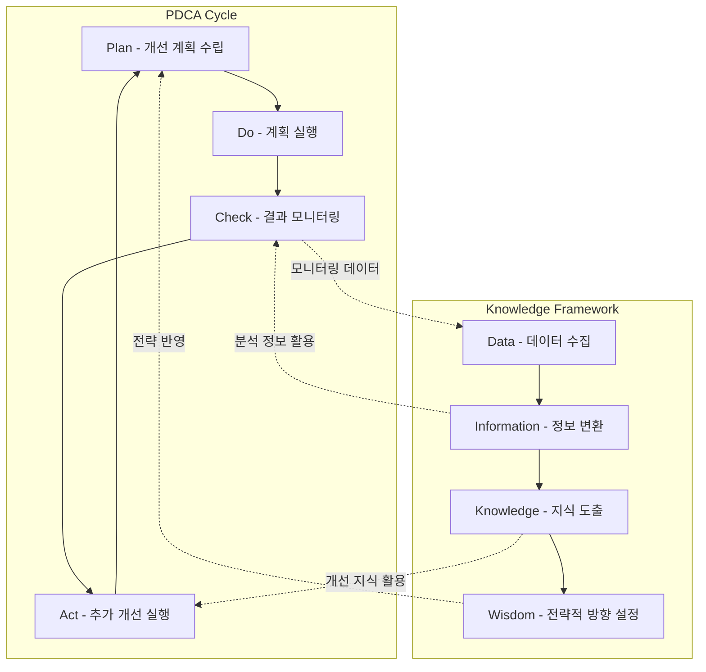

# SIP(Service Improvement Plan): IT 서비스 개선 계획

<!-- mtoc-start -->

- [SIP의 정의 및 개념](#sip의-정의-및-개념)
- [SIP의 주요 특징](#sip의-주요-특징)
- [SIP의 절차](#sip의-절차)
- [SIP의 프로세스](#sip의-프로세스)
- [SIP의 기대 효과](#sip의-기대-효과)
- [결론](#결론)
- [Keywords](#keywords)

<!-- mtoc-end -->

SIP(Service Improvement Plan)는 비즈니스 변화에 맞춰 IT 서비스의 품질과 효율성을 향상시키기 위한 체계적인 개선 계획입니다. ITIL 프레임워크를 기반으로, 서비스 라이프사이클 중심으로 수립되며, 지속적인 개선과 명확한 역할 구분을 통해 조직의 목표를 달성하는 데 기여합니다. SIP의 정의, 특징, 절차, 그리고 기대 효과를 살펴보겠습니다.

## SIP의 정의 및 개념

SIP는 IT 서비스의 현재 상태를 평가하고, 비즈니스 목표에 맞게 개선하기 위해 설계된 계획. 이는 IT 서비스 관리의 중요한 부분으로, 서비스 품질 향상과 지속 가능한 운영을 목표로 합니다.

- **라이프사이클 중심**: 서비스의 전 단계에서 개선 활동을 수행
- **역할 기반 수립**: RACI 모델(Role, Accountable, Consulted, Informed)을 활용하여 책임과 역할 명확화
- **지속적 개선**: 변화하는 요구 사항과 환경에 맞춰 지속적으로 업데이트

## SIP의 주요 특징

1. **Life-Cycle 중심**:
   - 서비스 전략, 설계, 전환, 운영, 개선의 전 과정에서 개선 활동 반영
2. **지속적 개선**:
   - PDCA(Plan-Do-Check-Act) 사이클을 활용하여 지속적으로 성과를 분석하고 개선
3. **ITIL의 RACI 모델**:
   - 개선 활동에서 각 역할의 책임과 의사소통 명확화

## SIP의 절차

SIP는 IT 서비스의 품질을 체계적으로 개선하기 위해 다음 절차를 따릅니다:

4. **PDCA 사이클 활용**:

   - **Plan**: 개선 계획 수립 및 목표 정의
   - **Do**: 계획 실행 및 변경 사항 적용
   - **Check**: 실행 결과 모니터링 및 평가
   - **Act**: 분석 결과를 바탕으로 추가 개선 활동 실행

5. **지식 체계의 활용(Wisdom -> Data -> Information -> Knowledge)**:
   - **Data**: 원시 데이터 수집 및 기록
   - **Information**: 수집된 데이터를 분석하여 유용한 정보로 변환
   - **Knowledge**: 정보를 바탕으로 서비스 개선에 필요한 지식 도출
   - **Wisdom**: 개선 활동의 전략적 방향 설정

## SIP의 프로세스

## SIP의 기대 효과

6. **서비스 품질 향상**:
   - 개선 활동을 통해 IT 서비스의 안정성과 효율성 증대
7. **비즈니스 적응력 강화**:
   - 변화하는 비즈니스 환경에 유연하게 대응
8. **책임 명확화**:
   - RACI 모델을 통해 각 단계의 책임과 역할을 명확히 정의
9. **효율적인 자원 활용**:
   - 개선 활동을 통해 리소스 최적화 및 비용 절감

## 결론

SIP는 IT 서비스의 지속적인 개선을 위해 필수적인 도구로, 조직의 목표와 비즈니스 변화에 맞춰 IT 서비스의 품질을 향상시킬 수 있습니다. PDCA 사이클과 지식 체계를 활용하여 개선 계획을 체계적으로 수립하고 실행함으로써, IT 서비스 관리의 성과를 극대화할 수 있습니다. SIP를 도입하여 조직의 경쟁력을 한 단계 높여보세요.

## Keywords

SIP, IT 서비스 개선, ITIL, PDCA, RACI 모델, 서비스 라이프사이클, 지속적 개선, IT 서비스 관리, 비즈니스 적응력, 서비스 품질 향상