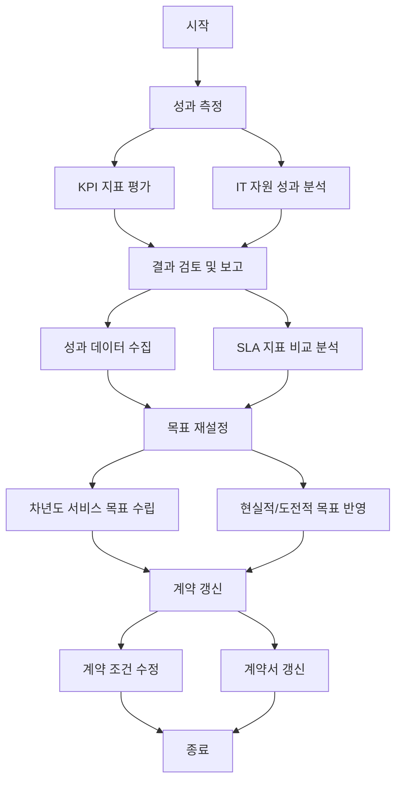

# Annual Reset: 서비스 목표 수준의 재설정

<!-- mtoc-start -->

- [Annual Reset의 정의 및 개념](#annual-reset의-정의-및-개념)
- [Annual Reset의 주요 특징](#annual-reset의-주요-특징)
- [Annual Reset의 절차](#annual-reset의-절차)
- [Annual Reset의 프로세스](#annual-reset의-프로세스)
- [Annual Reset의 기대 효과](#annual-reset의-기대-효과)
- [마무리](#마무리)
- [Keywords](#keywords)

<!-- mtoc-end -->

Annual Reset은 KPI(Key Performance Indicator) 지표 달성 결과에 따라 발주자와 계약 당사자(용역업체) 간 매년 서비스 목표 수준을 재설정하는 프로세스입니다. 이는 SLA(Service Level Agreement) 평가 지표와 성과를 기반으로 이루어지며, 하드웨어(HW), 소프트웨어(SW), 네트워크(NW) 등 다양한 IT 자원의 성과를 측정하고 관리하는 데 활용됩니다. Annual Reset의 정의, 특징, 절차, 그리고 기대 효과를 알아보겠습니다.

## Annual Reset의 정의 및 개념

Annual Reset은 IT 서비스 관리에서 KPI 성과를 평가한 뒤 다음 계약 기간의 SLA 목표를 재조정하는 프로세스. 이를 통해 서비스 품질을 유지하고, 계약 관계의 투명성과 신뢰성을 높일 수 있습니다.

- **KPI 지표 성과 기반**: 측정된 성과를 바탕으로 목표 재설정
- **SLA 평가 지표 활용**: 하드웨어, 소프트웨어, 네트워크의 성과를 포괄적으로 평가
- **연속적인 개선**: 변화하는 비즈니스 요구에 맞춘 유연한 서비스 목표 설정

## Annual Reset의 주요 특징

1. **KPI 성과 연계**:
   - 달성된 KPI 결과를 기반으로 실질적인 성과 평가
2. **SLA 중심 관리**:
   - 서비스 수준 목표를 SLA와 연계하여 관리
3. **유연성 강화**:
   - 비즈니스 변화에 따른 목표 수정 및 보완

## Annual Reset의 절차

Annual Reset 프로세스는 다음과 같은 단계로 이루어집니다:

4. **성과 측정**:

   - KPI 지표를 기반으로 IT 자원의 성과를 평가
   - HW, SW, NW 성과를 정량적으로 분석

5. **결과 검토 및 보고**:

   - 성과 데이터를 수집하고 계약 당사자 간 공유
   - SLA 지표와 비교하여 차이 분석

6. **목표 재설정**:

   - 검토 결과를 바탕으로 차년도 서비스 목표 수준 재설정
   - 현실적이고 도전적인 목표를 반영

7. **계약 갱신**:
   - 재설정된 목표에 따라 계약 조건 수정 및 갱신

## Annual Reset의 프로세스

## Annual Reset의 기대 효과

8. **서비스 품질 유지**:
   - 성과 기반 목표 설정을 통해 일관된 서비스 품질 유지
9. **투명한 계약 관리**:
   - 성과 데이터와 평가 기준을 명확히 하여 신뢰성 강화
10. **비즈니스 목표 달성 지원**:
   - KPI 달성을 통해 조직의 비즈니스 성과 향상
11. **지속적 서비스 개선**:
   - 성과 데이터를 기반으로 지속적인 개선 활동 수행

## 마무리

Annual Reset은 IT 서비스 관리에서 성과 기반의 목표 재설정을 통해 서비스 품질과 운영 효율성을 높이는 중요한 프로세스입니다. KPI 성과와 SLA 평가 지표를 활용하여 연속적인 서비스 개선과 계약 관계의 신뢰성을 강화할 수 있습니다. 조직의 IT 서비스 관리를 최적화하고 경쟁력을 확보하기 위해 Annual Reset 프로세스를 도입해 보세요.

## Keywords

Annual Reset, KPI, SLA, IT 서비스 관리, 성과 측정, HW, SW, NW, 계약 관리, 지속적 개선, 서비스 목표 재설정