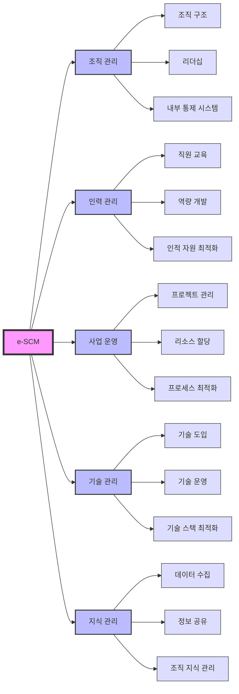

# e-SCM: ITO 역량 인증 체계

<!-- mtoc-start -->

- [e-SCM의 정의 및 개념](#e-scm의-정의-및-개념)
- [e-SCM의 구성 요소(조인사기지)](#e-scm의-구성-요소조인사기지)
- [e-SCM의 구성도](#e-scm의-구성도)
- [SLA 기반 측정(평가대상)](#sla-기반-측정평가대상)
- [e-SCM의 기대 효과](#e-scm의-기대-효과)
- [마무리](#마무리)
- [Keywords](#keywords)

<!-- mtoc-end -->

e-SCM은 ITO(Information Technology Outsourcing) 서비스 공급자의 객관적 역량 평가와 품질 수준 개선을 목표로 하는 역량 평가 모델입니다. 이는 SLA(Service Level Agreement)를 기반으로 구성 요소별 성과를 측정하여 조직 관리와 기술적 전문성을 강화합니다. e-SCM의 정의, 구성 요소, 그리고 기대 효과를 살펴보겠습니다.

## e-SCM의 정의 및 개념

e-SCM은 IT 아웃소싱 서비스의 품질과 역량을 체계적으로 평가하고 개선하기 위한 모델. 이 모델은 SLA 기반의 측정 지표를 통해 서비스 공급자의 전문성을 객관적으로 평가합니다.

- **ITO 역량 인증 체계**: ITO 서비스 제공자의 신뢰성과 역량을 검증하기 위한 표준
- **SLA 기반 측정**: 성과를 명확히 평가하고 개선 목표를 설정하기 위한 체계

## e-SCM의 구성 요소(조인사기지)

1. **조직 관리**:
   - 조직 구조와 리더십, 내부 통제 시스템 관리
2. **인력 관리**:
   - 직원 교육, 역량 개발, 인적 자원 최적화
3. **사업 운영**:
   - 프로젝트 관리, 리소스 할당, 프로세스 최적화
4. **기술 관리**:
   - 기술 도입과 운영, 기술 스택 최적화
5. **지식 관리**:
   - 데이터 수집, 정보 공유, 조직 지식의 체계적 관리

## e-SCM의 구성도

## SLA 기반 측정(평가대상)

e-SCM은 SLA 기반으로 평가 기준과 측정 방법을 설정:

6. **하드웨어(HW)**:
   - 서버, 네트워크 장비, 데이터 센터의 가용성과 성능
7. **소프트웨어(SW)**:
   - 애플리케이션 안정성, 업데이트 및 유지보수 효율성
8. **네트워크(NW)**:
   - 네트워크 대역폭, 속도, 안정성

## e-SCM의 기대 효과

9. **ITO 서비스 품질 향상**:
   - SLA 기반의 체계적 평가로 서비스 품질 강화
10. **공급자 신뢰성 확보**:
   - 객관적인 역량 평가로 파트너 신뢰도 증가
11. **비용 효율성 증대**:
   - 프로세스 최적화를 통해 비용 절감
12. **지속적 서비스 개선**:
   - 정량적 데이터 기반으로 지속적 품질 개선

## 마무리

e-SCM은 ITO 서비스 공급자의 역량을 체계적으로 평가하고, SLA를 기반으로 서비스 품질과 신뢰성을 강화하는 모델입니다. 조직 관리, 기술 관리, 지식 관리 등 다양한 구성 요소를 통해 IT 아웃소싱 서비스를 최적화할 수 있습니다. e-SCM을 도입하여 조직의 경쟁력을 강화하고, 지속 가능한 IT 서비스를 구축해 보세요.

## Keywords

e-SCM, ITO 역량 인증, SLA, IT 아웃소싱, 조직 관리, 기술 관리, 서비스 품질 개선, 하드웨어 평가, 소프트웨어 평가, 네트워크 평가