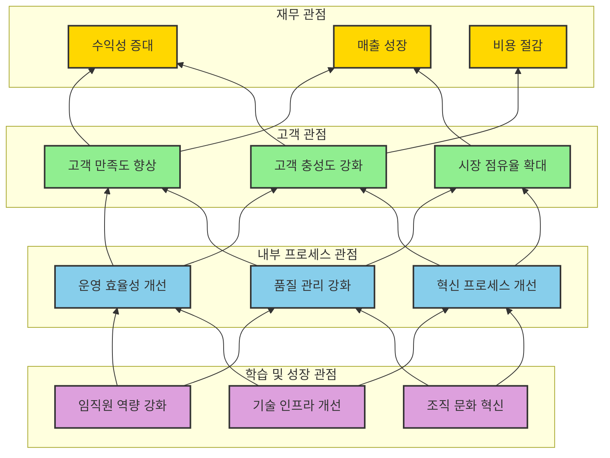

# Strategy Map: 전략의 커뮤니케이션과 실행 도구

<!-- mtoc-start -->

- [Strategy Map의 정의 및 개념](#strategy-map의-정의-및-개념)
- [Strategy Map의 목적](#strategy-map의-목적)
- [Strategy Map의 구성 요소](#strategy-map의-구성-요소)
- [Strategy Map Framework](#strategy-map-framework)
- [Strategy Map의 기대 효과](#strategy-map의-기대-효과)
- [활용 사례](#활용-사례)
- [마무리](#마무리)
- [Keywords](#keywords)

<!-- mtoc-end -->

Strategy Map은 조직의 전략적 목표를 시각적으로 표현하여 커뮤니케이션과 실행을 지원하는 도구입니다. BSC(Balanced Scorecard)의 4가지 관점에 따라 핵심 전략을 기술하고, 각 관점 간 인과 관계를 기반으로 전략을 체계적으로 표현합니다. Strategy Map의 개념, 목적, 구성 요소, 그리고 기대 효과를 알아보겠습니다.

## Strategy Map의 정의 및 개념

Strategy Map은 조직의 전략을 명확히 정의하고, 이를 실행 가능한 계획으로 전환하기 위한 프레임워크. 각 관점 간의 인과 관계를 통해 전략의 논리적 흐름을 명확히 보여줍니다.

- **BSC 기반**: 재무, 고객, 내부 프로세스, 학습 및 성장의 4가지 관점으로 전략을 표현
- **인과 관계 강조**: 각 전략 목표 간의 상호 연결성과 영향을 시각화
- **전략 실행 도구**: 전략적 목표와 실행 간의 연계를 강화

## Strategy Map의 목적

1. **커뮤니케이션**:
   - 전략을 조직 내 모든 구성원이 이해할 수 있도록 명확히 표현
2. **전략적 학습**:
   - 전략적 사고를 촉진하고 학습을 통해 조직 역량 강화
3. **가치 중심**:
   - 조직의 장기적인 가치 창출을 위한 명확한 방향 제공

## Strategy Map의 구성 요소

4. **BSC 4가지 관점**:

   - **재무(Financial)**:
     - 재무적 목표와 성과 지표(예: 매출 성장, 비용 절감)
   - **고객(Customer)**:
     - 고객 만족도, 시장 점유율 등 고객과 관련된 목표
   - **내부 프로세스(Internal Process)**:
     - 운영 효율성, 품질 개선 등 내부 운영 관련 목표
   - **학습 및 성장(Learning and Growth)**:
     - 조직 구성원의 역량 강화, 기술 개발 등 장기적 성장 목표

5. **인과 관계**:

   - 각 관점 간의 연결성을 기반으로 전략적 목표 간 상호 영향을 시각화

6. **핵심 전략**:
   - 조직의 장기적 목표를 달성하기 위한 주요 전략 기술

## Strategy Map Framework

## Strategy Map의 기대 효과

7. **전략적 정렬**:
   - 조직 내 모든 활동이 전략적 목표에 부합하도록 정렬
8. **성과 개선**:
   - 인과 관계 분석을 통해 효율적 자원 배분과 성과 극대화
9. **조직 역량 강화**:
   - 전략적 학습을 통해 구성원의 역량 및 이해도 증대
10. **가치 창출**:
   - 고객 및 재무적 관점에서 조직의 가치를 지속적으로 향상

## 활용 사례

11. **기업의 전략적 목표 시각화**:
   - 대기업에서 다양한 부서의 전략적 목표를 시각적으로 통합하여 조직 간 협업 강화
12. **공공 기관의 성과 관리**:
   - 공공 부문에서 정책 목표와 실행 계획을 연결하여 성과 관리 강화
13. **중소기업의 성장 전략 개발**:
   - 성장 초기의 중소기업이 재무와 고객 중심의 전략을 효과적으로 설계

## 마무리

Strategy Map은 조직의 전략을 명확히 정의하고, 이를 실행 가능한 계획으로 전환하는 데 필수적인 도구입니다. BSC의 4가지 관점을 기반으로 전략적 목표를 시각화하고, 각 관점 간의 인과 관계를 명확히 하여 조직의 가치를 극대화할 수 있습니다. Strategy Map을 통해 조직의 커뮤니케이션과 전략 실행 역량을 강화해 보세요.

## Keywords

Strategy Map, BSC, 전략 실행, 커뮤니케이션 도구, 인과 관계, 가치 중심, 성과 관리, 조직 역량 강화, 전략적 학습