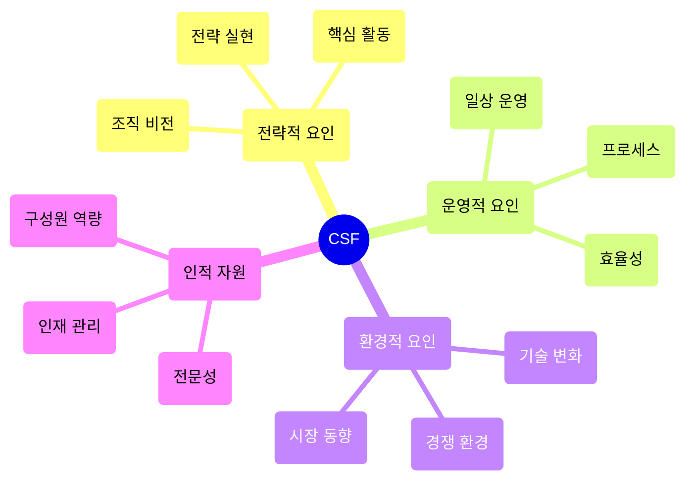

# CSF(Critical Success Factor): 성공을 좌우하는 핵심 요소

<!-- mtoc-start -->

- [CSF의 정의 및 개념](#csf의-정의-및-개념)
- [CSF의 특징](#csf의-특징)
- [CSF의 구성 요소](#csf의-구성-요소)
- [CSF의 구성도](#csf의-구성도)
- [CSF의 기대 효과](#csf의-기대-효과)
- [활용 사례](#활용-사례)
- [마무리](#마무리)
- [Keywords](#keywords)

<!-- mtoc-end -->

CSF(Critical Success Factor)는 조직이 목표를 달성하는 데 중요한 영향을 미치는 핵심 요소입니다. 내부적, 외부적 특성을 모두 포함하며, 조직의 성과를 결정짓는 주요 요인으로 작용합니다. CSF의 개념, 특징, 구성 요소, 그리고 기대 효과를 살펴보겠습니다.

## CSF의 정의 및 개념

CSF는 조직의 성공을 보장하기 위해 반드시 충족해야 하는 주요 성공 요인. 이는 조직의 비전과 전략 목표를 실현하는 데 필요한 핵심적인 활동과 자원을 포함합니다.

- **내적 특성**: 조직 내부의 프로세스, 인력, 자원
- **외적 특성**: 시장 변화, 경쟁 환경, 규제 요건

## CSF의 특징

1. **조직의 목표와 연계**:
   - 조직의 전략적 목표와 직접적으로 연결된 요소
2. **성공을 위한 필수 조건**:
   - CSF를 충족하지 못하면 목표 달성이 어려움
3. **정량적 및 정성적 평가 가능**:
   - 정량적 지표와 정성적 분석을 통해 측정

## CSF의 구성 요소

4. **전략적 요인**:
   - 조직의 비전과 전략 실현을 위한 핵심 활동
5. **운영적 요인**:
   - 일상적인 운영 효율성을 높이기 위한 요소
6. **환경적 요인**:
   - 경쟁 환경, 시장 동향, 기술 변화 등 외부 요인
7. **인적 자원**:
   - 조직 구성원의 역량과 전문성

## CSF의 구성도

## CSF의 기대 효과

8. **목표 달성 지원**:
   - 핵심 성공 요인을 충족함으로써 조직의 목표 달성 가능성 증대
9. **자원 집중**:
   - 제한된 자원을 가장 중요한 영역에 집중 투자
10. **조직 성과 향상**:
   - 성공 요소를 체계적으로 관리하여 전반적인 성과 향상
11. **리스크 감소**:
   - 주요 위험 요소를 사전에 식별하고 대응

## 활용 사례

12. **프로젝트 관리**:
   - 대규모 IT 프로젝트에서 성공적인 구현을 위한 핵심 요인 정의 및 관리
13. **비즈니스 전략**:
   - 신제품 출시 시 시장 점유율 확보를 위한 주요 요인 분석
14. **성과 평가**:
   - 조직 목표와 연계된 CSF를 기반으로 성과 측정 및 개선

## 마무리

CSF는 조직의 목표 달성과 성공적인 운영을 위해 반드시 충족해야 하는 핵심 요소입니다. 이를 명확히 정의하고 관리하면 조직의 전략적 목표를 효과적으로 실현할 수 있습니다. CSF를 활용하여 조직의 성과를 극대화하고 경쟁력을 강화해 보세요.

## Keywords

CSF, Critical Success Factor, 핵심 성공 요인, 조직 성과, 전략적 목표, 비즈니스 성과, 리스크 관리, 자원 집중, 성과 평가, 운영 효율성