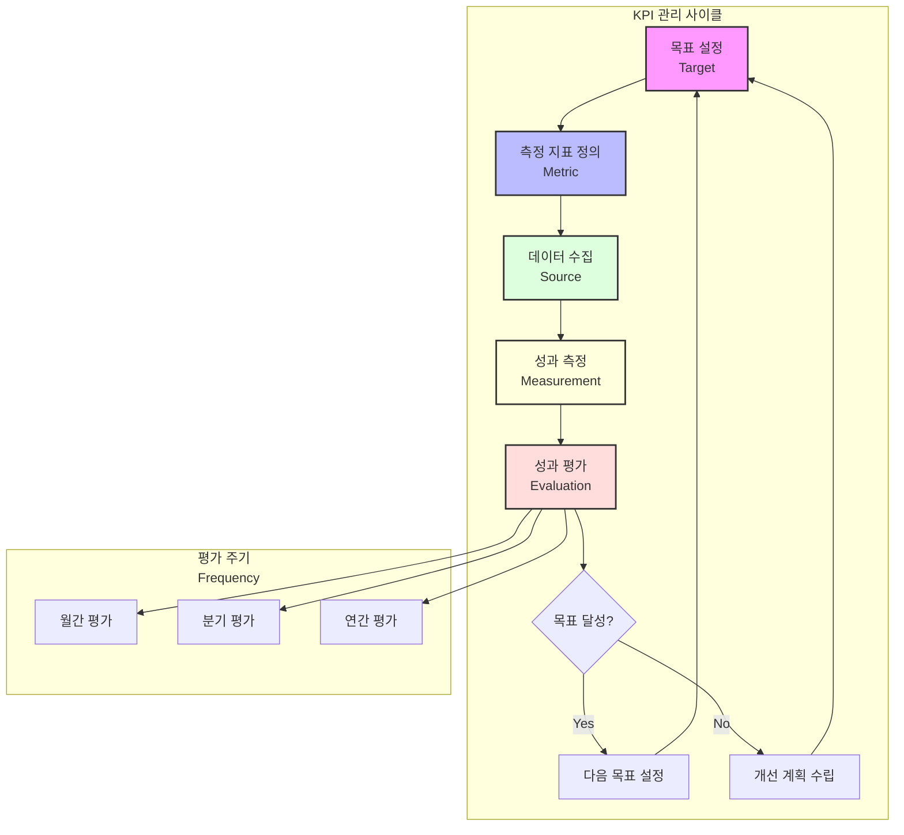

# KPI(Key Performance Indicators): 조직 성과를 계량화하는 핵심 지표

<!-- mtoc-start -->

- [KPI의 정의 및 개념](#kpi의-정의-및-개념)
- [KPI의 특징](#kpi의-특징)
- [KPI의 구성 요소](#kpi의-구성-요소)
- [KPI 관리 메카니즘](#kpi-관리-메카니즘)
- [KPI의 기대 효과](#kpi의-기대-효과)
- [활용 사례](#활용-사례)
- [마무리](#마무리)
- [Keywords](#keywords)

<!-- mtoc-end -->

KPI(Key Performance Indicators)는 조직이 목표를 얼마나 효과적으로 달성하고 있는지 평가하기 위해 사용되는 핵심 성과 지표입니다. KPI는 구체적이고 계량 가능한 방식으로 조직의 전략적 목표를 측정하며, 성과 개선과 목표 달성을 지원하는 중요한 도구입니다. KPI의 정의, 특징, 구성 요소, 그리고 기대 효과를 알아보겠습니다.

## KPI의 정의 및 개념

KPI는 조직의 전략적 목표를 달성하기 위해 중요한 성과를 측정하는 지표. KPI는 조직의 성과를 데이터로 표현하며, 이를 통해 의사결정과 성과 관리를 효과적으로 지원합니다.

- **정량적 측정**: 성과를 객관적으로 평가하기 위한 계량적 기준
- **목표 달성 지표**: 조직의 목표와 직접적으로 연계된 성과 측정

## KPI의 특징

1. **구체성과 명확성**:
   - 측정 가능한 구체적 지표로 구성
2. **목표와의 연계성**:
   - 조직의 전략적 목표와 직접적으로 연결
3. **성과 측정 및 개선**:
   - 현재 상태를 평가하고, 지속적인 개선을 위한 데이터 제공

## KPI의 구성 요소

4. **목표(Target)**:
   - 달성하고자 하는 구체적인 성과 목표
5. **측정 지표(Metric)**:
   - 목표 달성 정도를 평가하는 기준
6. **데이터 원천(Source)**:
   - KPI를 측정하기 위해 필요한 데이터의 출처
7. **평가 주기(Frequency)**:
   - 성과를 평가하는 주기(예: 월간, 분기별, 연간)

## KPI 관리 메카니즘

- 순환적 프로세스: 목표 설정부터 평가까지의 순환적인 관리 과정
- 의사결정 포인트: 목표 달성 여부에 따른 다음 단계 결정
- 평가 주기: 월간, 분기, 연간 등 다양한 시간 단위의 평가 체계
- 피드백 루프: 평가 결과가 다시 목표 설정으로 이어지는 구조

## KPI의 기대 효과

8. **성과 개선**:
   - 실시간 데이터를 통해 성과를 지속적으로 분석하고 개선
9. **의사결정 지원**:
   - 데이터 기반의 명확한 의사결정 가능
10. **목표 정렬**:
   - 조직 내 모든 활동이 전략적 목표와 일치하도록 조정
11. **책임성 강화**:
   - 명확한 지표를 통해 구성원의 책임감을 높임

## 활용 사례

12. **비즈니스 성장 평가**:
   - 매출 성장률, 고객 유지율, 신규 고객 획득 등
13. **프로세스 효율성 측정**:
   - 생산성, 처리 시간, 비용 절감 효과 등
14. **고객 만족도 분석**:
   - 고객 피드백 점수, 반복 구매율, 순추천지수(NPS) 등

## 마무리

KPI는 조직의 성과를 정량적으로 평가하고, 목표 달성을 효과적으로 지원하는 필수 도구입니다. 이를 명확히 정의하고 관리하면 조직의 전략적 목표와 일치된 성과를 실현할 수 있습니다. KPI를 적극적으로 활용하여 조직의 경쟁력을 강화하고 성과를 극대화해 보세요.

## Keywords

KPI, 성과 지표, 조직 목표, 성과 평가, 데이터 기반 의사결정, 비즈니스 성과, 목표 관리, 전략적 지표, 프로세스 효율성, 고객 만족도