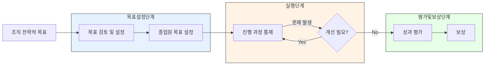

# MBO(Management By Objective): 목표에 기반한 관리 기법

<!-- mtoc-start -->

- [MBO의 정의 및 개념](#mbo의-정의-및-개념)
- [MBO의 주요 특징](#mbo의-주요-특징)
- [MBO의 절차](#mbo의-절차)
- [MBO의 관리 프로세스](#mbo의-관리-프로세스)
- [MBO의 기대 효과](#mbo의-기대-효과)
- [활용 사례](#활용-사례)
- [마무리](#마무리)
- [Keywords](#keywords)

<!-- mtoc-end -->

MBO(Management By Objective)는 상사와 부하 직원 간의 합의를 통해 설정된 목표를 기반으로 조직의 성과를 관리하고 평가하는 기법입니다. MBO는 특정 시점에서 목표를 설정하고 실행 계획을 수립하며, 공동의 노력을 통해 조직 전체의 목표 달성을 지원합니다. MBO의 정의, 특징, 절차, 그리고 기대 효과를 살펴보겠습니다.

## MBO의 정의 및 개념

MBO는 조직의 성과를 측정하고 관리하기 위한 도구로, 목표 중심의 접근 방식을 활용한 성과 관리 기법. 이는 조직의 전략적 목표를 개별 목표와 연계하여 실행 가능하게 만드는 체계적인 관리 기법입니다.

- **성과 평가 도구**: IT 및 기타 조직의 성과를 평가하는 데 효과적
- **목표 중심 관리**: 모든 활동을 명확한 목표와 연계
- **공동의 노력**: 상사와 직원 간 협력을 통해 목표 달성

## MBO의 주요 특징

1. **합의 기반 목표 설정**:
   - 상사와 부하 직원 간 목표를 명확히 합의
2. **실행 계획의 구체성**:
   - 실행 가능한 계획을 수립하고 진행 상황을 점검
3. **성과 중심 접근**:
   - 결과와 성과를 중심으로 평가

## MBO의 절차

4. **목표 검토 및 설정**:

   - 조직의 전략적 목표를 바탕으로 부서 및 개인 목표 설정
   - 상사와 직원 간 합의를 통해 구체적 목표 정의

5. **종업원 목표 설정**:

   - 개별 직원의 역할과 책임에 따라 명확한 목표 수립

6. **진행 과정 통제(지도 및 점검)**:

   - 목표 실행 중 발생하는 문제를 점검하고 필요한 지침 제공

7. **성과 평가**:

   - 설정된 목표 대비 성과를 평가하여 객관적 결과 도출

8. **보상**:
   - 성과 결과에 따라 적절한 보상 제공

## MBO의 관리 프로세스

## MBO의 기대 효과

9. **조직 성과 향상**:
   - 목표 중심의 관리로 조직 전체의 생산성과 효율성 증대
10. **직원 참여 강화**:
   - 직원들이 목표 설정과 달성에 적극적으로 참여
11. **명확한 책임과 권한**:
   - 각 직원의 역할과 목표를 명확히 정의
12. **성과 기반 보상**:
   - 성과와 보상의 연계를 통해 동기 부여

## 활용 사례

13. **IT 프로젝트 관리**:
   - 프로젝트의 구체적 목표 설정과 성과 평가를 통해 성공적인 프로젝트 완료
14. **기업의 전략적 목표 달성**:
   - 기업 전체의 전략 목표를 부서와 개인의 목표로 세분화하여 관리
15. **성과 중심 조직 구축**:
   - 성과를 명확히 평가하고 이에 따른 보상 체계를 구축

## 마무리

MBO는 목표 중심의 관리 기법으로, 조직의 성과를 체계적으로 평가하고 관리하는 데 효과적인 도구입니다. 상사와 부하 직원 간의 협력을 통해 명확한 목표를 설정하고, 이를 실행 가능하게 만드는 MBO는 조직의 경쟁력을 강화하고 성과를 극대화할 수 있습니다. MBO를 적극 활용하여 조직의 목표를 체계적으로 달성해 보세요.

## Keywords

MBO, Management By Objective, 목표 관리, 성과 평가, IT 성과 관리, 조직 성과, 목표 설정, 실행 계획, 성과 기반 보상, 조직 효율성