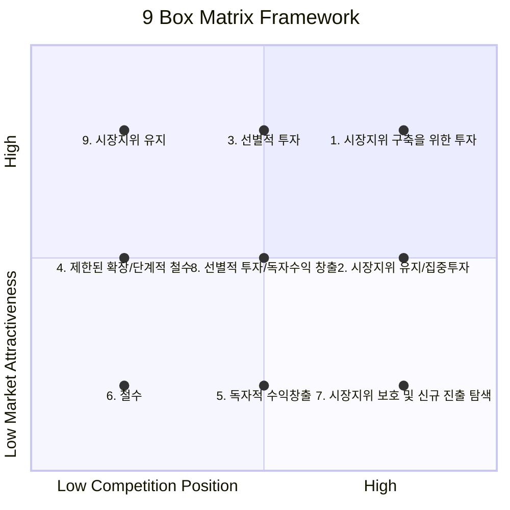

# 9-Box Matrix: 비즈니스 포트폴리오 관리의 핵심 도구

<!-- mtoc-start -->

- [9-Box Matrix의 정의 및 개념](#9-box-matrix의-정의-및-개념)
- [9-Box Matrix의 구성](#9-box-matrix의-구성)
  - [9단계 전략](#9단계-전략)
- [9-Box Matrix Strategy Planning](#9-box-matrix-strategy-planning)
- [9-Box Matrix의 기대 효과](#9-box-matrix의-기대-효과)
- [활용 사례](#활용-사례)
- [마무리](#마무리)
- [Keywords](#keywords)

<!-- mtoc-end -->

9-Box Matrix는 비즈니스 포트폴리오 분석을 위해 McKinsey에서 개발된 전략적 도구로, GE 매트릭스 또는 GE 사업 스크린으로도 알려져 있습니다. 이 모델은 기업의 전략적 사업 단위(SBU: Strategic Business Unit)에 대한 투자 우선순위를 평가하고 결정하는 데 사용됩니다. 9-Box Matrix의 정의, 구성, 9단계 전략, 그리고 기대 효과를 살펴보겠습니다.

## 9-Box Matrix의 정의 및 개념

9-Box Matrix는 기업의 다양한 사업 단위를 시장 매력도와 경쟁력이라는 두 가지 축으로 분석하여 각 단위의 투자 전략을 수립하는 프레임워크. 이를 통해 기업은 자원을 최적화하고 장기적인 성장을 도모할 수 있습니다.

- **시장 매력도**: 시장 성장률, 규모, 진입 장벽 등의 요소를 평가
- **경쟁력**: 사업 단위의 시장 지위, 기술력, 브랜드 파워 등을 평가

## 9-Box Matrix의 구성

9-Box Matrix는 시장 매력도(높음, 중간, 낮음)와 경쟁력(강함, 중간, 약함)의 조합으로 총 9개의 박스로 구성. 각 박스는 특정 전략적 방향.

### 9단계 전략

1. **시장지위 구축을 위한 투자**:
   - 높은 시장 매력도와 강한 경쟁력을 가진 사업 단위에 집중 투자
2. **시장지위 유지 및 집중 투자**:
   - 시장 매력도는 낮지만 경쟁력이 강한 사업에 안정적 투자를 지속
3. **선별적 투자**:
   - 중간 수준의 시장 매력도와 경쟁력을 가진 사업에 제한적 투자
4. **제한된 확장/단계적 철수**:
   - 경쟁력과 시장 매력도가 낮은 사업 단위를 점진적으로 철수
5. **독자적 수익 창출**:
   - 시장 매력도는 낮지만 수익성을 가진 사업에 최소한의 투자 유지
6. **철수**:
   - 시장 매력도와 경쟁력이 모두 낮은 사업 단위에서 철수
7. **시장지위 보호 및 신규 진출 탐색**:
   - 중간 시장 매력도와 강한 경쟁력을 가진 사업에서 신규 시장 기회를 모색
8. **선별적 투자/독자적 수익 창출**:
   - 중간 수준의 경쟁력을 가진 사업 단위에서 선택적 투자
9. **시장지위 유지**:
   - 경쟁력과 시장 매력도가 중간인 사업에서 안정적 관리

## 9-Box Matrix Strategy Planning

- X축: 경쟁 지위(Competition Position), 왼쪽에서 오른쪽으로 갈수록 경쟁력이 강해집니다.
- Y축: 시장 매력도(Market Attractiveness), 아래에서 위로 갈수록 시장 매력도가 높아집니다.
- 각 점은 9가지 전략적 포지션을 나타내며, 위치에 따라 적절한 전략적 대응 선택.

**매트릭스의 위치에 따른 주요 특징**:

- 우상단(1번): 가장 이상적인 투자 영역으로, 높은 시장 매력도와 강한 경쟁력을 보유
- 중앙(3번): 균형잡힌 선별적 투자가 필요한 영역
- 좌하단(6번): 가장 열악한 위치로, 철수를 고려해야 하는 영역

## 9-Box Matrix의 기대 효과

10. **효율적 자원 배분**:
   - 투자 우선순위를 명확히 하여 자원의 효율적 배분 가능
11. **사업 포트폴리오 최적화**:
   - 강점이 있는 사업에 집중하여 장기적 성장 도모
12. **리스크 관리**:
   - 경쟁력과 시장 매력도를 분석하여 리스크를 사전에 식별 및 관리
13. **전략적 의사결정 지원**:
   - 사업 단위별 명확한 전략 방향 설정으로 의사결정 효율화

## 활용 사례

14. **다국적 기업의 사업 포트폴리오 관리**:
   - 다양한 국가와 산업에 분산된 사업 단위를 체계적으로 분석
15. **스타트업의 성장 전략**:
   - 초기 시장 분석과 투자 우선순위 설정에 활용
16. **제조업체의 제품 라인 관리**:
   - 제품별 시장 매력도와 경쟁력을 평가하여 제품 개발 및 철수 전략 수립

## 마무리

9-Box Matrix는 기업의 전략적 사업 단위(SBU)를 효과적으로 관리하고, 장기적인 성장을 위한 투자 전략을 수립하는 데 강력한 도구입니다. 시장 매력도와 경쟁력을 기준으로 명확한 의사결정을 지원하며, 리스크를 최소화하고 자원을 최적화할 수 있습니다. 이 매트릭스를 활용하여 기업의 사업 포트폴리오를 체계적으로 관리하고 성공적인 비즈니스 전략을 실행해 보세요.

## Keywords

9-Box Matrix, 비즈니스 포트폴리오, 전략적 사업 단위, GE 매트릭스, McKinsey, 시장 매력도, 경쟁력, 투자 전략, 리스크 관리, 자원 배분