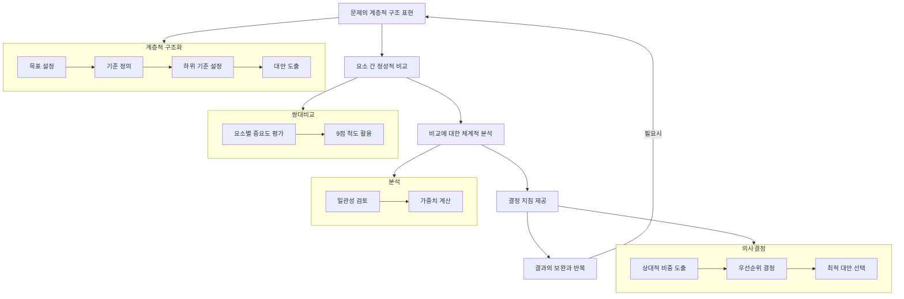

# AHP(Analytic Hierarchy Process): 계층적 문제해결 분석 방법

<!-- mtoc-start -->

- [AHP의 정의 및 개념](#ahp의-정의-및-개념)
- [AHP의 특징](#ahp의-특징)
- [AHP의 응용 절차](#ahp의-응용-절차)
- [AHP 응용 절차 흐름도](#ahp-응용-절차-흐름도)
- [AHP의 기대 효과](#ahp의-기대-효과)
- [활용 사례](#활용-사례)
- [마무리](#마무리)
- [Keywords](#keywords)

<!-- mtoc-end -->

AHP(Analytic Hierarchy Process)는 복잡한 문제를 체계적이고 계층적으로 분석하여 최상의 결정을 도출하기 위한 문제해결 기법입니다. AHP는 문제의 속성을 계층적으로 규명하고, 정성적 비교를 통해 요소 간의 상대적 비중을 평가함으로써 문제 해결의 우선순위를 명확히 설정할 수 있습니다. AHP의 정의, 특징, 응용 절차, 그리고 기대 효과를 살펴보겠습니다.

## AHP의 정의 및 개념

AHP는 계층적 구조를 기반으로 문제를 체계적으로 분석하고 해결하기 위한 기법. 이 방법은 정성적 비교와 체계적 분석을 통해 복잡한 문제를 단순화하고, 최적의 대안을 선정합니다.

- **계층적 구조**: 문제를 다양한 수준으로 분류하여 시각적으로 표현
- **정성적 비교**: 요소 간 중요도를 상대적으로 평가
- **체계적 분석**: 정량적 데이터와 정성적 판단을 결합하여 결정 지원

## AHP의 특징

1. **계층적 문제 표현**:
   - 문제를 목표, 기준, 대안으로 계층화하여 분석
2. **상대적 비중 평가**:
   - 요소 간 중요도를 정량적으로 계산
3. **결정 지침 제공**:
   - 요소의 상대적 비중과 문제 해결 우선순위를 도출

## AHP의 응용 절차

AHP는 문제를 체계적으로 분석하기 위해 다음과 같은 절차를 따릅니다:

4. **문제의 계층적 구조 표현**:
   - 문제를 목표, 기준, 하위 기준, 대안으로 나누어 계층적으로 정리
5. **요소 간 정성적 비교**:
   - 각 계층의 요소를 쌍대 비교하여 중요도를 평가
6. **비교에 대한 체계적 분석**:
   - 쌍대 비교 행렬을 기반으로 일관성을 검토하고 가중치를 계산
7. **결정 지침 제공**:
   - 요소 간 상대적 비중과 우선순위를 도출하여 최적의 대안 선택
8. **결과의 보완과 반복**:
   - 초기 결과를 검토하고 필요한 경우 문제 구조와 비교 데이터를 수정

## AHP 응용 절차 흐름도

## AHP의 기대 효과

9. **문제 해결의 명확화**:
   - 문제의 속성을 체계적으로 분석하여 복잡성을 감소
10. **의사결정 지원**:
   - 정량적 데이터와 정성적 판단을 결합하여 최적의 결정을 지원
11. **효율성 증대**:
   - 문제 해결 과정에서 시간과 자원의 효율적 활용
12. **우선순위 설정**:
   - 요소 간 상대적 비중을 평가하여 전략적 우선순위 도출

## 활용 사례

13. **비즈니스 전략 수립**:
   - 기업의 시장 진입 전략 결정 시 다양한 대안을 평가
14. **IT 프로젝트 관리**:
   - IT 프로젝트의 기술적 대안과 자원 배분 우선순위 선정
15. **공공 정책 개발**:
   - 공공 부문에서 정책 대안 평가와 최적화

## 마무리

AHP는 계층적 구조와 정성적 비교를 통해 복잡한 문제를 체계적으로 해결하는 강력한 도구입니다. 이를 활용하면 조직의 의사결정을 명확히 하고, 전략적 목표를 달성하는 데 큰 도움을 줄 수 있습니다. AHP를 적극적으로 활용하여 최상의 대안을 도출하고 조직의 성과를 극대화하세요.

## Keywords

AHP, Analytic Hierarchy Process, 문제 해결, 계층적 분석, 정성적 비교, 의사결정 지원, 우선순위 설정, 전략적 대안, 효율적 문제 해결, 체계적 분석