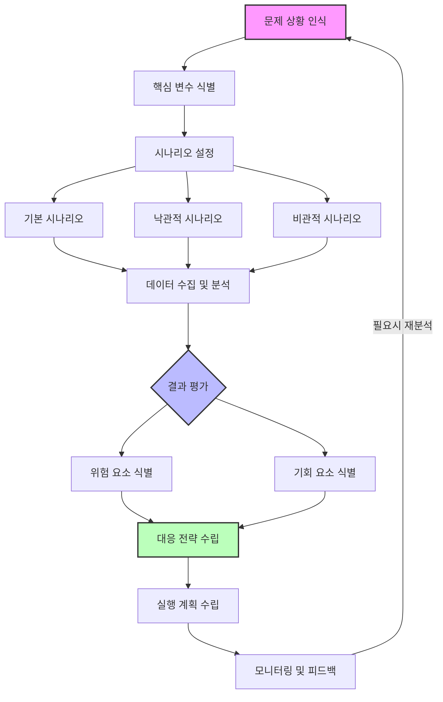

# What-if Analysis: 문제해결 분석기법

<!-- mtoc-start -->

- [What-if Analysis의 정의 및 개념](#what-if-analysis의-정의-및-개념)
- [주요 특징 또는 구성 요소](#주요-특징-또는-구성-요소)
- [What-if 분석 프로세스](#what-if-분석-프로세스)
- [활용 사례](#활용-사례)
- [기대 효과 및 필요성](#기대-효과-및-필요성)
- [마무리](#마무리)
- [Keywords](#keywords)

<!-- mtoc-end -->

What-if Analysis는 다양한 문제 해결을 위한 중요한 분석 기법으로, 제품의 생산 및 사용 과정에서 발생할 수 있는 사건이나 상황을 가정하고, 그로 인해 초래될 수 있는 위험을 평가하며, 이를 기반으로 개선 대안을 모색하는 데 사용됩니다. 본 포스트에서는 What-if Analysis의 정의, 주요 구성 요소, 활용 사례, 그리고 기대 효과에 대해 알아보겠습니다.

## What-if Analysis의 정의 및 개념

What-if Analysis는 "무엇이 발생한다면?"이라는 질문을 중심으로 다양한 가정 상황을 설정하고, 이에 따라 발생할 수 있는 결과를 분석하는 기법. 이 분석은 주로 위험 관리와 의사결정 과정에서 활용되며, 다양한 시나리오를 고려하여 최적의 대응 방안을 도출할 수 있도록 돕습니다.

- **가정 설정**: 특정 상황이나 사건의 발생 가능성을 가정
- **결과 분석**: 각 가정이 초래할 수 있는 결과를 평가
- **개선 대안 도출**: 가정된 상황을 예방하거나 완화할 수 있는 대안 제시

## 주요 특징 또는 구성 요소

1. **시나리오 기반 접근**

   - 다양한 가정된 상황을 설정하여 잠재적 위험을 다각도로 분석

2. **리스크 평가**

   - 각 시나리오에서 발생 가능한 위험의 심각성과 발생 가능성을 평가

3. **대응 전략 개발**

   - 각 시나리오에 따른 최적의 대응 방안을 설계

4. **의사결정 지원**

   - 분석 결과를 바탕으로 경영진과 팀이 효과적인 의사결정을 내릴 수 있도록 지원

5. **사후 검토**
   - 실제 상황에서 분석 결과의 적합성과 효과성을 평가하여 프로세스를 개선

## What-if 분석 프로세스

## 활용 사례

6. **제조업에서의 생산 공정 분석**

   - 기계 고장이나 품질 문제와 같은 상황을 가정하여 잠재적 영향을 사전에 식별

7. **IT 시스템에서의 장애 대응 계획**

   - 서버 다운타임, 보안 침해와 같은 상황을 가정하고 복구 계획 수립

8. **프로젝트 관리에서의 리스크 관리**

   - 일정 지연, 자원 부족 등 다양한 시나리오를 평가하여 프로젝트 실패를 방지

9. **재무 분석 및 투자 전략 수립**
   - 시장 변화, 경제 불황 등 가정된 상황에 따라 투자 전략을 조정

## 기대 효과 및 필요성

10. **리스크 감소**

   - 예상치 못한 사건으로 인한 손실을 예방

11. **효율적인 자원 배분**

   - 잠재적 위험을 사전에 파악하여 자원을 효과적으로 할당

12. **의사결정 품질 향상**

   - 데이터 기반의 신뢰성 있는 분석 결과 제공

13. **조직의 민첩성 증대**
   - 다양한 상황에 대한 대비책 마련으로 신속한 대응 가능

## 마무리

What-if Analysis는 복잡한 환경에서 효과적인 문제 해결과 의사결정을 지원하는 강력한 도구입니다. 다양한 가정된 상황을 분석함으로써 잠재적인 위험을 사전에 식별하고 대응 방안을 설계할 수 있습니다. 이를 통해 조직은 리스크를 최소화하고, 자원을 최적화하며, 경쟁력을 강화할 수 있습니다. What-if Analysis를 도입하여 더 나은 의사결정을 내리고 조직의 성공 가능성을 높여보세요.

## Keywords

What-if Analysis, 문제해결 기법, 리스크 평가, 시나리오 분석, 위험 관리, 의사결정 지원, 개선 대안, 생산 공정 분석, IT 장애 대응, 프로젝트 리스크 관리