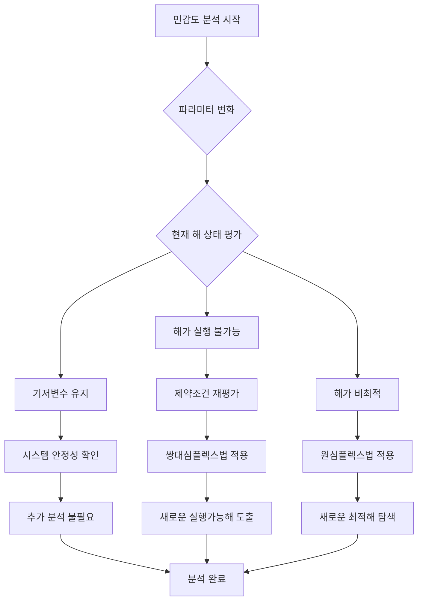

# 민감도 분석 (Sensitivity Analysis): 의사결정 지원을 위한 핵심 도구

<!-- mtoc-start -->

- [민감도 분석의 정의 및 개념](#민감도-분석의-정의-및-개념)
- [민감도 분석 과정](#민감도-분석-과정)
- [민감도 분석 프로세스](#민감도-분석-프로세스)
- [주요 특징](#주요-특징)
- [활용 사례](#활용-사례)
- [기대 효과](#기대-효과)
- [마무리](#마무리)
- [Keywords](#keywords)

<!-- mtoc-end -->

민감도 분석(Sensitivity Analysis)은 선형계획모형의 한계점을 보완하기 위한 중요한 수단으로, 초기 상황에 변화가 생길 경우 최적 해가 어떻게 달라지는지를 파악하는 데 사용됩니다. 이 분석은 변화의 영향을 평가하여 최적의 결정을 내리는 데 필요한 정보를 제공합니다. 민감도 분석의 정의, 주요 과정, 활용 사례, 그리고 기대 효과를 살펴보겠습니다.

## 민감도 분석의 정의 및 개념

민감도 분석은 선형계획 문제에서 입력 변수(예: 자원 가용성, 비용 등)의 변화가 결과에 미치는 영향을 평가하는 기법. 이를 통해 변화에 대한 시스템의 민감성을 이해하고, 상황 변화에 따른 대응 방안을 설계할 수 있습니다.

- **입력 변수 변화 평가**: 변수의 변화가 최적 해 및 모델의 실행 가능성에 미치는 영향을 분석
- **대안 도출**: 변화된 상황에서 최적의 해를 유지하거나 개선하기 위한 대안을 제시

## 민감도 분석 과정

1. **현재의 기저변수가 바뀌지 않는다.**

   - 변수 변화에도 불구하고 최적 해와 모델의 기저 구조가 유지됨
   - 시스템의 안정성을 유지하며 추가적인 분석 필요 없음

2. **현재의 해가 실행 불가능해진다.**

   - 변화로 인해 제약 조건이 충족되지 않을 경우 발생
   - **대응 방법**:
     - 제약 조건을 다시 평가하여 실행 가능성을 회복
     - **쌍대심플렉스법(Dual Simplex Method)**을 사용해 모델을 재구성

3. **현재의 해가 비최적이 된다.**
   - 변수 변화로 인해 기존 해가 더 이상 최적이 아니게 되는 상황
   - **대응 방법**:
     - 새로운 최적 해를 탐색하기 위해 **원심플렉스법(Primal Simplex Method)**을 적용
     - 최적화 알고리즘을 통해 대안을 제시

## 민감도 분석 프로세스

## 주요 특징

4. **변화의 영향 평가**

   - 입력 변수 변화가 최적 해에 미치는 영향을 정량적으로 평가
   - 변화의 민감도를 시각적으로 표현하여 결과를 명확히 전달

5. **모델 안정성 검토**

   - 모델이 입력 변화에 얼마나 민감한지 확인하여 안정성을 평가
   - 민감도가 높은 변수에 대한 우선순위를 설정

6. **의사결정 지원**

   - 다양한 시나리오를 고려하여 최적의 의사결정을 지원
   - 의사결정 과정에서 발생할 수 있는 리스크를 최소화

7. **최적화 보완 기법**
   - 선형계획법의 한계를 보완하여 현실적이고 유연한 계획 수립 가능
   - 복잡한 환경에서 다양한 변수를 동시에 고려

## 활용 사례

8. **자원 배분 문제**

   - 자원 가용성 변화가 최적 해에 미치는 영향을 분석
   - 생산 공정에서 자원 부족 또는 초과 상황을 고려한 대응 방안 수립

9. **비용 최적화**

   - 생산 비용 변화 시 최적의 생산 계획 유지 방안 도출
   - 비용이 높은 요소를 대체하거나 제거할 수 있는 대안 모색

10. **물류 및 공급망 관리**

   - 공급 제한이나 운송 비용 변화가 물류 계획에 미치는 영향을 평가
   - 새로운 공급망 경로나 대체 운송 방법을 검토

11. **재무 분석**
   - 투자 수익률 변동 시 포트폴리오의 최적 구성을 유지하거나 변경
   - 경제 상황 변화에 따른 재무 전략 재평가

## 기대 효과

12. **리스크 관리 강화**

   - 예상치 못한 변화에도 실행 가능성과 최적 해를 유지하여 손실을 최소화
   - 변화된 환경에 민첩하게 대응

13. **의사결정 품질 향상**

   - 데이터 기반의 분석을 통해 신뢰성 높은 의사결정을 지원
   - 명확한 기준을 통해 경영진의 신속한 판단 가능

14. **효율적 자원 활용**

   - 민감도 분석 결과를 통해 자원의 효율적 배분 가능
   - 제한된 자원을 우선순위에 따라 최적화

15. **비용 절감**
   - 변화된 상황에 최적 해를 신속히 도출하여 불필요한 비용 절감
   - 중복되거나 비효율적인 프로세스 제거

## 마무리

민감도 분석은 선형계획모형의 한계를 보완하고 변화에 대한 대응력을 강화하는 데 필수적인 도구입니다. 이를 통해 조직은 다양한 시나리오에서 최적의 해를 유지하고, 리스크를 관리하며, 효율적인 의사결정을 내릴 수 있습니다. 민감도 분석을 활용하여 변화에 대비하고 조직의 경쟁력을 강화해보세요.

## Keywords

민감도 분석, Sensitivity Analysis, 선형계획법, 쌍대심플렉스법, 원심플렉스법, 리스크 관리, 최적화 기법, 자원 배분, 비용 최적화, 의사결정 지원