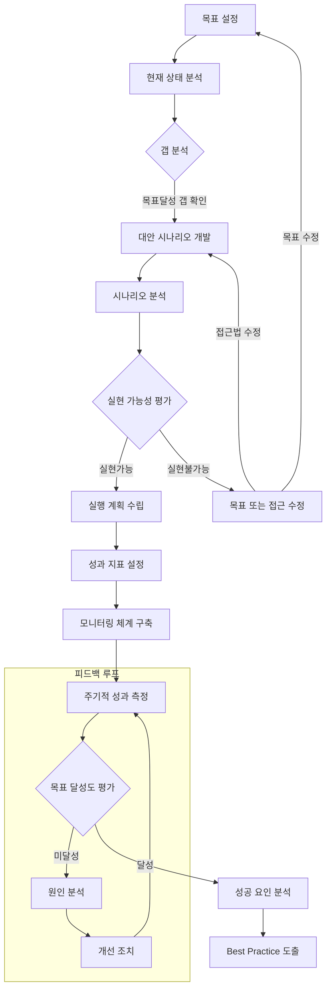

# 목표 탐색 분석 (Goal-Seeking Analysis): 기대 산출 목표 달성을 위한 효과적인 접근법

<!-- mtoc-start -->

- [목표 탐색 분석의 정의 및 개념](#목표-탐색-분석의-정의-및-개념)
- [의사결정지원시스템(DSS)의 3가지 정량적 모델](#의사결정지원시스템dss의-3가지-정량적-모델)
- [목표 탐색 분석 프로세스](#목표-탐색-분석-프로세스)
- [주요 특징](#주요-특징)
- [활용 사례](#활용-사례)
- [기대 효과](#기대-효과)
- [마무리](#마무리)
- [Keywords](#keywords)

<!-- mtoc-end -->

목표 탐색 분석(Goal-Seeking Analysis)은 결과값 또는 목표 변수값을 먼저 설정한 후, 해당 목표를 달성하기 위해 필요한 다른 변수값들을 지속적으로 변화시키는 분석 기법입니다. 이는 특정 목표를 달성하기 위한 최적의 투입량을 탐색하며, 의사결정지원시스템(DSS)의 핵심 구성 요소로 활용됩니다. 목표 탐색 분석은 다양한 분야에서 복잡한 문제 해결을 지원하며, 의사결정 과정을 보다 체계적이고 효율적으로 만들어 줍니다. 목표 탐색 분석의 정의, 주요 특징, 활용 사례, 그리고 기대 효과를 더욱 심도 있게 살펴보겠습니다.

## 목표 탐색 분석의 정의 및 개념

목표 탐색 분석은 설정된 목표값에 도달하기 위해 시스템 내 변수들을 조정하여 가능한 해결책을 모색하는 과정. 이는 단순히 목표 달성을 넘어, 시스템이 변화에 어떻게 반응하는지 이해하고 최적의 실행 방안을 설계하는 데 중요한 역할을 합니다. 특히 비즈니스, 과학, 공학 등 다양한 분야에서 사용되며, 복잡한 문제를 체계적으로 해결하는 데 도움을 줍니다.

- **결과 중심 접근**: 목표를 미리 설정하고 그 목표 달성을 위해 필요한 변수값을 계산
- **변수 조정 반복**: 목표 달성 여부를 확인하며 필요한 값을 지속적으로 변화시킴
- **변화 영향 평가**: 조정된 변수값이 전체 시스템에 미치는 영향을 분석

## 의사결정지원시스템(DSS)의 3가지 정량적 모델

목표 탐색 분석은 DSS에서 중요한 역할을 하며, 다음과 같은 정량적 모델들과 함께 사용:

1. **민감도 분석(Sensitivity Analysis)**

   - 모델에서 어느 한 부분이 다른 부분에 미치는 영향을 분석
   - 사용자는 변수값 변화가 다른 변수에 미치는 영향을 관찰하며, 변화가 전체 결과에 미치는 영향을 평가

2. **인과 분석(What-if Analysis)**

   - 특정 해결책의 가정이 변경되었을 때 결과가 어떻게 변화하는지 분석
   - 다양한 시나리오를 통해 결과의 변화를 예측하고, 최악의 경우를 대비

3. **목표 탐색 분석(Goal-Seeking Analysis)**
   - 설정된 목표 달성을 위해 필요한 투입량을 탐색
   - 결과값에 도달하기 위한 구체적인 변수 조정 수행, 최적의 경로 설계

## 목표 탐색 분석 프로세스

**목표 탐색 분석 주요 단계:**

4. 시작 단계

   - 명확한 목표 설정으로 시작
   - 현재 상태를 분석하여 기준점 설정
   - 목표와 현재 상태 간의 갭 분석

5. 계획 수립 단계

   - 다양한 대안 시나리오 개발
   - 각 시나리오의 실현 가능성 평가
   - 실행 가능한 계획 수립

6. 실행 및 모니터링 단계

   - 구체적인 성과 지표 설정
   - 체계적인 모니터링 시스템 구축
   - 주기적인 성과 측정

7. 평가 및 개선 단계

   - 목표 달성도 평가
   - 미달성 시 원인 분석과 개선
   - 달성 시 성공 요인 분석

8. 피드백 루프

   - 지속적인 모니터링과 평가
   - 필요시 목표나 접근법 수정
   - 학습된 교훈을 다음 과정에 반영

## 주요 특징

9. **목표 중심의 접근법**

   - 달성하고자 하는 결과를 사전에 정의하고, 해당 목표에 맞는 변수 조합을 탐색
   - 명확한 목표 설정을 통해 의사결정 과정을 간소화

10. **반복적 계산 과정**

   - 목표값에 도달할 때까지 변수값을 지속적으로 조정하며 계산 반복
   - 실시간으로 결과를 분석하고 최적의 변수를 탐색

11. **의사결정 지원**

   - 목표 달성을 위한 명확한 가이드라인 제공
   - 의사결정 과정에서 잠재적인 리스크를 줄이고, 효율성을 높임

12. **다양한 분야에서의 적용성**
   - 비즈니스 전략, 생산 관리, 재무 계획, 프로젝트 관리 등 다양한 영역에서 활용 가능
   - 각 분야별 요구사항에 맞는 유연한 적용 가능

## 활용 사례

13. **비즈니스 전략 수립**

   - 매출 목표를 달성하기 위해 필요한 마케팅 비용, 판매량, 가격 전략 등을 탐색
   - 예를 들어, 광고 비용 증가가 매출 상승에 미치는 영향을 평가하고 최적의 광고 예산을 설정

14. **생산 관리**

   - 생산 목표를 달성하기 위한 인력, 장비 가동 시간, 원자재 투입량 계산
   - 예를 들어, 생산 라인의 병목현상을 제거하여 목표 생산량을 달성

15. **재무 계획**

   - 투자 목표 달성을 위한 자본 할당, 예산 조정, 수익률 목표 설정
   - 투자 리스크를 분석하고, 최소 비용으로 최대 수익을 달성하기 위한 전략 수립

16. **프로젝트 관리**

   - 프로젝트 완료 목표를 위해 필요한 자원 투입과 일정 조정
   - 예를 들어, 제한된 예산과 시간 내에서 프로젝트를 완료하기 위한 최적의 계획 수립

17. **공공정책 분석**
   - 정책 목표를 달성하기 위해 필요한 자원 배분과 조정
   - 예를 들어, 환경 보호 목표를 위해 필요한 자금 조달과 법적 조치 분석

## 기대 효과

18. **목표 달성 가능성 향상**

   - 설정된 목표에 도달하기 위한 최적의 경로를 제시
   - 목표 달성을 위한 구체적이고 실행 가능한 방안 제시

19. **효율적 자원 활용**

   - 목표 달성을 위해 필요한 자원을 적재적소에 배분
   - 자원 낭비를 최소화하고, 효율적인 사용을 보장

20. **의사결정 신속화**

   - 목표 달성을 위한 명확한 기준과 방향성 제공
   - 복잡한 문제에 대한 빠르고 정확한 의사결정을 지원

21. **리스크 감소**

   - 목표에 도달하지 못할 가능성을 사전에 분석하고 대비
   - 잠재적인 문제를 미리 파악하여 해결 방안을 마련

22. **성과 측정 용이성**
   - 목표 달성 여부를 명확히 평가할 수 있는 기준 제공
   - 성과를 측정하고 개선을 위한 피드백 제공

## 마무리

목표 탐색 분석은 결과 중심의 문제 해결 방식을 통해 조직이 목표를 효과적으로 달성할 수 있도록 돕는 중요한 도구입니다. 이를 통해 조직은 명확한 목표를 설정하고, 필요한 변수를 조정하며, 자원의 효율적인 활용을 가능하게 합니다. 목표 탐색 분석을 적극 활용하여 원하는 결과를 신속히 달성하고 조직의 경쟁력을 강화하세요. 이 기법은 단순히 목표를 달성하는 것을 넘어, 지속 가능한 성과를 창출하는 데 중요한 역할을 합니다.

## Keywords

목표 탐색 분석, Goal-Seeking Analysis, 의사결정지원시스템, 민감도 분석, 인과 분석, 변수 조정, 목표 달성, 비즈니스 전략, 생산 관리, 재무 계획, 프로젝트 관리, 공공정책 분석