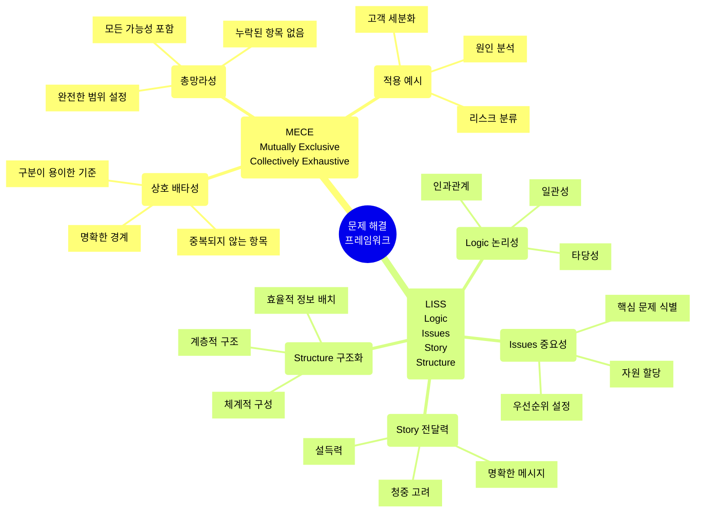

# MECE와 LISS: 문제 해결과 전략적 사고를 위한 핵심 프레임워크

<!-- mtoc-start -->

- [MECE와 LISS의 정의 및 개념](#mece와-liss의-정의-및-개념)
  - [MECE (Mutually Exclusive Collectively Exhaustive)](#mece-mutually-exclusive-collectively-exhaustive)
  - [LISS (Linearly Independent Spanning Set)](#liss-linearly-independent-spanning-set)
- [MECE와 LISS 프레임워크](#mece와-liss-프레임워크)
- [MECE와 LISS의 적용 주요 방법론](#mece와-liss의-적용-주요-방법론)
  - [1. Value Chain](#1-value-chain)
  - [2. 7S Model](#2-7s-model)
  - [3. 3C/4C Framework](#3-3c4c-framework)
  - [4. 5 Forces](#4-5-forces)
  - [5. SWOT Analysis](#5-swot-analysis)
- [기대 효과](#기대-효과)
- [마무리](#마무리)
- [Keywords](#keywords)

<!-- mtoc-end -->

효율적인 문제 해결과 전략적 사고를 위해서는 구조적이고 체계적인 접근이 필수적입니다. MECE(Mutually Exclusive Collectively Exhaustive)와 LISS(Linearly Independent Spanning Set)는 이러한 접근 방식을 가능하게 하는 두 가지 주요 프레임워크입니다. MECE와 LISS의 정의, 주요 특징, 적용 방법론, 그리고 기대 효과에 대해 살펴보겠습니다.

## MECE와 LISS의 정의 및 개념

### MECE (Mutually Exclusive Collectively Exhaustive)

MECE는 상호 배타적이고 전체를 포괄하는 사고방식. 이는 문제를 분석하거나 구조화할 때 중복이나 누락 없이 전체를 체계적으로 파악할 수 있도록 도와줍니다.

- **상호 배타(Mutually Exclusive)**: 각 요소가 서로 중복되지 않음
- **전체 포괄(Collectively Exhaustive)**: 전체 문제를 빠짐없이 포함
- **주요 특징**:
  - 문제의 핵심 파악
  - 효율적인 의사소통
  - 논리적이고 구조적인 접근 가능

### LISS (Linearly Independent Spanning Set)

LISS는 선형 독립성과 완전한 확장을 기반으로 문제를 분석하는 프레임워크. 이는 중복 없이 부분집합의 중요 의미를 명확히 하여 전략적 사고를 강화합니다.

- **선형 독립성(Linearly Independent)**: 각 요소가 독립적으로 중요성을 가짐
- **전체 확장(Spanning Set)**: 전체 집합을 아우르며 중요한 요소만 포함
- **주요 특징**:
  - 불필요한 중복 제거
  - 핵심 요소 강조
  - 문제의 본질에 집중

## MECE와 LISS 프레임워크

1. MECE (상호배타적 총망라)

   - 상호배타성: 각 항목이 서로 겹치지 않도록 분류
   - 총망라성: 모든 가능한 경우를 빠짐없이 포함
   - 실제 비즈니스 상황에서의 적용 예시 포함

2. LISS (논리성, 중요성, 전달력, 구조화)
   - Logic: 논리적 사고와 인과관계 분석
   - Issues: 핵심 문제 파악과 우선순위 설정
   - Story: 효과적인 커뮤니케이션과 메시지 전달
   - Structure: 체계적인 정보 구조화

두 프레임워크는 상호 보완적으로 사용될 수 있으며, 복잡한 비즈니스 문제를 체계적으로 해결하는 데 도움.

## MECE와 LISS의 적용 주요 방법론

MECE와 LISS는 다양한 비즈니스 및 전략적 분석 방법론에 적용 가능:

### 1. Value Chain

- 가치 사슬의 각 단계를 분석하여 중복 없이 핵심 단위를 도출
- 예: 생산, 마케팅, 판매 등 주요 활동 구분

### 2. 7S Model

- 조직의 전략, 구조, 시스템 등을 체계적으로 분석
- MECE를 활용해 중복 없는 분석 구성

### 3. 3C/4C Framework

- 고객(Customer), 경쟁사(Competitor), 자사(Company) 요소를 중복 없이 파악
- 추가적으로 협력(Complementor)을 포함하여 LISS 방식으로 분석 심화

### 4. 5 Forces

- 산업 내 경쟁 강도를 분석할 때 핵심 요소를 MECE 및 LISS 관점에서 분리
- 공급자, 구매자, 신규 진입자, 대체재, 경쟁사 등의 요소 분석

### 5. SWOT Analysis

- 강점, 약점, 기회, 위협을 중복 없이 분류하고 분석하여 전략 도출

## 기대 효과

1. **효율적인 문제 해결**

   - 문제를 빠짐없이 분석하고 불필요한 중복을 제거하여 명확한 해결책 도출

2. **구조적 사고 강화**

   - MECE와 LISS를 통해 논리적이고 체계적인 사고방식을 확립

3. **의사소통 개선**

   - 명확하고 간결한 분석 결과를 통해 조직 내 소통 효율성 증대

4. **전략적 사고 심화**
   - LISS를 활용해 중요 요소에 집중하고 전략적으로 접근

## 마무리

MECE와 LISS는 비즈니스 및 전략적 분석에서 필수적인 사고 프레임워크입니다. MECE는 문제를 체계적으로 구조화하는 데 유용하며, LISS는 핵심 요소에 집중하고 중복을 제거하는 데 도움을 줍니다. 이 두 가지 프레임워크를 활용하여 문제 해결 능력을 강화하고 전략적 사고를 발전시켜 보세요.

## Keywords

MECE, LISS, 문제 해결, 전략적 사고, Value Chain, 7S Model, 3C Framework, 5 Forces, SWOT Analysis, 분석 프레임워크, 구조적 사고