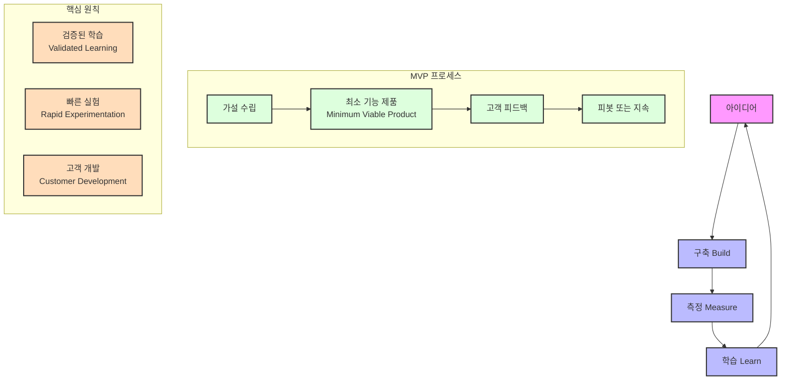

# 린 스타트업(Lean Startup): 혁신과 성장을 위한 실험적 접근

<!-- mtoc-start -->

- [린 스타트업의 정의 및 개념](#린-스타트업의-정의-및-개념)
  - [최소 요건 제품(MVP)](#최소-요건-제품mvp)
  - [Build-Measure-Learn 루프](#build-measure-learn-루프)
  - [방향전환(Pivot)](#방향전환pivot)
- [린 스타트업의 핵심 전략](#린-스타트업의-핵심-전략)
  - [1. 빠른 실험과 반복](#1-빠른-실험과-반복)
  - [2. 데이터 중심 의사결정](#2-데이터-중심-의사결정)
  - [3. 자원 최적화](#3-자원-최적화)
- [린 스타트업 개념도](#린-스타트업-개념도)
- [기대 효과](#기대-효과)
- [마무리](#마무리)
- [Keywords](#keywords)

<!-- mtoc-end -->

린 스타트업(Lean Startup)은 혁신적인 제품 및 서비스를 개발하기 위한 실험적이고 반복적인 경영 기법입니다. 도요타 생산 시스템의 린(Lean) 기법을 기반으로 하며, 최소 요건 제품(MVP, Minimum Viable Product)을 빠르게 개발하고 고객 피드백을 반영하여 개선해 나가는 "Build-Measure-Learn" 순환 루프를 중심으로 합니다. 이 포스트에서는 린 스타트업의 정의, 주요 개념, 핵심 전략, 그리고 기대 효과에 대해 알아보겠습니다.

## 린 스타트업의 정의 및 개념

린 스타트업(Lean Startup)은 혁신적인 제품 및 서비스를 개발하기 위한 실험적이고 반복적인 경영 기법

### 최소 요건 제품(MVP)

MVP는 가장 기본적인 기능만을 포함한 제품, 빠르게 시장에 출시하여 고객 피드백을 얻는 데 초점을 둡니다. 이를 통해 초기 개발 비용과 시간을 절감하고, 실제 고객의 요구를 반영한 제품 개선이 가능합니다.

- **핵심 기능만 포함**: 불필요한 기능을 제거하여 빠른 출시 가능
- **고객 피드백 중심**: 시장 반응을 기반으로 한 데이터 수집
- **리스크 최소화**: 초기 투자 비용 절감 및 실패 가능성 감소

### Build-Measure-Learn 루프

린 스타트업의 중심에는 "Build-Measure-Learn" 루프가 있습니다. 이는 아이디어를 실행하고, 결과를 측정하며, 학습을 통해 개선하는 과정을 반복하여 제품 또는 서비스의 성공 가능성을 높입니다.

- **Build(만들기)**: MVP를 기반으로 빠르게 프로토타입 제작
- **Measure(측정)**: 고객 반응 및 사용 데이터를 분석
- **Learn(학습)**: 데이터를 기반으로 새로운 전략 도출 및 방향 전환

### 방향전환(Pivot)

Pivot은 초기 전략이 기대한 성과를 내지 못할 경우, 새로운 방향으로 빠르게 전환하는 것을 의미합니다. 이를 통해 자원을 낭비하지 않고 성공 가능성을 높일 수 있습니다.

- **제품 기능 조정**: 고객 요구에 맞는 기능 추가 또는 변경
- **비즈니스 모델 변경**: 수익화 전략이나 타깃 시장 수정

## 린 스타트업의 핵심 전략

### 1. 빠른 실험과 반복

- 제품 개발 주기를 단축하고, 지속적인 실험을 통해 시장 요구에 적응
- MVP를 활용하여 작은 성공과 실패를 반복적으로 경험

### 2. 데이터 중심 의사결정

- 고객 피드백과 데이터 분석을 기반으로 제품 개발과 전략 수립
- 감이 아닌 데이터를 활용하여 더 나은 의사결정 가능

### 3. 자원 최적화

- 제한된 자원을 효율적으로 사용하여 초기 비용 절감
- 중요한 기능과 시장 반응에 집중

## 린 스타트업 개념도

1. 핵심 순환 프로세스: 구축(Build) - 측정(Measure) - 학습(Learn) 순환
2. MVP 프로세스:
   - 가설 수립
   - MVP(최소 기능 제품) 개발
   - 고객 피드백 수집
   - 피봇 또는 지속 결정
3. 핵심 원칙:
   - 검증된 학습
   - 빠른 실험
   - 고객 개발

## 기대 효과

4. **혁신적인 제품 개발**

   - 고객 중심의 접근을 통해 실제로 필요한 제품 개발 가능
   - 빠르게 개선된 제품으로 경쟁 우위 확보

5. **리스크 관리 강화**

   - 초기 단계에서 고객 반응을 통해 잘못된 가정을 식별
   - 자원의 낭비를 줄이고 실패 확률 감소

6. **성장 가속화**
   - 피드백 기반의 빠른 개선으로 시장 점유율 확대
   - 변화하는 시장 요구에 신속하게 대응

## 마무리

린 스타트업은 빠르게 변화하는 시장 환경에서 성공 가능성을 높이는 강력한 경영 기법입니다. Build-Measure-Learn 루프와 MVP를 활용하여 효율적인 제품 개발과 개선을 이루고, Pivot 전략을 통해 자원의 낭비를 줄이며 성공적인 방향으로 나아갈 수 있습니다. 린 스타트업 접근법을 채택하여 혁신과 성장을 동시에 이룰 수 있는 조직으로 발전해 보세요.

## Keywords

린 스타트업, Lean Startup, Build-Measure-Learn, 최소 요건 제품, MVP, Pivot, 혁신 전략, 제품 개발, 피드백, 데이터 기반 의사결정