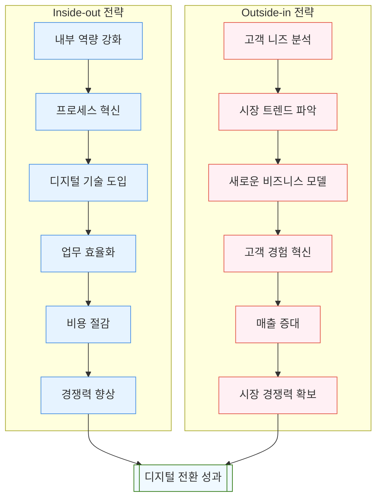

# Inside-out과 Outside-in 전략: 디지털 전환을 위한 핵심 접근법

<!-- mtoc-start -->

- [Inside-out 전략](#inside-out-전략)
  - [정의 및 개념](#정의-및-개념)
  - [주요 특징](#주요-특징)
- [Outside-in 전략](#outside-in-전략)
  - [정의 및 개념](#정의-및-개념-1)
  - [주요 특징](#주요-특징-1)
- [Inside-out과 Outside-in의 조합](#inside-out과-outside-in의-조합)
  - [조합의 필요성](#조합의-필요성)
  - [조합 방안](#조합-방안)
- [Inside-out과 Outside-in 전략 비교](#inside-out과-outside-in-전략-비교)
- [기대 효과](#기대-효과)
- [마무리](#마무리)
- [Keywords](#keywords)

<!-- mtoc-end -->

디지털 전환(Digital Transformation)을 성공적으로 추진하기 위해서는 기존 비즈니스 모델을 유지하면서 새로운 전략을 수립해야 합니다. 이를 위한 두 가지 핵심 관점으로 Inside-out과 Outside-in 전략이 주목받고 있습니다. Inside-out은 기업 내부의 자원과 능력을 중심으로 전략을 수립하는 방식이며, Outside-in은 시장과 고객 중심으로 접근하는 방식입니다. 두 전략의 정의, 주요 특징, 조합 방안, 그리고 기대 효과에 대해 살펴보겠습니다.

## Inside-out 전략

### 정의 및 개념

Inside-out 전략은 기업이 보유한 자원과 역량을 중심으로 비즈니스 전략을 수립하는 접근법. 내부의 기술, 제품, 서비스, 경쟁력을 바탕으로 새로운 비즈니스 모델을 개발하고, 이를 기존 모델과 연결하여 경쟁력을 강화하는 데 초점을 둡니다.

- **핵심 자원 활용**: 기업의 기술력, 전문성, 인프라를 바탕으로 전략 수립
- **비용 효율성 증대**: 내부 자원의 활용을 극대화하여 비용 절감
- **자체 혁신 강화**: 내부 역량을 기반으로 지속적인 혁신 추진

### 주요 특징

1. **기술 중심 혁신**

   - 자체적으로 보유한 기술 및 역량을 활용하여 새로운 비즈니스 모델 개발

2. **내부 자원 활용 극대화**

   - 기존 자원을 최적화하여 새로운 시장 진출 또는 기존 시장 강화

3. **지속 가능성**
   - 장기적인 관점에서 내부 역량 기반의 경쟁력 강화

## Outside-in 전략

### 정의 및 개념

Outside-in 전략은 기업이 시장과 고객 중심으로 비즈니스 전략을 수립하는 접근법. 시장의 요구사항과 변화하는 환경을 적극적으로 파악하고, 이를 기반으로 새로운 비즈니스 모델을 개발하여 경쟁력을 강화합니다.

- **고객 중심 접근**: 고객의 니즈와 피드백을 전략 수립에 반영
- **시장 변화 대응**: 외부 환경 분석을 통해 민첩하게 대응
- **외부 자원 활용**: 파트너십, 협력 등을 통해 추가적인 역량 확보

### 주요 특징

4. **시장 중심 혁신**

   - 시장 데이터와 고객 피드백을 활용하여 제품 및 서비스 개발

5. **외부 환경 분석**

   - 변화하는 트렌드와 경쟁사 동향을 파악하여 전략적 대응

6. **유연성**
   - 환경 변화에 신속히 적응하여 경쟁 우위를 확보

## Inside-out과 Outside-in의 조합

### 조합의 필요성

Inside-out과 Outside-in 전략을 개별적으로 활용할 수도 있지만, 디지털 전환의 성공 여부는 두 접근법을 얼마나 효과적으로 융합하느냐에 달려 있습니다. 내부 자원과 외부 환경을 함께 고려하는 전략적 사고는 지속 가능한 성장을 가능하게 합니다.

### 조합 방안

7. **내부 강점과 외부 요구의 연결**

   - 내부 기술과 제품을 외부 시장 요구에 맞게 조정하여 경쟁력 강화

8. **데이터 기반 의사결정**

   - 내부 및 외부 데이터를 종합적으로 분석하여 전략 수립

9. **협력과 통합**
   - 외부 파트너와 협력하며 내부 자원을 보완하여 시너지를 창출

## Inside-out과 Outside-in 전략 비교

10. Inside-out 전략:

   - 조직 내부의 역량 강화에서 시작
   - 프로세스 혁신과 디지털 기술 도입을 통한 업무 효율화 추구
   - 비용 절감을 통한 경쟁력 향상에 초점

11. Outside-in 전략:
   - 고객과 시장의 니즈 분석에서 시작
   - 새로운 비즈니스 모델 발굴과 고객 경험 혁신 추구
   - 매출 증대를 통한 시장 경쟁력 확보에 중점

두 전략은 각각의 장단점이 있으며, 최종적으로는 조직의 디지털 전환 성과로 수렴. 효과적인 디지털 전환을 위해서는 두 전략을 상황에 맞게 적절히 조합하여 활용하는 것이 중요.

## 기대 효과

12. **디지털 전환 성공률 향상**

   - 내부 자원과 외부 환경을 동시에 고려하여 균형 잡힌 전략 수립

13. **경쟁력 강화**

   - 내부 혁신과 외부 트렌드 대응을 통해 시장 점유율 확대

14. **지속 가능한 성장**
   - 융합 전략을 통한 장기적인 비즈니스 성과 창출

## 마무리

Inside-out과 Outside-in 전략은 디지털 전환 과정에서 필수적인 접근법입니다. 내부 자원을 최대한 활용하면서도 시장과 고객 중심으로 대응하는 융합 전략은 디지털 환경에서의 성공을 보장합니다. 두 전략을 적절히 조합하여 조직의 경쟁력을 강화하고 지속 가능한 성장을 이뤄보세요.

## Keywords

Inside-out 전략, Outside-in 전략, 디지털 전환, Digital Transformation, 내부 자원, 시장 중심, 고객 중심, 전략 융합, 데이터 기반 의사결정, 지속 가능한 성장