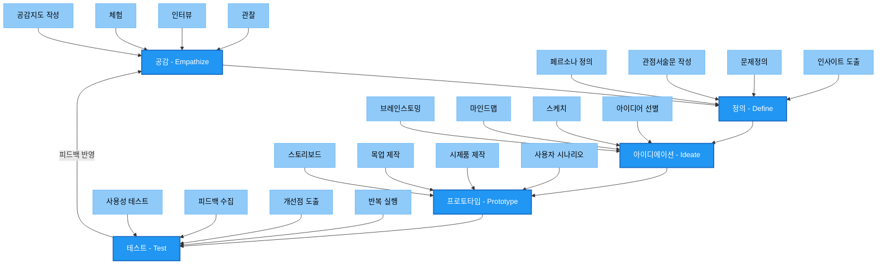

# 디자인 씽킹(Design Thinking): 창의적 문제 해결을 위한 UX 기법

<!-- mtoc-start -->

- [디자인 씽킹의 정의 및 개념](#디자인-씽킹의-정의-및-개념)
- [디자인 씽킹의 주요 단계](#디자인-씽킹의-주요-단계)
  - [1. 공감(Empathize)](#1-공감empathize)
  - [2. 문제 정의(Define)](#2-문제-정의define)
  - [3. 아이디어 발상(Ideate)](#3-아이디어-발상ideate)
  - [4. 프로토타입 제작(Prototype)](#4-프로토타입-제작prototype)
  - [5. 테스트(Test)](#5-테스트test)
- [디자인 씽킹 프로세스](#디자인-씽킹-프로세스)
- [디자인 씽킹의 활용 사례](#디자인-씽킹의-활용-사례)
- [기대 효과](#기대-효과)
- [마무리](#마무리)
- [Keywords](#keywords)

<!-- mtoc-end -->

디자인 씽킹(Design Thinking)은 혁신적이고 창의적인 문제 해결을 위한 UX 기법으로, 사용자 중심의 사고를 기반으로 합니다. 이 접근법은 현장과 지속적인 소통을 통해 고객의 수요를 파악하고, 가능한 모든 대안을 발굴하며 이를 반복적으로 적용하고 개선하는 과정을 통해 최적의 해결책을 도출합니다. 특히 복잡한 문제를 해결하고 새로운 아이디어를 창출하는 데 강력한 도구로 활용됩니다. 디자인 씽킹의 정의, 주요 단계, 다양한 활용 사례, 그리고 기대 효과를 자세히 알아보겠습니다.

## 디자인 씽킹의 정의 및 개념

디자인 씽킹은 사용자의 관점에서 문제를 정의하고, 이를 창의적이고 반복적인 방식으로 해결하려는 접근법. 이는 고객의 실제 니즈를 기반으로 다양한 아이디어를 탐색하며, 프로토타입 제작과 테스트를 통해 최종적인 솔루션을 구현합니다. 사용자 경험과 비즈니스 요구를 조화롭게 결합하여 새로운 가치를 창출하는 데 초점을 둡니다.

- **사용자 중심 접근**: 고객의 니즈를 철저히 이해하고 이를 기반으로 해결책을 설계
- **반복적 과정**: 실험과 피드백을 지속적으로 반복하여 개선
- **팀 기반 협업**: 다양한 분야의 전문가가 협력하여 창의적인 아이디어를 도출
- **문제 해결과 혁신의 결합**: 문제의 본질을 파악하고 혁신적인 솔루션을 제공

## 디자인 씽킹의 주요 단계

디자인 씽킹은 다음의 다섯 가지 단계를 통해 문제를 해결합니다. 각 단계는 독립적이지만 상호보완적으로 작용하며, 반복적으로 실행될 수 있습니다.

### 1. 공감(Empathize)

- **사용자 조사**: 사용자와의 상호작용을 통해 고객의 니즈와 문제를 깊이 이해
- **도구 활용**: 인터뷰, 관찰, 설문조사, 감정 맵 등을 활용하여 공감대 형성
- **문제의 배경 이해**: 사용자의 환경과 맥락을 분석하여 문제의 근본 원인 파악

### 2. 문제 정의(Define)

- **핵심 문제 도출**: 사용자 경험과 데이터를 기반으로 해결해야 할 핵심 문제를 명확히 정의
- **문제 진술 작성**: 문제를 구체적이고 해결 가능한 형태로 정리
- **목표 설정**: 문제 해결이 가져올 결과를 명확히 설정

### 3. 아이디어 발상(Ideate)

- **창의적 사고**: 다양한 창의적 아이디어를 생성하고 가능한 해결책을 탐색
- **브레인스토밍**: 다양한 관점을 반영하여 폭넓은 아이디어 도출
- **아이디어 우선순위 선정**: 실현 가능성과 효과를 고려하여 가장 유망한 아이디어 선정

### 4. 프로토타입 제작(Prototype)

- **시각화**: 아이디어를 실제로 구현할 수 있는 형태로 시각화
- **저비용 프로토타입**: 간단한 프로토타입을 제작하여 빠르게 테스트 준비
- **피드백 준비**: 사용자로부터 즉각적인 피드백을 수집할 수 있는 형태로 설계

### 5. 테스트(Test)

- **사용자 피드백**: 사용자와 함께 프로토타입을 테스트하고 개선점 식별
- **반복적 개선**: 피드백을 반영하여 프로토타입을 반복적으로 수정
- **최종 솔루션 개발**: 최적의 결과물을 도출하여 구현 준비 완료

## 디자인 씽킹 프로세스

**디자인씽킹의 5단계 프로세스와 각 단계별 주요 활동:**

1. 공감(Empathize) 단계

   - 사용자 관찰, 인터뷰, 직접 체험을 통한 이해
   - 공감지도를 통한 사용자 니즈 파악

2. 정의(Define) 단계

   - 페르소나 설정
   - 문제점 명확화
   - 핵심 인사이트 도출

3. 아이디에이션(Ideate) 단계

   - 다양한 아이디어 발산
   - 브레인스토밍과 마인드맵 활용
   - 가능성 있는 아이디어 선별

4. 프로토타입(Prototype) 단계

   - 아이디어의 구체화
   - 실제 사용자 경험 시나리오 작성
   - 테스트 가능한 형태로 구현

5. 테스트(Test) 단계

   - 사용자 테스트 진행
   - 피드백 수집 및 분석
   - 개선점 도출 및 반복 실행

각 단계는 순차적으로 진행되지만, 필요에 따라 이전 단계로 돌아가 반복적으로 수행할 수 있는 순환적 프로세스. 특히 테스트 단계에서 얻은 인사이트는 다시 공감 단계로 연결되어 지속적인 개선 지원.

## 디자인 씽킹의 활용 사례

6. **제품 개발**

   - 사용자의 니즈를 반영한 새로운 제품 설계 및 개선
   - 예: IT 기업에서 사용자 중심의 소프트웨어 개발

7. **서비스 디자인**

   - 고객 경험을 혁신적으로 개선하기 위한 서비스 모델 구축
   - 예: 항공사에서 탑승 절차를 간소화하는 디지털 서비스 도입

8. **비즈니스 전략 수립**

   - 고객의 피드백을 바탕으로 새로운 비즈니스 모델 설계
   - 예: 스타트업이 MVP를 통해 시장 진출 전략을 검증

9. **공공 서비스 개선**
   - 시민의 요구를 반영하여 공공 서비스의 접근성과 품질 개선
   - 예: 스마트 시티 프로젝트에서 교통 시스템 최적화

## 기대 효과

10. **문제 해결 능력 향상**

   - 사용자 중심의 접근으로 실제 문제를 해결하는 데 효과적
   - 반복적 개선 과정을 통해 최적의 해결책 도출

11. **혁신적인 결과 도출**

   - 기존의 틀을 벗어난 창의적이고 혁신적인 솔루션 개발
   - 새로운 아이디어를 발굴하여 시장 경쟁력 확보

12. **사용자 만족도 증가**

   - 고객의 니즈를 반영한 제품 및 서비스로 사용자 경험 개선
   - 고객 충성도를 높이고 브랜드 가치를 강화

13. **팀워크와 협업 강화**

   - 다양한 팀원 간의 협력을 통해 새로운 관점과 아이디어 창출
   - 조직 내 커뮤니케이션과 협업 문화 개선

14. **비즈니스 성장 지원**
   - 고객 중심의 혁신이 비즈니스 성과로 연결
   - 효율적인 문제 해결로 시간과 자원 절감

## 마무리

디자인 씽킹은 단순한 문제 해결 방식을 넘어, 사용자 중심의 혁신을 가능하게 하는 강력한 도구입니다. 공감, 문제 정의, 아이디어 발상, 프로토타입 제작, 테스트의 단계를 통해 고객의 니즈를 철저히 반영한 최적의 해결책을 도출할 수 있습니다. 이 접근법은 제품 및 서비스 개발뿐만 아니라 비즈니스 전략 수립, 공공 서비스 개선 등 다양한 분야에서 활용될 수 있습니다. 디자인 씽킹을 적극적으로 활용하여 창의적이고 혁신적인 제품과 서비스를 개발하고, 지속 가능한 성장을 이뤄보세요.

## Keywords

디자인 씽킹, Design Thinking, 창의적 문제 해결, UX 기법, 사용자 중심, 공감, 문제 정의, 아이디어 발상, 프로토타입, 테스트, 혁신적 결과, 비즈니스 성장, 공공 서비스 개선