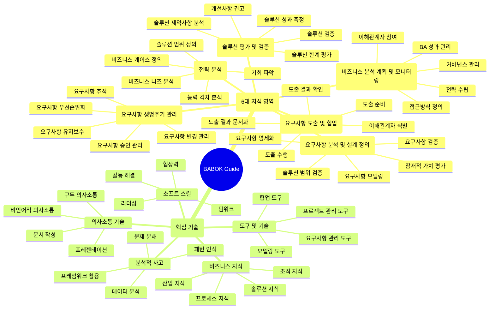

# BABOK: 비즈니스 분석의 지식 체계

<!-- mtoc-start -->

- [BABOK의 정의 및 개념](#babok의-정의-및-개념)
- [BABOK의 주요 구성 요소](#babok의-주요-구성-요소)
  - [1. 비즈니스 분석 계획 및 모니터링](#1-비즈니스-분석-계획-및-모니터링)
  - [2. 요구사항 수집 및 분석](#2-요구사항-수집-및-분석)
  - [3. 전략 분석](#3-전략-분석)
  - [4. 솔루션 평가](#4-솔루션-평가)
  - [5. 요구사항 관리 및 커뮤니케이션](#5-요구사항-관리-및-커뮤니케이션)
  - [6. 기술 및 도구 활용](#6-기술-및-도구-활용)
- [BABOK 지식 영역 및 기술](#babok-지식-영역-및-기술)
- [BABOK 지식 영역 및 기술 체계표](#babok-지식-영역-및-기술-체계표)
  - [1. 6대 지식 영역 (Knowledge Areas)](#1-6대-지식-영역-knowledge-areas)
  - [2. 핵심 기술 (Core Skills)](#2-핵심-기술-core-skills)
- [BABOK의 활용 사례](#babok의-활용-사례)
- [기대 효과](#기대-효과)
- [마무리](#마무리)
- [Keywords](#keywords)

<!-- mtoc-end -->

BABOK(Business Analysis Body of Knowledge)는 국제 비즈니스 분석 협회(IIBA, International Institute of Business Analysis)에서 개발한 비즈니스 분석(BA, Business Analysis)을 체계적으로 수행하기 위한 지침과 기술 모음을 의미합니다. 이는 비즈니스 요구를 파악하고 해결책을 정의하는 과정에서 필요한 핵심 업무와 기술들을 포괄하는 지식 체계로, 비즈니스 분석 전문가들의 필수적인 참고 자료로 활용되고 있습니다. BABOK의 정의, 주요 구성 요소, 활용 사례, 그리고 기대 효과를 살펴보겠습니다.

## BABOK의 정의 및 개념

BABOK는 비즈니스 분석에 필요한 주요 개념, 활동, 기술을 문서화하여 표준화된 지침을 제공하는 지식 체계. 이는 비즈니스 분석 전문가가 조직의 목표를 달성하고 문제를 해결하는 데 필요한 전문성과 일관성을 보장합니다.

- **목적**: 비즈니스 분석 프로세스를 체계화하고 표준화
- **포괄성**: 다양한 산업 및 프로젝트 환경에서 활용 가능한 지침 제공
- **유연성**: 조직의 요구에 맞춰 조정 가능한 접근법 포함

## BABOK의 주요 구성 요소

BABOK는 6개의 핵심 지식 영역과 다양한 기술로 구성되어 있습니다. 각각의 영역은 비즈니스 분석 과정에서 중요한 역할.

### 1. 비즈니스 분석 계획 및 모니터링

- 프로젝트 목표를 달성하기 위한 분석 계획 수립
- 분석 활동의 진척 상황 모니터링

### 2. 요구사항 수집 및 분석

- 이해관계자의 요구사항을 식별하고 문서화
- 요구사항의 우선순위를 설정하고 검증

### 3. 전략 분석

- 현재 상태를 평가하고 미래 상태를 정의
- 조직의 목표에 맞는 전략적 방향 설정

### 4. 솔루션 평가

- 구현된 솔루션의 성과를 평가
- 개선 방안을 제안하여 솔루션의 효과를 극대화

### 5. 요구사항 관리 및 커뮤니케이션

- 요구사항의 변경 사항 관리
- 이해관계자와 효과적으로 소통

### 6. 기술 및 도구 활용

- 데이터 분석, 시각화, 프로세스 모델링 등의 도구 사용
- 다양한 기술을 통해 효율적인 분석 수행

## BABOK 지식 영역 및 기술

1. 6대 지식 영역(Knowledge Areas)의 세부 활동.
2. 비즈니스 분석가가 갖춰야 할 핵심 기술들을 5개의 주요 카테고리로 구분.

각 지식 영역은 서로 연계되어 있으며, 프로젝트나 조직의 상황에 따라 순차적 또는 반복적으로 수행 가능. 기술들은 모든 지식 영역에서 필요한 핵심 역량들.

## BABOK 지식 영역 및 기술 체계표

### 1. 6대 지식 영역 (Knowledge Areas)

| 지식 영역                          | 하위 영역                                                                                   | 세부 활동/기술                                                                                                                    |
| ---------------------------------- | ------------------------------------------------------------------------------------------- | --------------------------------------------------------------------------------------------------------------------------------- |
| **비즈니스 분석 계획 및 모니터링** | • 계획 수립 • 접근 방식 정의 • 이해관계자 관리 • BA 성과 관리 • 프로세스 개선   | • 비즈니스 분석 계획서 작성 • 방법론 선택 및 조정 • 이해관계자 식별 및 분석 • 성과 지표 정의 및 측정 • 개선 기회 식별 |
| **요구사항 도출 및 협업**          | • 이해관계자 준비 • 도출 활동 계획 • 도출 실행 • 결과 확인 • 문서화             | • 이해관계자 인터뷰 • 워크샵 진행 • 설문조사 실시 • 요구사항 검증 • 요구사항 명세서 작성                              |
| **요구사항 생명주기 관리**         | • 추적성 관리 • 변경 관리 • 우선순위 관리 • 승인 프로세스 • 요구사항 보관       | • 요구사항 매트릭스 작성 • 변경 영향도 분석 • 우선순위 기준 정의 • 승인 절차 수행 • 형상 관리                         |
| **전략 분석**                      | • 현황 분석 • 미래 상태 정의 • 리스크 평가 • 기회 분석 • 실행 전략              | • 비즈니스 환경 분석 • 목표 상태 정의 • 리스크 식별 및 평가 • 개선 기회 도출 • 전환 전략 수립                         |
| **요구사항 분석 및 설계 정의**     | • 요구사항 상세화 • 가정 및 제약사항 • 요구사항 검증 • 솔루션 범위 • 프로토타입 | • 상세 요구사항 정의 • 제약사항 분석 • 품질 검토 • 범위 문서 작성 • 프로토타입 개발                                   |
| **솔루션 평가 및 검증**            | • 솔루션 평가 • 성과 측정 • 한계 분석 • 개선점 도출 • 수용 기준                 | • 평가 기준 정의 • 성과 지표 측정 • 제약사항 분석 • 개선 방안 제시 • 인수 테스트 수행                                 |

### 2. 핵심 기술 (Core Skills)

| 기술 영역         | 세부 스킬                                                                           | 구체적 스킬                                                                                     |
| ----------------- | ----------------------------------------------------------------------------------- | ----------------------------------------------------------------------------------------------- |
| **분석적 사고**   | • 시스템 사고 • 프로세스 분석 • 의사결정 분석 • 리스크 분석 • 문제 해결 | • 상호관계 분석 • 프로세스 모델링 • 의사결정 트리 작성 • 리스크 평가 • 해결안 도출  |
| **비즈니스 지식** | • 산업 지식 • 조직 이해 • 솔루션 지식 • 운영 지식 • 전략적 사고         | • 시장 분석 • 조직 구조 이해 • 기술 동향 파악 • 운영 프로세스 이해 • 전략 목표 연계 |
| **의사소통 기술** | • 구두 의사소통 • 문서 작성 • 발표 능력 • 촉진 기술 • 협상 기술         | • 효과적인 경청 • 보고서 작성 • 프레젠테이션 • 미팅 진행 • 이해관계 조정            |
| **소프트 스킬**   | • 리더십 • 팀워크 • 적응성 • 문제 해결 • 창의성                         | • 팀 리딩 • 협업 활동 • 변화 대응 • 갈등 해결 • 혁신적 사고                         |
| **도구 및 기술**  | • 모델링 도구 • 문서화 도구 • 협업 도구 • 분석 도구 • 프로젝트 도구     | • UML/BPMN 활용 • 문서 템플릿 작성 • 협업 툴 활용 • 데이터 분석 • 일정/자원 관리    |

## BABOK의 활용 사례

1. **프로젝트 관리**

   - 프로젝트 초기 단계에서 요구사항을 명확히 정의하고 문서화
   - 요구사항 우선순위를 설정하여 프로젝트 성공률 향상

2. **비즈니스 프로세스 개선**

   - 현재 프로세스의 병목 현상을 식별하고 개선 방안 제시
   - 새로운 프로세스 설계 및 실행

3. **IT 시스템 개발**

   - 소프트웨어 개발 라이프사이클(SDLC) 전반에서 요구사항 관리
   - 개발팀과의 명확한 커뮤니케이션 지원

4. **전략적 의사결정 지원**
   - 데이터 기반 분석을 통해 조직의 전략 수립 지원
   - 시장 동향 및 경쟁 환경 분석

## 기대 효과

1. **비즈니스 분석의 전문성 향상**

   - 체계적이고 표준화된 지침을 통해 분석 능력 강화

2. **프로젝트 성공률 증가**

   - 요구사항을 명확히 정의하고 관리하여 실패 가능성 최소화

3. **조직의 목표 달성 지원**

   - 효과적인 솔루션 설계와 평가를 통해 조직의 성과 향상

4. **효율적인 커뮤니케이션**
   - 이해관계자 간의 원활한 소통으로 협업 강화

## 마무리

BABOK는 비즈니스 분석을 체계적이고 전문적으로 수행하기 위한 필수적인 지식 체계입니다. 이를 통해 비즈니스 요구를 명확히 파악하고, 효과적인 해결책을 설계하며, 조직의 목표를 달성할 수 있습니다. BABOK를 적극 활용하여 프로젝트 성공률을 높이고 조직의 경쟁력을 강화해 보세요.

## Keywords

BABOK, 비즈니스 분석, IIBA, 요구사항 관리, 전략 분석, 솔루션 평가, 프로젝트 관리, 프로세스 개선, 데이터 분석, 비즈니스 목표, 커뮤니케이션