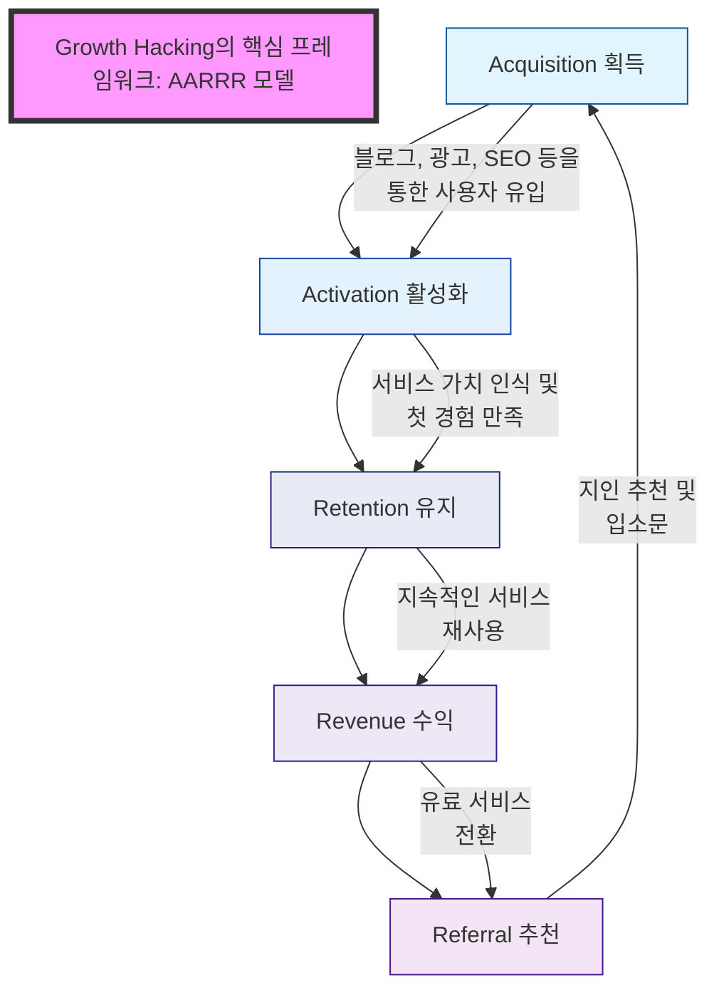

# 그로스 해킹(Growth Hacking): 기업 성장을 위한 전략적 마케팅

<!-- mtoc-start -->

- [그로스 해킹의 정의 및 개념](#그로스-해킹의-정의-및-개념)
- [AARRR 모델(해적지표): 사용자 행동 5단계](#aarrr-모델해적지표-사용자-행동-5단계)
  - [1. **획득(Acquisition)**](#1-획득acquisition)
  - [2. **활성화(Activation)**](#2-활성화activation)
  - [3. **유지(Retention)**](#3-유지retention)
  - [4. **매출(Revenue)**](#4-매출revenue)
  - [5. **추천(Referral)**](#5-추천referral)
- [그로스 해킹 핵심 모델(AARRR 모델) 프로세스](#그로스-해킹-핵심-모델aarrr-모델-프로세스)
- [그로스 해킹의 개선 계층](#그로스-해킹의-개선-계층)
  - [1. **분석 및 트래킹**](#1-분석-및-트래킹)
  - [2. **기능 개선**](#2-기능-개선)
  - [3. **설계 변경**](#3-설계-변경)
  - [4. **전략 책정 및 재고**](#4-전략-책정-및-재고)
- [주요 기법](#주요-기법)
  - [1. **퍼널 분석(Funnel Analysis)**](#1-퍼널-분석funnel-analysis)
  - [2. **A/B 테스트**](#2-ab-테스트)
  - [3. **코호트 분석(Cohort Analysis)**](#3-코호트-분석cohort-analysis)
  - [4. **설문 조사 도구 활용**](#4-설문-조사-도구-활용)
- [기대 효과](#기대-효과)
- [마무리](#마무리)
- [Keywords](#keywords)

<!-- mtoc-end -->

그로스 해킹(Growth Hacking)은 기업과 서비스를 급성장시키기 위한 혁신적이고 전략적인 마케팅 접근법입니다. 이 기법은 제품이나 서비스의 주요 지표를 지속적으로 분석하고 최적화하여 사용자 기반을 빠르게 확대하는 데 초점을 둡니다. 데이터 중심의 퍼포먼스 마케팅과 가설 기반 실험을 중심으로, 사용자 흐름과 전환 과정을 최적화하며 지속적인 개선을 통해 높은 성과를 도출합니다. 그로스 해킹의 정의, 핵심 모델과 기법, 그리고 기대 효과를 심층적으로 살펴보겠습니다.

## 그로스 해킹의 정의 및 개념

그로스 해킹은 디지털 환경에서 기업 성장을 극대화하기 위해 데이터 분석, 실험, 그리고 사용자 중심의 접근을 활용하는 마케팅 전략. 전통적인 마케팅 기법과 달리, 그로스 해킹은 기술적 도구와 창의적인 전략을 결합하여 빠른 성장과 효율성을 동시에 추구합니다. 이를 통해 신규 사용자 확보, 사용자 유지율 향상, 그리고 매출 증대를 달성할 수 있습니다.

- **핵심 개념**:
  - **가설 기반 검증**: 데이터와 실험을 통해 가설의 타당성을 검증
  - **시행착오 중심**: 반복적인 실험과 피드백을 통해 개선
  - **세그먼트별 맞춤 전략**: 고객 그룹별 맞춤형 접근법 활용

## AARRR 모델(해적지표): 사용자 행동 5단계

AARRR 모델은 사용자 행동을 다섯 단계로 나누어 분석하고 최적화하는 프레임워크입니다. 이 모델은 사용자 여정을 체계적으로 파악하고, 각 단계에서 전환율을 개선하여 비즈니스 성장을 도모합니다.

### 1. **획득(Acquisition)**

- 새로운 사용자를 확보하기 위한 마케팅 전략의 최적화
- 주요 채널: 검색 엔진 최적화(SEO), 소셜 미디어 광고, 이메일 캠페인, 콘텐츠 마케팅
- 분석 지표: 트래픽 소스, 클릭율(CTR), 전환율

### 2. **활성화(Activation)**

- 사용자가 긍정적인 첫 경험을 하도록 유도하여 초기 참여를 극대화
- 주요 요소: 사용자 온보딩 프로세스, 초기 할인 및 혜택 제공
- 분석 지표: 계정 생성 완료율, 첫 사용 후 체류 시간

### 3. **유지(Retention)**

- 기존 사용자가 서비스를 계속 이용하도록 유지
- 주요 전략: 푸시 알림, 개인화된 이메일 캠페인, 로열티 프로그램
- 분석 지표: 사용자 이탈율, 월간 활성 사용자(MAU), 반복 방문율

### 4. **매출(Revenue)**

- 사용자가 제품이나 서비스에 비용을 지불하도록 유도
- 주요 접근법: 유료 구독 모델, 업셀링, 크로스셀링 전략
- 분석 지표: ARPU(사용자당 평균 매출), 결제 전환율

### 5. **추천(Referral)**

- 기존 사용자가 새로운 사용자를 유치하도록 유도
- 주요 기법: 추천 보상 프로그램, 소셜 미디어 공유 기능
- 분석 지표: 추천 사용자 수, 바이럴 계수(Viral Coefficient)

## 그로스 해킹 핵심 모델(AARRR 모델) 프로세스

## 그로스 해킹의 개선 계층

### 1. **분석 및 트래킹**

- 사용자 데이터를 실시간으로 추적하고, 문제 영역을 식별
- Google Analytics, Mixpanel, Amplitude와 같은 분석 도구 활용

### 2. **기능 개선**

- 핵심 기능을 업그레이드하여 사용자 만족도와 전환율 향상
- 사용자 피드백을 기반으로 지속적인 개선

### 3. **설계 변경**

- 사용자 경험(UX)을 개선하기 위한 인터페이스 재설계
- A/B 테스트를 통해 사용자 선호도를 비교 분석

### 4. **전략 책정 및 재고**

- 기존 마케팅 전략을 검토하고 새로운 접근법 도입
- 시장 트렌드 분석을 통해 효과적인 성장 채널 발굴

## 주요 기법

### 1. **퍼널 분석(Funnel Analysis)**

- 사용자 전환 경로를 단계별로 분석하여 병목현상과 개선 가능성 식별
- 예: 구매 전환 퍼널에서 결제 단계 이탈률 분석

### 2. **A/B 테스트**

- 두 가지 이상의 대안을 비교하여 최적의 선택 도출
- 예: 버튼 색상, 텍스트 카피 변경 등으로 전환율 차이 분석

### 3. **코호트 분석(Cohort Analysis)**

- 사용자 그룹별 행동 패턴을 분석하여 맞춤형 전략 수립
- 예: 특정 마케팅 캠페인에 반응한 사용자들의 장기적 유지율 분석

### 4. **설문 조사 도구 활용**

- 사용자 의견을 직접 수집하여 서비스 개선
- SurveyMonkey, Typeform 등을 통해 정성적 데이터 확보

## 기대 효과

1. **성장 가속화**

   - 데이터 기반 의사결정과 반복 실험을 통해 시장 점유율을 빠르게 확대
   - 최적화된 마케팅 캠페인을 통해 신규 사용자 확보

2. **사용자 경험 개선**

   - 사용자 피드백을 반영한 지속적 개선으로 서비스 품질 향상
   - 높은 사용자 만족도를 통해 충성도 제고

3. **마케팅 비용 절감**

   - 효율적인 채널과 전략을 활용하여 불필요한 비용 최소화
   - 높은 ROI(Return on Investment)를 달성

4. **장기적 성장 기반 구축**
   - 사용자 유지와 추천을 통해 바이럴 효과를 극대화
   - 지속 가능한 성장을 위한 견고한 데이터 기반 마련

## 마무리

그로스 해킹은 디지털 시대에서 기업 성장을 극대화하기 위한 필수적인 전략입니다. AARRR 모델과 다양한 데이터 분석 기법을 활용하여 사용자 흐름을 최적화하고, 지속적인 개선을 통해 경쟁력을 강화할 수 있습니다. 특히, 데이터 중심의 접근법과 반복적인 실험은 기업이 빠르게 변화하는 시장 환경에서 성공적으로 적응하고 성과를 창출할 수 있도록 돕습니다. 그로스 해킹을 통해 제품과 서비스의 가치를 극대화하고, 시장에서의 입지를 공고히 하세요.

## Keywords

그로스 해킹, Growth Hacking, AARRR 모델, 해적지표, 퍼포먼스 마케팅, 퍼널 분석, A/B 테스트, 코호트 분석, 사용자 경험, 데이터 기반 마케팅, 사용자 유지, 추천 프로그램, 디지털 마케팅, ROI, 바이럴 효과