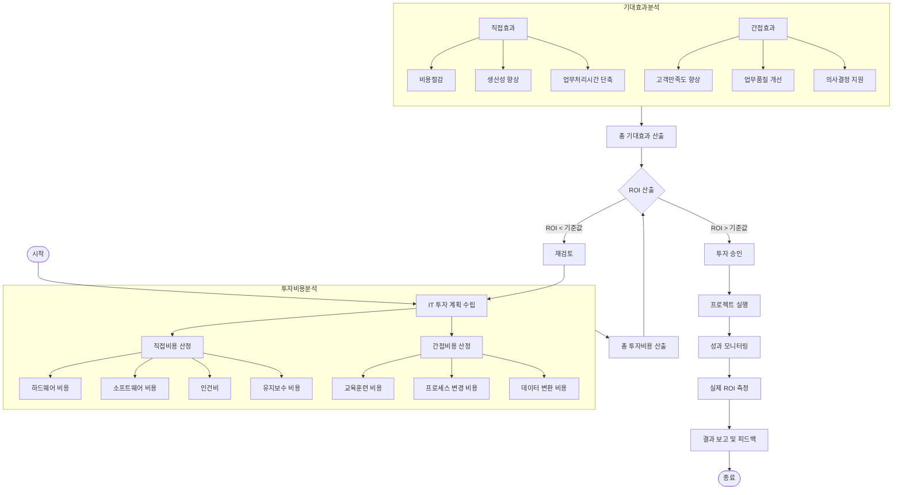

# IT ROI: IT 투자 대비 성과 분석의 핵심

<!-- mtoc-start -->

- [IT ROI의 정의 및 개념](#it-roi의-정의-및-개념)
  - [IT 투자비용](#it-투자비용)
  - [IT 투자성과](#it-투자성과)
- [IT ROI 분석 방법](#it-roi-분석-방법)
  - [1. 분석 시기와 목적 기준](#1-분석-시기와-목적-기준)
  - [2. 회수 기간과 전략적 기여도 기준](#2-회수-기간과-전략적-기여도-기준)
    - [비용-효과 분석 (Cost-Benefit Analysis)](#비용-효과-분석-cost-benefit-analysis)
    - [정보경제학 (Information Economics)](#정보경제학-information-economics)
    - [실물옵션 가치 (Real Options)](#실물옵션-가치-real-options)
    - [시나리오 계획 (Scenario Planning)](#시나리오-계획-scenario-planning)
    - [정보 기반 (Information Orientation)](#정보-기반-information-orientation)
- [IT ROI 분석 프로세스](#it-roi-분석-프로세스)
- [IT ROI의 기대 효과](#it-roi의-기대-효과)
- [마무리](#마무리)
- [Keywords](#keywords)

<!-- mtoc-end -->

IT ROI(Return on Investment)는 IT 투자의 비용 대비 성과를 재무적으로 평가하는 분석 방법입니다. IT 시스템의 도입, 유지, 개선 등에 투입된 비용과 이를 통해 얻어진 비즈니스 성과를 측정함으로써 투자 효율성을 판단하는 데 중요한 도구로 활용됩니다. IT ROI의 정의, 주요 분석 방법, 그리고 기대 효과를 살펴보겠습니다.

## IT ROI의 정의 및 개념

### IT 투자비용

IT 투자비용은 IT 프로젝트와 관련된 모든 비용을 포함하며, 주로 다음과 같은 항목으로 구성:

- **컨설팅 비용**: 프로젝트 초기 단계에서의 전략 수립 및 요구사항 분석 비용
- **구축비용**: 하드웨어, 소프트웨어, 네트워크 등의 시스템 구축 비용
- **유지보수 비용**: 운영 중 발생하는 유지 관리 및 업그레이드 비용

### IT 투자성과

IT 투자성과는 IT가 비즈니스 성과 향상에 기여하는 바를 재무적 지표로 환산한 결과. 이는 생산성 증가, 비용 절감, 매출 증대, 고객 만족도 향상 등으로 측정됩니다.

## IT ROI 분석 방법

IT ROI는 분석 시기와 목적, 그리고 회수 기간 및 전략적 기여도에 따라 다양한 방식으로 평가:

### 1. 분석 시기와 목적 기준

- **사전 ROI 분석**: 프로젝트 시작 전 예상되는 투자비용과 성과를 예측하여 투자 여부 결정
- **중간 ROI 분석**: 프로젝트 진행 중 투자 대비 성과를 측정하여 진행 상황 점검
- **사후 ROI 분석**: 프로젝트 완료 후 실제 투자 대비 성과를 평가하여 향후 의사결정에 활용

### 2. 회수 기간과 전략적 기여도 기준

#### 비용-효과 분석 (Cost-Benefit Analysis)

- 투자비용과 효과를 정량적으로 비교하여 순이익 산출

#### 정보경제학 (Information Economics)

- IT가 조직의 비즈니스 가치에 미치는 영향을 정성적 및 정량적으로 평가

#### 실물옵션 가치 (Real Options)

- IT 투자가 미래의 유연성을 제공하는 가치를 포함하여 평가

#### 시나리오 계획 (Scenario Planning)

- 다양한 시나리오를 가정하여 IT 투자로 인한 리스크와 성과를 분석

#### 정보 기반 (Information Orientation)

- 조직의 정보 활용 능력을 기반으로 IT 투자 성과를 측정

## IT ROI 분석 프로세스

1. 투자비용 분석

   - 직접비용: 하드웨어, 소프트웨어, 인건비, 유지보수 비용
   - 간접비용: 교육훈련, 업무프로세스 변경, 데이터 변환 비용

2. 기대효과 분석

   - 직접효과: 비용절감, 생산성 향상, 업무처리시간 단축
   - 간접효과: 고객만족도 향상, 업무품질 개선, 의사결정 지원

3. ROI 산출 및 의사결정

   - 기준값과 비교하여 투자 승인 또는 재검토 결정
   - 승인 시 프로젝트 실행으로 진행

4. 모니터링 및 평가
   - 실제 ROI 측정
   - 결과 보고 및 피드백

## IT ROI의 기대 효과

1. **투자 효율성 증대**

   - 투자 대비 성과를 명확히 측정하여 효율적인 자원 배분 가능

2. **의사결정 지원**

   - 데이터 기반의 분석 결과를 통해 경영진의 전략적 의사결정 지원

3. **비용 절감**

   - 불필요한 비용을 식별하고, 최적화된 투자 계획 수립 가능

4. **성과 향상**
   - IT가 비즈니스 성과에 미치는 영향을 체계적으로 분석하여 성과 극대화

## 마무리

IT ROI는 IT 투자 효율성을 판단하고, 이를 통해 조직의 경쟁력을 강화하는 데 필수적인 도구입니다. 다양한 분석 방법을 활용하여 IT 투자의 효과를 정량화하고, 최적의 의사결정을 내려 비즈니스 가치를 극대화하세요.

## Keywords

IT ROI, 투자 성과 분석, IT 비용, 비용-효과 분석, 정보경제학, 실물옵션, 시나리오 계획, 정보 기반, 비즈니스 성과, 투자 효율성, 데이터 기반 의사결정