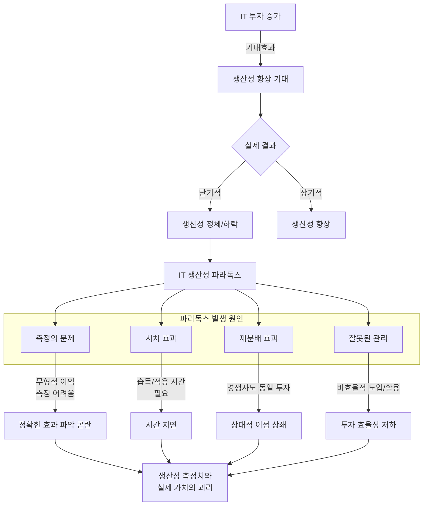

# IT 생산성 패러독스 (Productivity Paradox): IT 투자와 생산성의 불일치

<!-- mtoc-start -->

- [IT 생산성 패러독스의 정의와 개념](#it-생산성-패러독스의-정의와-개념)
  - [정의](#정의)
  - [주요 특징](#주요-특징)
- [IT 생산성 패러독스의 주요 원인](#it-생산성-패러독스의-주요-원인)
  - [1. IT 투자와 성과 간의 불명확한 관계](#1-it-투자와-성과-간의-불명확한-관계)
  - [2. 조직 내 활용 부족](#2-조직-내-활용-부족)
  - [3. 측정 지표의 한계](#3-측정-지표의-한계)
- [IT 생산성 패러독스의 해결 방안](#it-생산성-패러독스의-해결-방안)
  - [1. IT 거버넌스 강화](#1-it-거버넌스-강화)
  - [2. 시뮬레이션 모델링](#2-시뮬레이션-모델링)
  - [3. 프로토타이핑 모델링](#3-프로토타이핑-모델링)
  - [4. 생산성 측정 지표 개선](#4-생산성-측정-지표-개선)
- [IT 생산성 패러독스 개념도](#it-생산성-패러독스-개념도)
- [기대 효과](#기대-효과)
- [마무리](#마무리)
- [Keywords](#keywords)

<!-- mtoc-end -->

IT 생산성 패러독스(Productivity Paradox)는 IT 투자 증가에도 불구하고 기업, 산업, 국가 수준의 생산성이 이에 비례하여 증가하지 않거나 오히려 감소하는 현상을 지칭합니다. 이는 IT 기술이 노동 생산성에 미치는 영향이 명확하지 않고, 기대했던 성과를 제대로 달성하지 못하는 상황에서 발생합니다. IT 생산성 패러독스의 개념, 원인, 그리고 이를 해결하기 위한 방안을 탐구하겠습니다.

## IT 생산성 패러독스의 정의와 개념

### 정의

IT 생산성 패러독스는 IT에 대한 막대한 투자가 생산성 향상으로 직결되지 않는 모순적 현상. 이는 1990년대 이후 디지털 기술 도입이 확대되면서 더욱 주목받았으며, 기업 및 국가 차원에서 IT 투자에 대한 기대와 현실 간의 간극을 나타냅니다.

- **IT 투자 증가**: 기업들이 경쟁력 강화를 위해 지속적으로 IT에 투자
- **생산성 불일치**: 이러한 투자가 명확한 생산성 향상으로 이어지지 않음

### 주요 특징

1. **투자 대비 성과의 불투명성**

   - IT 투자의 실질적인 성과를 측정하기 어렵고, 재무적 기여가 간접적일 수 있음

2. **노동 생산성 증가의 미미함**

   - IT 기술이 업무 속도를 높이지만, 전체 생산성에는 큰 영향을 주지 못할 가능성 존재

3. **관리 및 조직적 문제**
   - IT 시스템 활용 부족 및 조직 문화와의 부조화

## IT 생산성 패러독스의 주요 원인

### 1. IT 투자와 성과 간의 불명확한 관계

- IT 성과는 직접적인 재무적 결과로 나타나지 않는 경우가 많음
- IT가 조직 내 프로세스를 지원하는 역할에 그칠 가능성

### 2. 조직 내 활용 부족

- IT 시스템 도입 후 활용 및 최적화 부족
- 기술 도입과 조직 문화 간의 부조화로 인한 비효율

### 3. 측정 지표의 한계

- 생산성을 측정하는 기존 지표가 IT의 간접적인 기여를 반영하지 못함
- 예: 협업 도구가 생산성에 기여하더라도 명확한 수치로 나타내기 어려움

## IT 생산성 패러독스의 해결 방안

### 1. IT 거버넌스 강화

- IT 투자와 관련된 의사결정을 체계적으로 관리하고 모니터링
- 명확한 ROI(Return on Investment) 분석 기준 수립

### 2. 시뮬레이션 모델링

- 다양한 IT 투자 시나리오를 시뮬레이션하여 최적의 전략 도출
- 리스크를 사전에 분석하고 대비책 마련

### 3. 프로토타이핑 모델링

- IT 시스템 도입 전에 프로토타입을 통해 초기 성과와 문제점을 검증
- 사용자 피드백을 반영하여 도입 전략 조정

### 4. 생산성 측정 지표 개선

- 협업, 데이터 활용, 고객 경험 등 IT의 간접적 기여를 반영하는 새로운 지표 개발
- 기존 KPI와 IT 기반 성과를 통합하여 평가

## IT 생산성 패러독스 개념도

IT 생산성 파라독스를 도식화하여 표현해보겠습니다.

IT 생산성 파라독스의 주요 구성 요소와 인과 관계:

4. IT 투자와 기대효과의 관계
5. 단기적/장기적 결과의 차이
6. 파라독스 발생의 4가지 주요 원인
   - 측정의 문제
   - 시차 효과
   - 재분배 효과
   - 잘못된 관리

## 기대 효과

7. **투자 효율성 향상**

   - IT 거버넌스와 시뮬레이션을 통해 최적의 투자 전략 수립

8. **생산성 극대화**

   - IT와 조직 문화의 조화를 통해 실제 생산성 증가 달성

9. **리스크 감소**

   - 초기 검증과 지속적인 모니터링으로 불필요한 투자 방지

10. **장기적 경쟁력 강화**
   - IT의 간접적 기여를 포함한 성과를 측정하여 지속 가능한 성장 가능

## 마무리

IT 생산성 패러독스는 IT 투자의 가치를 명확히 측정하고 조직 내 활용을 최적화함으로써 극복할 수 있습니다. IT 거버넌스, 시뮬레이션 및 프로토타이핑 모델링을 활용하면 투자 효율성을 높이고 생산성을 극대화할 수 있습니다. 이를 통해 기업과 산업은 디지털 기술을 효과적으로 활용하여 지속 가능한 성장을 도모할 수 있습니다.

## Keywords

IT 생산성 패러독스, Productivity Paradox, IT 투자, IT 거버넌스, 시뮬레이션 모델링, 프로토타이핑, 생산성 향상, ROI 분석, 디지털 기술, 조직 문화