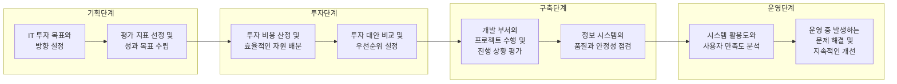

# IT 투자성과평가: 조직 목표 달성 기여도를 측정하는 전략

<!-- mtoc-start -->

- [IT 투자성과평가의 주요 지표](#it-투자성과평가의-주요-지표)
  - [1. 품질 지표](#1-품질-지표)
  - [2. 이용 지표](#2-이용-지표)
  - [3. 효과 지표](#3-효과-지표)
- [IT 투자성과 측정 방법](#it-투자성과-측정-방법)
  - [1. 정량적(재무적) 평가 방법](#1-정량적재무적-평가-방법)
  - [2. 정성적(비재무적) 평가 방법](#2-정성적비재무적-평가-방법)
- [IT 투자성과평가의 지표 흐름](#it-투자성과평가의-지표-흐름)
  - [1. 기획 단계](#1-기획-단계)
  - [2. 투자 단계](#2-투자-단계)
  - [3. 구축 단계](#3-구축-단계)
  - [4. 운영 단계](#4-운영-단계)
- [IT 투자성과평가의 단계별 흐름도](#it-투자성과평가의-단계별-흐름도)
- [IT 투자성과평가의 기대 효과](#it-투자성과평가의-기대-효과)
- [마무리](#마무리)
- [Keywords](#keywords)

<!-- mtoc-end -->

IT 투자성과평가는 조직이 IT 투자에 대한 목표 달성 기여도를 전략적이고 정성적으로 평가하는 활동입니다. 투자, 품질, 이용, 효과의 관점에서 IT 시스템과 기술이 조직에 얼마나 기여하고 있는지를 체계적으로 분석합니다. IT 투자성과평가의 주요 지표, 측정 방법, 그리고 지표 흐름에 대해 자세히 알아보겠습니다.

## IT 투자성과평가의 주요 지표

IT 투자성과평가는 품질, 이용, 효과라는 세 가지 주요 지표를 중심으로 이루어집니다.

### 1. 품질 지표

- **정보 품질**: 데이터의 정확성, 신뢰성, 적시성 등을 평가
- **시스템 품질**: IT 시스템의 안정성, 사용성, 응답 속도 등을 측정

### 2. 이용 지표

- **정보시스템 활용도**: 시스템 활용 빈도와 범위를 분석
- **사용자 만족도**: 사용자 경험과 만족도를 설문이나 피드백으로 평가
- **접속시간**: 시스템 응답 속도 및 접속 시간의 효율성 측정

### 3. 효과 지표

- **업무 성과 향상도**: IT 시스템 도입으로 인한 생산성 및 효율성 증가율
- **업무 처리 시간**: 프로세스 개선을 통해 업무 시간이 얼마나 단축되었는지 평가

## IT 투자성과 측정 방법

IT 투자성과를 측정하기 위해 정량적 방법과 정성적 방법을 함께 활용합니다.

### 1. 정량적(재무적) 평가 방법

- **ROI (Return on Investment)**: 투자 대비 수익률 평가
- **NPV (Net Present Value)**: 현재 가치를 기준으로 한 순현재가치 분석
- **PP (Payback Period)**: 투자 비용 회수 기간 측정
- **IRR (Internal Rate of Return)**: 내부 수익률 계산으로 투자 타당성 평가

### 2. 정성적(비재무적) 평가 방법

- **Value Chain**: IT가 조직의 가치 사슬에 미치는 영향을 분석
- **BCG Matrix**: IT 투자가 사업 포트폴리오 내에서 어떤 위치를 차지하는지 평가

## IT 투자성과평가의 지표 흐름

IT 투자성과평가는 다음과 같은 단계별 흐름을 따릅니다:

### 1. 기획 단계

- IT 투자 목표와 방향 설정
- 평가 지표 선정 및 성과 목표 수립

### 2. 투자 단계

- 투자 비용 산정 및 효율적인 자원 배분
- 투자 대안 비교 및 우선순위 설정

### 3. 구축 단계

- 개발 부서의 프로젝트 수행 및 진행 상황 평가
- 정보 시스템의 품질과 안정성 점검

### 4. 운영 단계

- 시스템 활용도와 사용자 만족도 분석
- 운영 중 발생하는 문제 해결 및 지속적인 개선

## IT 투자성과평가의 단계별 흐름도

## IT 투자성과평가의 기대 효과

1. **효율적인 자원 활용**

   - 투자 우선순위를 명확히 하여 자원의 최적 배분 가능

2. **성과 극대화**

   - IT 투자로 인한 업무 성과 및 효율성 증대

3. **의사결정 지원**

   - 정량적, 정성적 데이터를 기반으로 경영진의 전략적 의사결정 지원

4. **지속 가능한 성장**
   - IT 시스템의 지속적 개선으로 장기적인 경쟁력 확보

## 마무리

IT 투자성과평가는 조직의 IT 투자가 비즈니스 성과에 얼마나 기여하고 있는지를 평가하기 위한 필수적인 도구입니다. 품질, 이용, 효과의 관점에서 IT 성과를 정량적, 정성적으로 측정하고, 이를 통해 전략적 의사결정을 지원할 수 있습니다. 체계적인 평가를 통해 IT 투자 효율성을 극대화하고 조직의 지속 가능한 성장을 도모하세요.

## Keywords

IT 투자성과평가, ROI, NPV, PP, IRR, 정보 품질, 시스템 품질, 사용자 만족도, Value Chain, BCG Matrix, IT 성과, 자원 활용, 지속 가능 성장