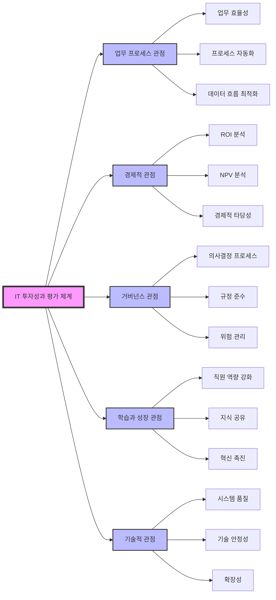

# 공공기관 정보기술 투자성과 성과관리: BSC 모델과 기술적 관점의 융합

<!-- mtoc-start -->

- [공공기관 정보기술 투자성과 관리의 필요성](#공공기관-정보기술-투자성과-관리의-필요성)
- [성과관리 평가 체계](#성과관리-평가-체계)
  - [1. 업무 프로세스 관점](#1-업무-프로세스-관점)
  - [2. 경제적 관점](#2-경제적-관점)
  - [3. 거버넌스 관점](#3-거버넌스-관점)
  - [4. 학습과 성장 관점](#4-학습과-성장-관점)
  - [5. 기술적 관점](#5-기술적-관점)
- [공공기관 IT 투자성과 평가 체계도](#공공기관-it-투자성과-평가-체계도)
- [평가 체계의 핵심 요소: BSC + 기술적 관점](#평가-체계의-핵심-요소-bsc--기술적-관점)
- [기대 효과](#기대-효과)
- [마무리](#마무리)
- [Keywords](#keywords)

<!-- mtoc-end -->

공공기관의 정보기술 투자성과 관리는 IT 투자 적정성을 평가하고, 중복 문제를 해결하며, 투자 가치의 객관성을 확보하기 위한 필수적인 과정입니다. 이를 위해 BSC(Balanced Scorecard) 모델의 네 가지 관점(재무, 고객, 내부 프로세스, 학습과 성장)과 기술적 관점을 통합하여 체계적인 관리 체계를 구축합니다. 본 포스트에서는 공공기관의 IT 투자성과 관리의 필요성, 평가 체계, 그리고 기대 효과에 대해 살펴보겠습니다.

## 공공기관 정보기술 투자성과 관리의 필요성

1. **정보사업 투자성과 극대화**

   - 제한된 자원을 효과적으로 활용하여 정보기술 프로젝트의 성과를 극대화

2. **투명성 보장**

   - 표준화된 평가 체계를 통해 IT 투자 과정의 투명성을 확보

3. **투자가치의 객관성 확보**

   - 정량적, 정성적 지표를 통해 IT 투자의 효과를 객관적으로 평가

4. **표준화된 평가체계 구축**
   - 공통된 프레임워크를 통해 조직 간 비교 가능성 및 일관성 강화

## 성과관리 평가 체계

공공기관의 IT 투자성과 평가는 다양한 관점을 반영하여 체계적으로 수행됩니다. 주요 평가 관점은 다음과 같습니다:

### 1. 업무 프로세스 관점

- 정보시스템이 조직의 핵심 업무 프로세스를 얼마나 효율적으로 지원하는지 평가
- 업무 간소화, 자동화 수준, 데이터 흐름 최적화 등을 측정

### 2. 경제적 관점

- 투자 대비 성과를 재무적으로 평가
- ROI(Return on Investment), NPV(Net Present Value) 등을 활용하여 경제적 타당성을 분석

### 3. 거버넌스 관점

- IT 투자의 의사결정 과정과 실행을 체계적으로 관리
- 규정 준수, 위험 관리, IT 정책 일관성 평가

### 4. 학습과 성장 관점

- IT 프로젝트를 통해 조직이 학습한 결과와 성장 가능성 평가
- 직원 역량 강화, 지식 공유 및 혁신 촉진

### 5. 기술적 관점

- 정보시스템의 기술적 품질과 안정성 평가
- 시스템 가용성, 확장성, 기술 지원 수준 분석

## 공공기관 IT 투자성과 평가 체계도

## 평가 체계의 핵심 요소: BSC + 기술적 관점

BSC 모델은 공공기관의 IT 성과를 다차원적으로 평가하기 위한 주요 프레임워크로, 기술적 관점을 추가하여 IT 프로젝트의 특수성을 반영합니다:

1. **재무 관점**

   - 투자 대비 재무적 성과 측정
   - 비용 절감 및 매출 증대 분석

2. **고객 관점**

   - 시스템 사용자 및 이해관계자의 만족도 평가
   - 사용자 피드백과 요구사항 반영 수준 측정

3. **내부 프로세스 관점**

   - 정보시스템이 내부 프로세스를 지원하는 효과성 평가

4. **학습과 성장 관점**

   - 조직의 IT 활용 역량 및 혁신 가능성 평가

5. **기술적 관점**
   - 정보시스템의 기술적 성능과 지속 가능성 평가

## 기대 효과

6. **투자 성과 극대화**

   - 체계적인 관리와 평가를 통해 공공기관의 IT 투자 효과를 최적화

7. **투명성과 신뢰성 강화**

   - 표준화된 평가 체계를 통해 이해관계자의 신뢰 확보

8. **리스크 감소**

   - 중복 투자 및 비효율적인 프로젝트를 사전에 방지

9. **장기적 경쟁력 강화**
   - IT 시스템의 지속적인 개선과 혁신을 통해 공공기관의 경쟁력 향상

## 마무리

공공기관 정보기술 투자성과 관리는 IT 투자의 적정성과 효과를 객관적으로 평가하고, 지속 가능한 발전을 위한 기반을 제공합니다. BSC 모델과 기술적 관점을 통합하여 체계적인 관리 체계를 구축함으로써 IT 투자 효과를 극대화하고 투명성을 확보할 수 있습니다. 이를 통해 공공기관은 효율적이고 신뢰받는 정보기술 서비스를 제공할 수 있습니다.

## Keywords

공공기관, 정보기술, IT 투자성과, BSC 모델, 기술적 관점, 성과관리, 투명성, ROI, 정보시스템, 거버넌스