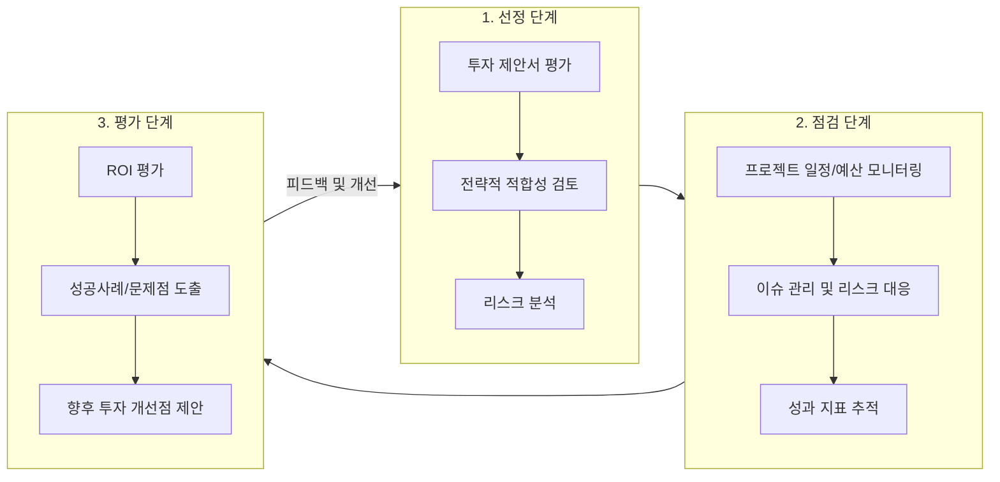

# CPIC: 자본계획 및 투자 점검 기법의 핵심 이해

<!-- mtoc-start -->

- [CPIC의 정의 및 개념](#cpic의-정의-및-개념)
- [CPIC의 3가지 주요 요소](#cpic의-3가지-주요-요소)
  - [1. **선정(Select)**](#1-선정select)
  - [2. **점검(Control)**](#2-점검control)
  - [3. **평가(Evaluate)**](#3-평가evaluate)
- [CPIC(자본계획 및 투자통제) 프레임워크](#cpic자본계획-및-투자통제-프레임워크)
- [CPIC의 필요성](#cpic의-필요성)
- [기대 효과](#기대-효과)
- [마무리](#마무리)
- [Keywords](#keywords)

<!-- mtoc-end -->

CPIC(Capital Planning & Investment Control)는 정보화를 위한 자본 계획과 투자 점검을 체계적으로 수행하기 위한 접근법으로, 조직의 전략 계획 수립, 예산 편성, 정보기술 관리 등을 통합적으로 다룹니다. 특히, 미 연방 정부에서 정보화 투자관리 계획 및 점검의 기본 프레임워크로 활용되며, IT 투자 성패에 중요한 역할을 합니다. CPIC의 정의, 주요 구성 요소, 그리고 기대 효과에 대해 살펴보겠습니다.

## CPIC의 정의 및 개념

CPIC는 정보기술 투자관리 체계를 체계적으로 구축하고, 투자와 성과를 통합적으로 관리하기 위한 기법. 이를 통해 정보기술 투자를 전략적으로 계획하고, 추진 현황을 점검하며, 수행 결과를 평가하는 전체 프로세스를 포함합니다.

- **정보자원의 투자화**: 정보자원을 단순 운영 비용이 아닌 전략적 투자 대상으로 인식
- **포트폴리오 관리의 중요성**: 투자의 타당성과 성과를 지속적으로 모니터링
- **통합적 접근**: 전략 계획, 예산, 기술 관리의 유기적 연계

## CPIC의 3가지 주요 요소

CPIC는 선정(Select), 점검(Control), 평가(Evaluate)의 3단계로 구성되어 있으며, 각 단계는 IT 투자 과정의 중요한 지점을 다룹니다.

### 1. **선정(Select)**

- **목표**: 조직의 전략적 목표에 부합하는 투자 대안을 선택
- **주요 활동**:
  - 투자 제안서 평가
  - 전략적 적합성 검토
  - 리스크 분석

### 2. **점검(Control)**

- **목표**: 진행 중인 IT 투자 프로젝트의 현황을 점검하고, 필요시 조정
- **주요 활동**:
  - 프로젝트 일정과 예산 모니터링
  - 이슈 관리 및 리스크 대응
  - 성과 지표 추적

### 3. **평가(Evaluate)**

- **목표**: 투자 종료 후 성과와 실패 요인을 분석하여 학습
- **주요 활동**:
  - ROI(Return on Investment) 평가
  - 성공 사례와 문제점 도출
  - 향후 투자 개선점 제안

## CPIC(자본계획 및 투자통제) 프레임워크

## CPIC의 필요성

1. **IT 투자 성과 극대화**

   - 체계적인 계획과 관리로 투자 효율성 제고

2. **투명성과 신뢰성 확보**

   - 표준화된 프레임워크를 통해 의사결정의 투명성 강화

3. **리스크 관리 강화**

   - 사전 리스크 평가 및 지속적인 점검을 통해 실패 확률 최소화

4. **지속 가능한 IT 투자 문화 조성**
   - 평가와 학습을 통해 장기적으로 발전 가능한 투자 시스템 구축

## 기대 효과

1. **전략적 IT 투자 관리**

   - CPIC는 정보기술이 조직의 장기적 전략 목표에 부합하도록 지원

2. **성과 중심의 투자 문화 형성**

   - 투자 성과를 명확히 평가하여 성과 중심의 조직 문화 구축

3. **비용 절감 및 효율성 강화**

   - 불필요한 중복 투자와 비효율적인 운영을 사전에 방지

4. **조직 내 협업 강화**
   - CPIC는 예산, 전략, 기술 부서 간의 유기적인 협업을 촉진

## 마무리

CPIC는 정보화 투자의 성과를 극대화하고 리스크를 최소화하기 위한 체계적인 접근법입니다. 선정, 점검, 평가의 단계를 통해 정보기술 투자가 조직의 전략적 목표를 달성하는 데 기여할 수 있도록 지원합니다. CPIC를 효과적으로 활용하여 투명하고 효율적인 IT 투자 관리를 실현해 보세요.

## Keywords

CPIC, 자본계획, 투자 점검, IT 투자관리, 정보화 투자, ROI, 전략적 목표, 포트폴리오 관리, 리스크 관리, IT 성과, 정보기술 관리