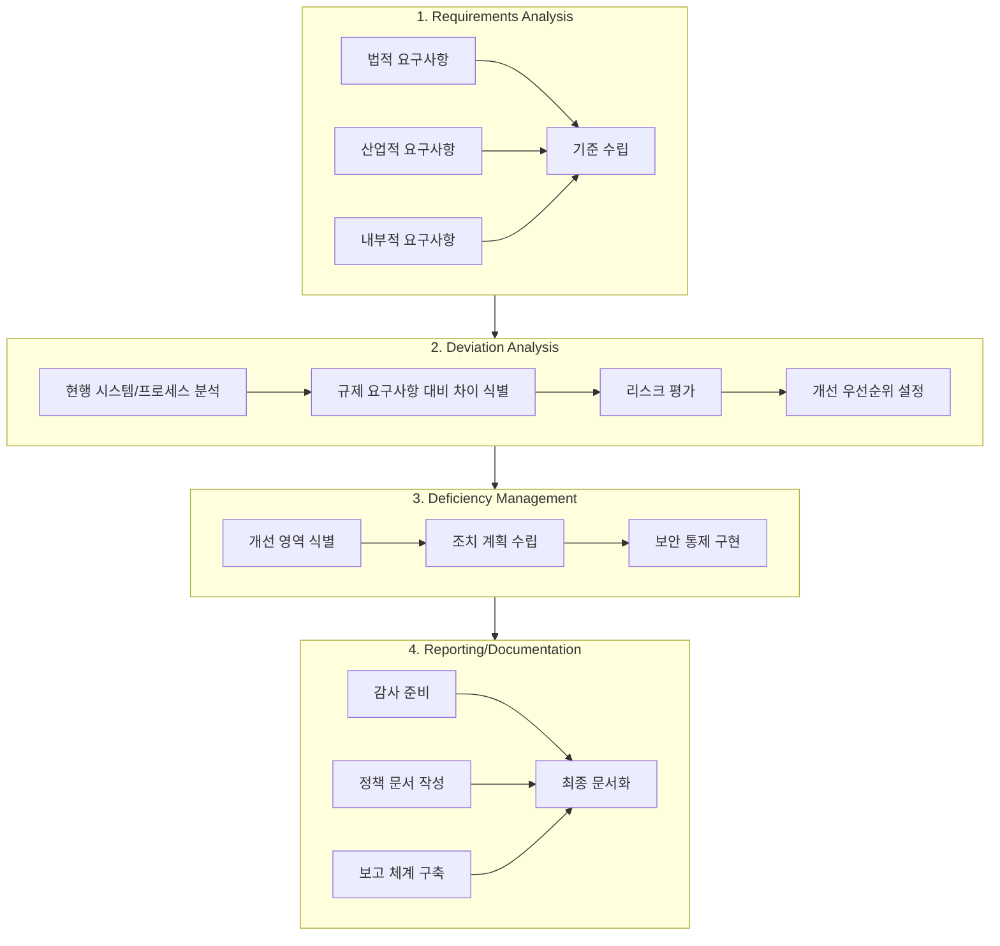

# IT Compliance: 기업 투명성과 경쟁력을 강화하는 핵심 전략

<!-- mtoc-start -->

- [IT Compliance의 정의와 배경](#it-compliance의-정의와-배경)
  - [정의](#정의)
  - [배경](#배경)
- [IT Compliance의 주요 특징](#it-compliance의-주요-특징)
- [IT Compliance의 구성 요소](#it-compliance의-구성-요소)
  - [1. Requirements Analysis](#1-requirements-analysis)
  - [2. Deviation Analysis (일탈 분석)](#2-deviation-analysis-일탈-분석)
  - [3. Deficiency Management (부족 관리)](#3-deficiency-management-부족-관리)
  - [4. Reporting/Documentation](#4-reportingdocumentation)
- [IT Compliance 구성도](#it-compliance-구성도)
- [IT Compliance의 기대 효과](#it-compliance의-기대-효과)
- [마무리](#마무리)
- [Keywords](#keywords)

<!-- mtoc-end -->

IT Compliance는 기업의 투명성과 경쟁력을 강화하기 위해 리스크 관리와 규제 준수를 목표로 한 필수적인 활동입니다. 이 기법은 사베인-옥슬리(Sarbanes-Oxley), 바젤 III(Basel III), 기업회계 규정 등 다양한 법규와 규제를 준수하는 동시에 IT 시스템을 정비하고 의무 활동을 관리하는 데 중점을 둡니다. IT Compliance의 정의, 주요 특징, 구성 요소, 그리고 기대 효과를 살펴보겠습니다.

## IT Compliance의 정의와 배경

### 정의

IT Compliance는 기업이 법적, 윤리적, 산업 표준을 준수하면서 IT 시스템과 비즈니스 프로세스를 관리하고 최적화하는 활동. 이를 통해 리스크를 줄이고, 투명성을 높이며, 경쟁력을 확보합니다.

### 배경

IT Compliance의 중요성은 글로벌 규제 환경 변화에 따라 더욱 부각되었습니다. 주요 배경은 다음과 같습니다:

- **사베인-옥슬리(Sarbanes-Oxley)**: 재무 보고서의 투명성과 정확성을 보장하기 위한 미국 법안
- **바젤 III(Basel III)**: 금융기관의 리스크 관리와 자본 요건 강화
- **기업회계 규정**: 재무 데이터의 정확성과 규제 준수를 위한 표준 제시

## IT Compliance의 주요 특징

1. **업무 프로세스 재정비**

   - 규제 준수를 위해 기존 업무 프로세스를 재설계하고 최적화

2. **단기적 수요 증가**

   - 규제 강화 시점에 따라 Compliance 요구사항이 폭발적으로 증가

3. **광범위한 범위**
   - 법적 요구사항, IT 시스템, 데이터 관리, 조직 문화 등 다양한 영역 포함

## IT Compliance의 구성 요소

IT Compliance는 요구사항 분석에서 시작하여 문서화에 이르는 체계적인 접근법을 따릅니다:

### 1. Requirements Analysis

- 법적, 산업적, 내부적 요구사항을 분석하여 명확한 기준 수립
- 예: 데이터 보안 표준, 감사 요구사항

### 2. Deviation Analysis (일탈 분석)

- 기존 시스템이나 프로세스가 규제 요구사항에서 벗어난 부분을 식별
- 리스크 평가와 개선 우선순위 설정

### 3. Deficiency Management (부족 관리)

- 요구사항에 미달하는 영역을 개선하기 위한 조치 계획 수립
- 예: 데이터 암호화, 액세스 제어 강화

### 4. Reporting/Documentation

- 규제 준수를 입증하기 위한 보고서 작성과 문서화
- 주요 활동: 감사 준비, 정책 문서 작성, 보고 체계 구축

## IT Compliance 구성도

4. Requirements Analysis 단계에서는 세 가지 유형의 요구사항이 기준 수립으로 수렴.
5. Deviation Analysis 단계는 순차적인 분석 프로세스.
6. Deficiency Management 단계에서는 개선 활동의 흐름.
7. Reporting/Documentation 단계에서는 세 가지 주요 활동이 최종 문서화로 통합되는 과정.

각 단계는 순차적으로 연결되어 있어 전체적인 IT Compliance 프로세스의 흐름 정의

## IT Compliance의 기대 효과

8. **투명성 강화**

   - 규제 준수를 통해 기업 내부 및 외부 이해관계자 간 신뢰 구축

9. **리스크 최소화**

   - 데이터 손실, 규제 위반, 법적 제재 등의 리스크 감소

10. **운영 효율성 향상**

   - 프로세스 표준화와 IT 시스템 정비를 통해 업무 효율성 증대

11. **경쟁력 확보**
   - 규제 준수와 함께 혁신적 IT 관리 체계를 구축하여 시장에서의 신뢰 확보

## 마무리

IT Compliance는 단순한 규제 준수를 넘어, 기업의 투명성과 경쟁력을 강화하는 전략적 도구로 자리 잡고 있습니다. Requirements Analysis, Deviation Analysis, Deficiency Management, Reporting/Documentation의 단계를 체계적으로 수행함으로써 리스크를 최소화하고 지속 가능한 성장을 도모할 수 있습니다. IT Compliance를 통해 신뢰받는 기업으로 도약하세요.

## Keywords

IT Compliance, 규제 준수, 사베인-옥슬리, 바젤 III, 기업 투명성, 리스크 관리, Deficiency Management, Reporting, IT 시스템 정비, 경쟁력 강화, 데이터 보안