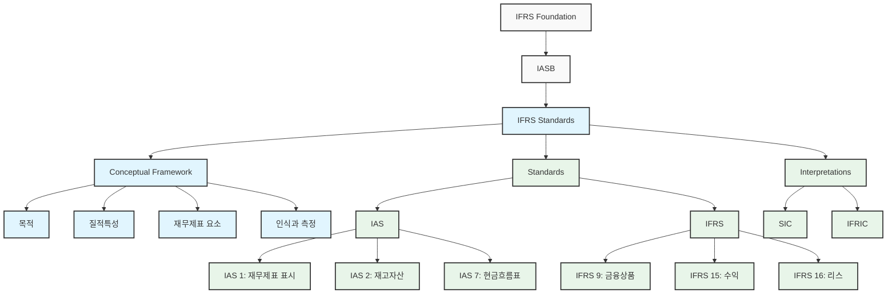

# IFRS (International Financial Reporting Standard): 글로벌 회계 기준의 중요성

<!-- mtoc-start -->

- [IFRS의 정의와 필요성](#ifrs의-정의와-필요성)
  - [정의](#정의)
  - [필요성](#필요성)
- [IFRS의 주요 특징](#ifrs의-주요-특징)
- [IFRS Framework](#ifrs-framework)
- [IFRS 도입의 기대 효과](#ifrs-도입의-기대-효과)
- [마무리](#마무리)
- [Keywords](#keywords)

<!-- mtoc-end -->

IFRS(International Financial Reporting Standard)는 국제 회계 기준 위원회(IASB, International Accounting Standards Board)가 공표한 회계 기준으로, 기업의 회계처리와 재무제표의 국제적 통일성을 확보하기 위해 도입되었습니다. 글로벌화된 경제 환경에서 IFRS는 기업 투명성을 강화하고, 투자자와 이해관계자들에게 신뢰를 제공하며, 다국적 기업의 효율적인 회계 관리를 지원하는 필수적인 도구로 자리 잡았습니다. IFRS의 개념, 필요성, 주요 특징, 그리고 기대 효과를 살펴보겠습니다.

## IFRS의 정의와 필요성

### 정의

IFRS는 국제적으로 통일된 회계 기준을 통해 기업의 재무제표를 일관되게 작성할 수 있도록 하는 글로벌 회계 표준. 이를 통해 국경을 초월한 투자와 기업 활동이 보다 투명하고 신뢰성 있게 이루어질 수 있습니다.

### 필요성

1. **글로벌화 대응**

   - 글로벌 경제 환경에서 다국적 기업의 회계처리를 표준화하여 신뢰성과 효율성을 강화

2. **회계처리 이중화 문제 해결**

   - 해외 상장 기업의 경우 각국 회계 기준과 IFRS 간의 차이를 해소하여 중복 작업 감소

3. **기업 투명성 강화**
   - 재무정보의 투명성과 비교 가능성을 높여 투자자와 이해관계자의 신뢰 확보

## IFRS의 주요 특징

4. **원칙 기반 접근**

   - 세부 규정 대신 원칙에 기반하여 회계처리를 유연하게 적용
   - 다양한 산업과 상황에 맞는 회계 처리 가능

5. **재무제표의 국제적 비교 가능성**

   - 모든 국가에서 동일한 기준을 적용하여 글로벌 투자 환경 조성

6. **공정 가치 평가**

   - 자산과 부채를 공정 가치로 평가하여 재무제표의 현실성과 정확성 강화

7. **투자자 중심**
   - 투자자와 이해관계자들의 의사결정을 지원하는 투명한 정보 제공

## IFRS Framework

IFRS의 전반적인 체계도를 Mermaid를 사용하여 작성하겠습니다.

8. 최상위에는 IFRS Foundation이 있으며, 이는 독립적인 회계기준 제정기구.
9. IASB(International Accounting Standards Board)는 IFRS Foundation 산하의 기준 제정 위원회.
10. IFRS Standards는 크게 세 부분으로 구성:

   - Conceptual Framework (개념체계)
   - Standards (기준서)
   - Interpretations (해석서)

11. 주요 기준서:

   - IAS (International Accounting Standards): 기존의 국제회계기준
   - IFRS (International Financial Reporting Standards): 새로운 국제회계기준

12. 해석서:
   - SIC (Standing Interpretations Committee): 구 해석위원회의 해석서
   - IFRIC (IFRS Interpretations Committee): 현재 해석위원회의 해석서

## IFRS 도입의 기대 효과

13. **글로벌 자본 시장 접근성 향상**

   - 국제적으로 통일된 기준으로 재무제표를 작성하여 해외 투자 유치 용이

14. **비용 절감**

   - 중복된 회계처리를 줄이고 효율성을 높임

15. **투자자 신뢰 제고**

   - 투명하고 비교 가능한 재무정보 제공으로 신뢰도 향상

16. **조직 경쟁력 강화**
   - 표준화된 회계 기준을 통해 내부 관리와 전략적 의사결정 지원

## 마무리

IFRS는 국제적 통일성과 신뢰성을 기반으로 한 글로벌 회계 기준으로, 기업 투명성 강화와 글로벌 시장에서의 경쟁력 확보에 기여하고 있습니다. 이를 통해 기업은 투자자의 신뢰를 얻고, 효율적인 회계 관리를 통해 장기적인 성장 기반을 마련할 수 있습니다. IFRS를 적극 도입하여 글로벌 비즈니스 환경에서 성공적인 전략을 구현하세요.

## Keywords

IFRS, 국제 회계 기준, 글로벌 회계, 재무제표, 기업 투명성, 투자자 신뢰, 공정 가치 평가, 회계 표준화, IASB, 글로벌화