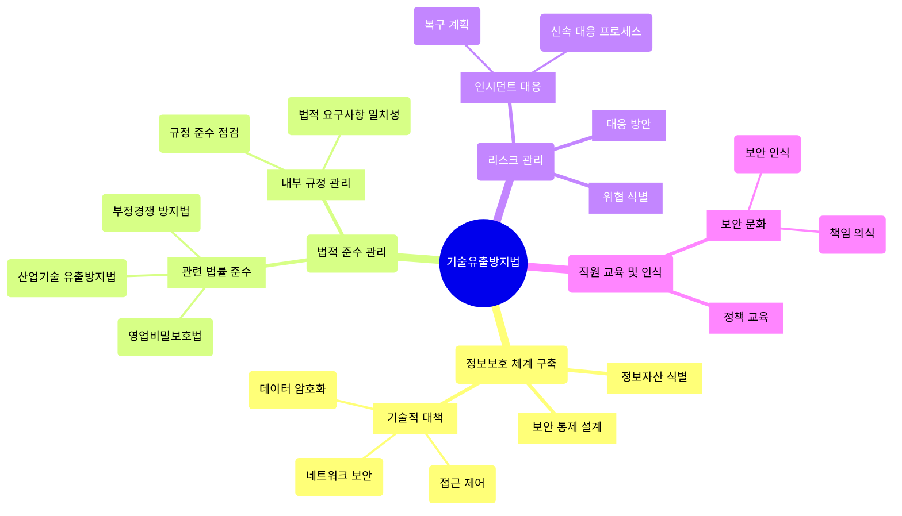

# 기술유출방지법: 기업 정보보호와 리스크 관리의 필수 법안

<!-- mtoc-start -->

- [기술유출방지법의 정의와 필요성](#기술유출방지법의-정의와-필요성)
  - [정의](#정의)
  - [필요성](#필요성)
- [기술유출방지법의 주요 구성 요소](#기술유출방지법의-주요-구성-요소)
  - [1. 정보보호 체계 구축](#1-정보보호-체계-구축)
  - [2. 법적 준수 관리](#2-법적-준수-관리)
  - [3. 리스크 관리](#3-리스크-관리)
  - [4. 직원 교육 및 인식 강화](#4-직원-교육-및-인식-강화)
- [기술유출방지법의 구성도](#기술유출방지법의-구성도)
- [기술유출방지법의 기대 효과](#기술유출방지법의-기대-효과)
- [마무리](#마무리)
- [Keywords](#keywords)

<!-- mtoc-end -->

기술유출방지법은 기업의 가치 있는 정보자산을 보호하고, 산업기술의 유출을 방지하기 위해 제정된 법률입니다. 이는 부정경쟁 방지법, 산업기술 유출방지법, 영업비밀보호법 등의 법적 체계를 기반으로 기업 보안 수준에 적합한 통제 대책을 마련하여 보안 리스크를 최소화하는 데 중점을 둡니다. 기술유출방지법의 개념, 필요성, 구성 요소, 그리고 기대 효과를 살펴보겠습니다.

## 기술유출방지법의 정의와 필요성

### 정의

기술유출방지법은 기업의 핵심 기술과 영업비밀을 보호하기 위한 법적 프레임워크, 정보보호와 보안 통제를 통해 불법적인 기술 유출을 방지하고 기업의 경쟁력을 강화하는 데 목적을 둡니다.

### 필요성

1. **정보보호의 중요성**

   - 기업의 핵심 기술과 영업비밀은 경쟁 우위를 유지하는 데 필수적인 자산
   - 기술 유출로 인한 재무적 손실과 신뢰도 하락 방지

2. **글로벌 시장에서의 경쟁력 확보**

   - 국제 시장에서 기술 유출 방지와 보안 체계를 통한 신뢰성 강화

3. **법적 리스크 관리**
   - 규제 준수를 통해 법적 분쟁과 손실을 예방

## 기술유출방지법의 주요 구성 요소

### 1. 정보보호 체계 구축

- 기업의 가치 있는 정보자산을 식별하고, 이에 맞는 보안 통제를 설계
- 데이터 암호화, 접근 제어, 네트워크 보안 등 기술적 대책 적용

### 2. 법적 준수 관리

- 산업기술 유출방지법, 부정경쟁 방지법, 영업비밀보호법 등의 법률 준수
- 기업 내부 규정과 법적 요구사항의 일치성 점검

### 3. 리스크 관리

- 기술 유출의 잠재적 위협을 사전에 식별하고 대응 방안 마련
- 보안 인시던트 발생 시 신속한 대응 프로세스 구축

### 4. 직원 교육 및 인식 강화

- 기술 보호와 관련된 내부 정책 및 절차에 대한 직원 교육
- 보안 문화 정착과 책임 의식 제고

## 기술유출방지법의 구성도

4. 정보보호 체계 구축 - 기술적 측면의 보안 대책
5. 법적 준수 관리 - 관련 법률과 규정의 준수
6. 리스크 관리 - 위협 대응과 인시던트 처리
7. 직원 교육 및 인식 - 조직 문화와 교육 측면

## 기술유출방지법의 기대 효과

8. **기업 경쟁력 강화**

   - 핵심 기술 보호를 통해 시장에서의 경쟁력 유지 및 강화

9. **법적 리스크 최소화**

   - 규제 준수와 효과적인 정보보호로 법적 분쟁 방지

10. **신뢰성 향상**

   - 고객, 파트너, 투자자들로부터 신뢰도 제고

11. **비용 절감**
   - 기술 유출 방지를 통해 잠재적 손실과 복구 비용 절감

## 마무리

기술유출방지법은 기업의 정보자산을 보호하고 경쟁력을 강화하기 위한 필수적인 법적 프레임워크입니다. 정보보호 체계 구축, 법적 준수, 리스크 관리, 그리고 직원 교육을 통해 기술 유출의 위험을 최소화하고 지속 가능한 성장을 도모할 수 있습니다. 이러한 법적 체계를 적극 활용하여 기업의 핵심 자산을 보호하고 글로벌 시장에서의 경쟁력을 확보하세요.

## Keywords

기술유출방지법, 정보보호, 산업기술 유출방지법, 부정경쟁 방지법, 영업비밀보호법, 기업 보안, 리스크 관리, 데이터 암호화, 네트워크 보안, 기업 경쟁력, 법적 준수