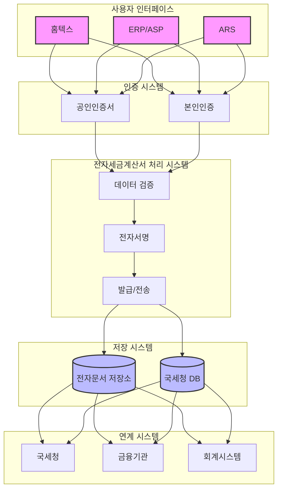

# 전자세금계산서제도: 세무 관리의 디지털 혁신

<!-- mtoc-start -->

- [전자세금계산서제도의 정의와 필요성](#전자세금계산서제도의-정의와-필요성)
  - [정의](#정의)
  - [필요성](#필요성)
- [전자세금계산서제도의 주요 장점](#전자세금계산서제도의-주요-장점)
- [전자세금계산서 발급 방법](#전자세금계산서-발급-방법)
  - [1. 홈텍스](#1-홈텍스)
  - [2. ERP/ASP 시스템](#2-erpasp-시스템)
  - [3. ARS(자동응답시스템)](#3-ars자동응답시스템)
- [전자세금계서버 발급 시스템 아키텍처](#전자세금계서버-발급-시스템-아키텍처)
- [기대 효과](#기대-효과)
- [마무리](#마무리)
- [Keywords](#keywords)

<!-- mtoc-end -->

전자세금계산서제도는 전자적 방법으로 세금계산서를 작성, 발급(전자서명)하고 그 발급 명세를 국세청에 전송하는 제도입니다. 이 제도는 납세 협력 비용 절감과 세무 거래의 투명성 확보를 목표로 하며, 경제의 디지털화라는 환경 변화 속에서 도입되었습니다. 전자세금계산서제도의 개념, 장점, 발급 방법, 그리고 기대 효과를 알아보겠습니다.

## 전자세금계산서제도의 정의와 필요성

### 정의

전자세금계산서제도는 세금계산서를 전자적 방식으로 작성하고 국세청에 실시간으로 전송하여 세무 관리를 체계적으로 운영할 수 있도록 지원하는 제도. 전자서명을 통한 인증과 데이터 전송으로 세무의 신뢰성과 투명성을 높입니다.

### 필요성

1. **납세협력비용 절감**

   - 종이 문서 관리의 불편함 해소
   - 발급, 보관, 전달 과정의 효율화

2. **세무 거래 투명성 확보**

   - 세금계산서 누락 및 오류 방지
   - 국세청과의 실시간 데이터 연계를 통한 투명성 강화

3. **경제의 디지털화 촉진**
   - 디지털 기술 활용으로 세무 관리의 현대화
   - 전자거래 활성화를 통한 경제 디지털화 가속

## 전자세금계산서제도의 주요 장점

4. **세액공제 혜택**

   - 전자세금계산서 발급 시 특정 조건에서 세액공제 가능

5. **오류 방지**

   - 세금계산서 누락 및 작성 오류를 방지하여 세무 리스크 감소

6. **편리성 증대**
   - 세무/회계 업무의 자동화로 처리 시간 단축
   - 전자 문서 기반으로 보관 및 조회 간소화

## 전자세금계산서 발급 방법

### 1. 홈텍스

- 국세청이 제공하는 홈텍스 시스템을 통해 세금계산서를 발급
- 중소기업 및 개인사업자에게 적합

### 2. ERP/ASP 시스템

- 기업용 전사적 자원관리 시스템(ERP) 또는 응용 서비스 제공자(ASP) 시스템을 활용
- 대규모 사업체와 다량의 세금계산서를 처리하는 기업에게 적합

### 3. ARS(자동응답시스템)

- 전화 기반의 자동응답시스템(ARS)을 활용하여 세금계산서 발급
- 간단한 발급이 필요한 사용자에게 적합

## 전자세금계서버 발급 시스템 아키텍처

7. 사용자 인터페이스
   - 홈텍스, ERP/ASP, ARS 세 가지 발급 채널 제공
8. 인증 시스템
   - 공인인증서와 본인인증을 통한 보안 강화
9. 전자세금계산서 처리 시스템
   - 데이터 검증, 전자서명, 발급/전송의 3단계 처리
10. 저장 시스템
   - 전자문서 저장소와 국세청 DB에 이중 저장
11. 연계 시스템
   - 국세청, 금융기관, 회계시스템과의 연동

## 기대 효과

12. **효율성 증대**

   - 세무 및 회계 업무의 디지털화로 운영 효율성 향상

13. **경제적 비용 절감**

   - 종이 문서 비용과 보관 비용 감소
   - 세무 오류로 인한 추가 비용 방지

14. **투명성 및 신뢰성 강화**

   - 실시간 국세청 연계를 통해 세무 거래의 투명성과 신뢰성 제고

15. **환경 보호 기여**
   - 종이 사용 감소를 통한 친환경 경영 지원

## 마무리

전자세금계산서제도는 세무 관리의 디지털 전환을 통해 효율성과 투명성을 동시에 달성할 수 있는 혁신적인 방법입니다. 세액공제, 오류 방지, 편리성 증대 등 다양한 장점을 제공하며, 홈텍스, ERP/ASP, ARS와 같은 다양한 발급 방법으로 사용자에게 적합한 선택지를 제공합니다. 전자세금계산서제도를 적극 도입하여 기업의 세무 관리 효율성을 높이고 디지털 경제 환경에서 경쟁력을 강화하세요.

## Keywords

전자세금계산서, 세금계산서 발급, 전자서명, 납세협력비용 절감, 세무 거래 투명성, 디지털 세무 관리, 홈텍스, ERP, ASP, ARS, 세액공제, 세무 편리성