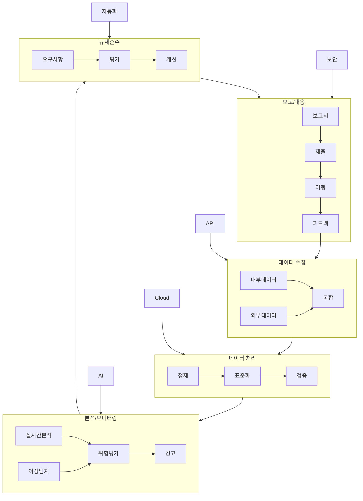

# 레그테크(RegTech): 금융 규제 대응의 혁신적 솔루션

<!-- mtoc-start -->

- [레그테크의 정의와 필요성](#레그테크의-정의와-필요성)
  - [정의](#정의)
  - [필요성](#필요성)
- [레그테크의 주요 업무 영역](#레그테크의-주요-업무-영역)
  - [1. 데이터 수집 및 집계](#1-데이터-수집-및-집계)
  - [2. 데이터 분석](#2-데이터-분석)
  - [3. 결과 생성](#3-결과-생성)
- [레그테크의 주요 기술 요소](#레그테크의-주요-기술-요소)
  - [1. 데이터 관리](#1-데이터-관리)
  - [2. 위험 분석 및 예측](#2-위험-분석-및-예측)
  - [3. 실시간 거래 감시](#3-실시간-거래-감시)
  - [4. 고객 신원 관리](#4-고객-신원-관리)
- [레그테크 프로세스](#레그테크-프로세스)
- [레그테크의 기대 효과](#레그테크의-기대-효과)
- [마무리](#마무리)
- [Keywords](#keywords)

<!-- mtoc-end -->

레그테크(RegTech)는 "Regulatory Technology"의 약자로, 다양한 금융 규제에 효율적으로 대응하기 위해 IT 기술을 활용하여 규제 관련 업무를 자동화하는 기술을 의미합니다. 최근 규제 환경의 변화와 함께 규제 이행 비용, 투자 비용, 규제 위반 벌금 등이 증가하면서 레그테크의 중요성이 더욱 부각되고 있습니다. 레그테크의 정의, 필요성, 주요 업무 영역, 기술 요소, 그리고 기대 효과를 살펴보겠습니다.

## 레그테크의 정의와 필요성

### 정의

레그테크는 인공지능(AI), 머신러닝(ML), 클라우드 컴퓨팅 등의 첨단 기술을 활용하여 금융 규제 준수와 관련된 프로세스를 효율화하고 자동화하는 기술.

### 필요성

1. **규제 환경 변화**

   - 금융 규제가 점차 복잡해지고 빈번하게 변화

2. **규제 이행 비용 증가**

   - 준수해야 할 규제와 관련된 비용이 지속적으로 상승

3. **투자 비용 증가**

   - 규제 준수를 위해 필요한 인프라와 기술 투자 증가

4. **규제 위반 벌금 증가**

   - 위반 시 부과되는 벌금과 제재가 엄격해짐

5. **규제 데이터 증가**
   - 관리해야 할 데이터의 양과 복잡성이 확대

## 레그테크의 주요 업무 영역

레그테크는 금융 규제 준수의 모든 단계를 체계적으로 지원하며, 주요 업무 영역은 다음과 같습니다:

### 1. 데이터 수집 및 집계

- 다양한 소스에서 규제 관련 데이터를 자동으로 수집 및 통합
- 클라우드 기반의 데이터 저장 및 관리 활용

### 2. 데이터 분석

- 수집된 데이터를 분석하여 규제 요구 사항을 평가
- 이상 징후 및 위험 요소 식별

### 3. 결과 생성

- 규제 보고서를 자동으로 생성하고, 필요한 조치 사항 제안

## 레그테크의 주요 기술 요소

### 1. 데이터 관리

- **데이터마이닝**: 대규모 데이터에서 규제와 관련된 중요한 정보를 추출
- **클라우드 컴퓨팅**: 데이터 저장과 분석을 효율적으로 처리
- **API 활용**: 다양한 데이터 소스와의 통합을 용이하게 함
- **데이터 보호**: 민감한 데이터의 보안 유지

### 2. 위험 분석 및 예측

- **머신러닝**: 데이터 패턴을 학습하여 규제 위반 가능성 예측
- **로보틱스**: 반복적인 규제 준수 업무를 자동화

### 3. 실시간 거래 감시

- **머신러닝**: 거래 내역 분석을 통해 이상 거래 탐지
- **클라우드 컴퓨팅**: 대량의 거래 데이터를 실시간으로 처리

### 4. 고객 신원 관리

- **바이오 인증**: 지문, 홍채 인식 등을 통해 신원 확인
- **블록체인**: 고객 정보의 무결성과 신뢰성을 보장

## 레그테크 프로세스

## 레그테크의 기대 효과

6. **규제 준수 효율화**

   - 자동화된 프로세스를 통해 규제 준수 속도와 정확성 향상

7. **비용 절감**

   - 규제 이행과 관련된 운영 비용 감소

8. **리스크 감소**

   - 규제 위반 위험을 사전에 탐지하고 방지

9. **데이터 활용 극대화**

   - 데이터 분석과 통합 관리로 규제 준수와 비즈니스 의사결정 지원

10. **투명성 및 신뢰성 강화**
   - 금융 규제 준수를 통한 고객 신뢰 확보

## 마무리

레그테크는 복잡하고 변화하는 금융 규제 환경에서 기업의 경쟁력을 강화하는 데 필수적인 도구입니다. 데이터 관리, 위험 분석, 실시간 감시, 고객 신원 관리 등 다양한 기술 요소를 통해 규제 준수 과정을 효율적으로 자동화할 수 있습니다. 레그테크를 적극 도입하여 금융 규제 준수와 동시에 혁신적인 비즈니스 성과를 달성하세요.

## Keywords

레그테크, RegTech, 금융 규제, 컴플라이언스, 데이터 관리, 머신러닝, 클라우드 컴퓨팅, 블록체인, 고객 신원 관리, 리스크 분석, 규제 준수, 금융 혁신