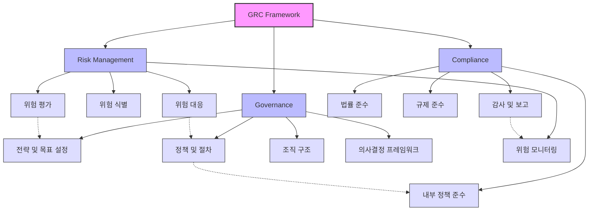

# GRC(Governance, Risk & Compliance): 조직의 통합 관리 체계

<!-- mtoc-start -->

- [GRC의 정의와 필요성](#grc의-정의와-필요성)
  - [정의](#정의)
  - [필요성](#필요성)
- [GRC의 구성 요소](#grc의-구성-요소)
  - [1. 거버넌스(Governance)](#1-거버넌스governance)
  - [2. 리스크 관리(Risk Management)](#2-리스크-관리risk-management)
  - [3. 규제 준수(Compliance)](#3-규제-준수compliance)
- [GRC 구성도](#grc-구성도)
- [COSO 위험관리 모형과의 연계](#coso-위험관리-모형과의-연계)
- [GRC 도입의 기대 효과](#grc-도입의-기대-효과)
- [마무리](#마무리)
- [Keywords](#keywords)

<!-- mtoc-end -->

GRC(Governance, Risk & Compliance)는 조직의 거버넌스, 리스크 관리, 그리고 규제 준수를 통합적으로 관리하기 위한 체계입니다. 이는 조직의 전략적 목표를 달성하면서 위험 요소를 최소화하고 규제 요구사항을 효과적으로 준수하는 데 중점을 둡니다. GRC의 정의, 구성 요소, COSO 위험관리 모형과의 연계, 그리고 기대 효과를 살펴보겠습니다.

## GRC의 정의와 필요성

### 정의

GRC는 조직이 직면한 리스크를 효과적으로 파악하고 관리하며, 이를 통해 비즈니스 목표 달성과 규제 준수를 동시에 지원하는 전사적 관리 체계.

- **Governance**: 조직의 목표와 전략을 효과적으로 실행하기 위한 체계적 관리
- **Risk**: 비즈니스 활동과 관련된 리스크를 식별하고 평가하여 대비
- **Compliance**: 법적, 윤리적 규제를 준수하고 조직 내 표준을 유지

### 필요성

1. **규제 복잡성 증가**

   - 글로벌 및 지역 규제가 복잡하고 빈번하게 변화

2. **리스크 관리 필요성 증대**

   - 디지털 환경과 글로벌화로 인해 새로운 리스크 등장

3. **투명성 및 신뢰성 확보**
   - 조직의 투명성과 신뢰성을 강화하여 이해관계자의 신뢰 확보

## GRC의 구성 요소

### 1. 거버넌스(Governance)

- 조직의 목표와 정책을 정의하고, 이를 달성하기 위한 체계를 수립
- 의사결정 프로세스, 책임 구조, 내부 통제 시스템 포함

### 2. 리스크 관리(Risk Management)

- **COSO 위험관리 모형**: 조직의 위험을 식별, 평가, 대응하는 프레임워크
- **리스크 식별**: 조직 활동과 관련된 잠재적 위험 요소를 파악
- **Deviation 분석**: 규제 일탈 및 탈선 상황 분석
- **Deficiency 분석**: 리스크 관리의 부족한 부분을 개선

### 3. 규제 준수(Compliance)

- 법적, 윤리적 규제 준수 보장
- 내부 정책 및 외부 규제와의 일관성 유지
- 지속적인 교육 및 감사 활동 포함

## GRC 구성도

4. 세 가지 핵심 영역

   - Governance (지배구조)
   - Risk Management (위험 관리)
   - Compliance (규정 준수)

5. 각 영역별 주요 구성요소

   - Governance: 전략 수립, 정책 및 절차, 조직 구조, 의사결정 프레임워크
   - Risk Management: 위험 식별, 평가, 대응, 모니터링의 순환 구조
   - Compliance: 법률, 규제, 내부 정책 준수와 감사 및 보고 체계

6. 상호 연관성
   - 점선으로 표시된 부분은 각 영역 간의 상호 연관관계를 나타냅니다
   - 예를 들어, 위험 평가(R2)는 전략 및 목표 설정(G1)에 영향을 미치고
   - 감사 및 보고(C4)는 위험 모니터링(R4)과 연계됩니다

## COSO 위험관리 모형과의 연계

COSO 위험관리 모형은 GRC의 리스크 관리 구성 요소를 체계화하는 데 중요한 역할을 합니다. 모형은 다음의 8가지 요소로 구성됩니다:

7. **내부 환경**: 조직의 전반적인 리스크 관리 문화
8. **목표 설정**: 리스크 관리와 관련된 명확한 목표 수립
9. **리스크 식별**: 리스크와 기회를 명확히 파악
10. **리스크 평가**: 리스크의 발생 가능성과 영향을 분석
11. **리스크 대응**: 적절한 조치를 통해 리스크를 최소화
12. **통제 활동**: 리스크를 관리하기 위한 정책과 절차 수립
13. **정보 및 커뮤니케이션**: 관련 정보를 적시에 공유
14. **모니터링**: 리스크 관리 프로세스의 지속적인 평가 및 개선

## GRC 도입의 기대 효과

15. **리스크 최소화**

   - 통합적인 리스크 관리로 잠재적 위험 요소를 사전에 제거

16. **효율적인 규제 준수**

   - 복잡한 규제 환경에서도 효과적으로 대응

17. **조직 투명성 강화**

   - 거버넌스 체계와 준법 감시를 통해 신뢰도 상승

18. **비용 절감**

   - 중복된 규제 준수 활동 제거 및 프로세스 효율화

19. **전략적 의사결정 지원**
   - 리스크와 규제 준수를 고려한 데이터 기반 의사결정 가능

## 마무리

GRC는 조직이 직면한 다양한 도전 과제를 효과적으로 관리하기 위한 필수적인 통합 관리 체계입니다. 거버넌스, 리스크 관리, 규제 준수의 세 가지 요소를 통해 조직의 목표 달성을 지원하고, 리스크를 최소화하며, 규제 요구사항에 유연하게 대응할 수 있습니다. GRC를 도입하여 조직의 지속 가능한 성장을 도모하세요.

## Keywords

GRC, 거버넌스, 리스크 관리, 규제 준수, COSO, Deviation 분석, Deficiency 분석, 조직 투명성, 리스크 최소화, 규제 대응, 통합 관리