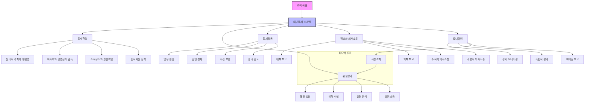

# 내부통제(Internal Control): 조직 목표 달성을 위한 전략적 관리 도구

<!-- mtoc-start -->

- [내부통제의 정의와 필요성](#내부통제의-정의와-필요성)
  - [정의](#정의)
  - [필요성](#필요성)
- [내부통제의 주요 유형](#내부통제의-주요-유형)
  - [1. 감사(회계)](#1-감사회계)
  - [2. 감리(기술)](#2-감리기술)
- [내부통제 시스템과 프로세스](#내부통제-시스템과-프로세스)
- [내부통제의 기대 효과](#내부통제의-기대-효과)
- [마무리](#마무리)
- [Keywords](#keywords)

<!-- mtoc-end -->

내부통제(Internal Control)는 조직의 전략과 목표가 올바르게 수행되고 있는지를 확인하기 위해 경영진에게 핵심성과지표(KPI)를 기반으로 정보를 제공하는 전략적 관리 도구입니다. 내부통제는 감사와 감리의 두 가지 주요 유형으로 나뉘며, 재무적 및 기술적 통제를 통해 조직의 신뢰성과 효율성을 확보합니다. 내부통제의 정의, 주요 유형, 그리고 기대 효과에 대해 살펴보겠습니다.

## 내부통제의 정의와 필요성

### 정의

내부통제는 조직이 목표를 효과적으로 달성하고, 자원을 효율적으로 관리하며, 법적 및 윤리적 규정을 준수하도록 지원하는 시스템과 프로세스. 이는 경영진이 의사결정을 내릴 때 신뢰할 수 있는 정보를 제공하는 데 중점을 둡니다.

### 필요성

1. **조직 목표 달성 지원**

   - 전략적 목표와 일치하는 활동을 보장

2. **리스크 관리 강화**

   - 운영, 재무, 규제 등 다양한 리스크를 사전에 식별하고 대응

3. **투명성과 신뢰성 확보**

   - 이해관계자들에게 신뢰할 수 있는 정보를 제공

4. **규정 준수 보장**
   - 법적, 윤리적 규제를 효과적으로 준수

## 내부통제의 주요 유형

내부통제는 두 가지 주요 유형으로 구분됩니다:

### 1. 감사(회계)

- **정의**: 재무보고와 관련된 통제를 통해 재무 데이터의 정확성과 신뢰성을 보장
- **활동**:
  - 재무 기록의 검토와 검증
  - 내부감사 및 외부감사를 통한 데이터 신뢰성 확보

### 2. 감리(기술)

- **정의**: 기술적 프로세스와 시스템의 통제를 통해 IT 운영의 신뢰성과 보안을 보장
- **활동**:
  - IT 시스템의 점검과 문제 식별
  - 기술적 리스크 관리 및 개선 조치

## 내부통제 시스템과 프로세스

1. 최상위에 조직 목표를 두고, 이를 달성하기 위한 내부통제 시스템을 구성.

2. COSO 프레임워크의 5대 구성요소를 포함:

- 통제환경
- 위험평가
- 통제활동
- 정보와 의사소통
- 모니터링

1. 각 구성요소별로 4가지 주요 하위 요소.

2. 피드백 루프를 통해 모니터링 결과가 위험평가 프로세스에 반영되는 순환구조.

이러한 내부통제 시스템은 조직이 효과적이고 효율적으로 운영되며, 신뢰성 있는 재무보고를 하고, 관련 법규를 준수하는데 도움.

## 내부통제의 기대 효과

3. **효율적 경영 지원**

   - KPI를 기반으로 한 통찰력 제공으로 경영진의 의사결정 지원

4. **리스크 최소화**

   - 다양한 리스크를 사전에 식별하고 대응 전략 마련

5. **투명성 제고**

   - 조직 운영 및 재무 보고의 신뢰성을 높임

6. **지속 가능한 성장 촉진**
   - 규정 준수를 통해 법적 문제를 방지하고 장기적 성장 기반 확보

## 마무리

내부통제는 조직의 목표 달성과 신뢰성 확보를 위한 필수적인 전략 관리 도구입니다. 감사와 감리의 두 가지 접근 방식을 통해 재무적, 기술적 리스크를 관리하고, 조직 운영의 투명성과 효율성을 높일 수 있습니다. 내부통제를 적극적으로 활용하여 조직의 경쟁력을 강화하고 지속 가능한 성장을 이루세요.

## Keywords

내부통제, Internal Control, 감사, 감리, KPI, 전략 관리, 리스크 관리, 투명성, 규정 준수, 조직 신뢰성, 지속 가능한 성장