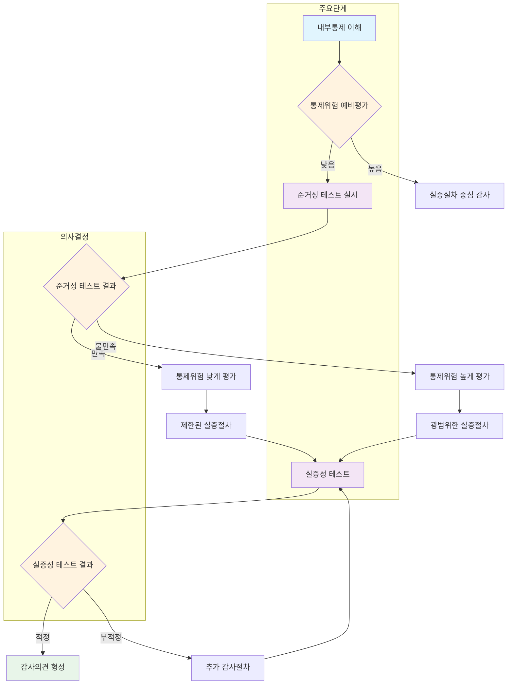

# 준거성 및 실증성 테스트: 내부통제의 신뢰성 평가

<!-- mtoc-start -->

- [준거성 테스트](#준거성-테스트)
  - [정의](#정의)
  - [목적](#목적)
  - [특징](#특징)
- [실증성 테스트](#실증성-테스트)
  - [정의](#정의-1)
  - [목적](#목적-1)
  - [특징](#특징-1)
- [내부통제 신뢰성 평가 프로세스](#내부통제-신뢰성-평가-프로세스)
- [준거성 및 실증성 테스트의 비교](#준거성-및-실증성-테스트의-비교)
- [기대 효과](#기대-효과)
- [마무리](#마무리)
- [Keywords](#keywords)

<!-- mtoc-end -->

준거성 테스트와 실증성 테스트는 내부통제의 신뢰성을 평가하기 위한 핵심적인 감사 기법입니다. 이 두 가지 테스트는 감사와 감리 과정에서 정책과 절차의 준수 여부 및 결과의 정당성을 평가하는 데 사용됩니다. 준거성 테스트와 실증성 테스트의 정의, 목적, 주요 특징 및 기대 효과를 살펴보겠습니다.

## 준거성 테스트

### 정의

준거성 테스트(Conformance Testing)는 통제 절차가 경영 정책과 절차에 적합하게 적용되고 있는지를 판정하는 기법. 이를 통해 조직이 설정한 내부통제 기준과 규정을 제대로 준수하고 있는지 확인합니다.

### 목적

1. **통제 절차의 적합성 확인**

   - 내부통제가 정책과 절차에 맞게 운영되고 있는지 평가

2. **내부통제 체계의 신뢰성 확보**

   - 통제 절차가 일관되게 적용되고 있는지 검증

3. **규제 및 정책 준수 보장**
   - 법적 및 윤리적 요구사항을 준수하도록 지원

### 특징

- 문서 검토, 인터뷰, 관찰 등을 활용하여 통제 활동을 평가
- 통제가 실제로 운영되고 있는지 테스트
- 특정 기간 동안의 절차 일관성을 확인

## 실증성 테스트

### 정의

실증성 테스트(Substantive Testing)는 통제 목적이 달성되지 않을 위험을 평가하기 위해 분석적 기법과 도구를 활용하는 기법. 주로 재무 보고서 및 기타 데이터의 정확성과 완전성을 검증하는 데 초점을 맞춥니다.

### 목적

4. **결과의 정당성 평가**

   - 내부통제가 실제로 목표를 달성했는지 확인

5. **리스크 분석 및 평가**

   - 내부통제 실패로 인한 잠재적 위험을 식별

6. **데이터 신뢰성 확보**
   - 재무 데이터와 운영 결과의 정확성을 보장

### 특징

- 데이터 분석 도구와 샘플링 기법 활용
- 재무 데이터, 운영 데이터의 일관성과 정확성 평가
- 통제 실패로 인한 영향 분석

## 내부통제 신뢰성 평가 프로세스

7. 내부통제 이해 단계에서 시작하여 통제위험을 예비평가.
8. 예비평가 결과에 따라:

   - 통제위험이 높다고 판단되면 실증절차 중심의 감사를 수행
   - 통제위험이 낮다고 판단되면 준거성 테스트를 실시

9. 준거성 테스트 결과에 따라:

   - 만족스러운 경우 통제위험을 낮게 평가하고 제한된 실증절차 수행
   - 불만족스러운 경우 통제위험을 높게 평가하고 광범위한 실증절차 수행

10. 실증성 테스트를 수행하고 그 결과에 따라:
   - 적정한 경우 감사의견 형성
   - 부적정한 경우 추가 감사절차 수행 후 재테스트

## 준거성 및 실증성 테스트의 비교

| 구분          | 준거성 테스트              | 실증성 테스트                         |
| ------------- | -------------------------- | ------------------------------------- |
| **목적**      | 통제 절차의 준수 여부 평가 | 통제 목적 달성 여부 평가              |
| **주요 활동** | 문서 검토, 관찰, 인터뷰    | 데이터 분석, 샘플링                   |
| **활용 기법** | 정책 준수 확인             | 재무 데이터 및 운영 결과 분석         |
| **결과물**    | 통제 절차의 적합성 평가    | 데이터와 결과의 정당성 및 정확성 평가 |

## 기대 효과

11. **내부통제 신뢰성 강화**

   - 준거성과 실증성을 평가하여 통제 체계를 개선하고 신뢰성 확보

12. **리스크 최소화**

   - 내부통제 실패로 인한 재무적 및 운영적 리스크를 사전에 방지

13. **규제 준수 보장**

   - 법적 및 윤리적 요구사항 준수로 이해관계자의 신뢰 제고

14. **데이터 기반 의사결정 지원**
   - 신뢰할 수 있는 데이터를 바탕으로 전략적 의사결정 가능

## 마무리

준거성 테스트와 실증성 테스트는 내부통제의 효과성을 평가하고 개선하기 위한 필수적인 감사 기법입니다. 두 테스트를 통합적으로 활용함으로써 조직은 통제 체계를 강화하고, 리스크를 최소화하며, 지속 가능한 성장을 도모할 수 있습니다. 내부통제 평가를 통해 투명성과 신뢰성을 갖춘 조직으로 발전하세요.

## Keywords

준거성 테스트, 실증성 테스트, 내부통제, 감사, 감리, Conformance Testing, Substantive Testing, 리스크 평가, 데이터 분석, 정책 준수, 조직 신뢰성