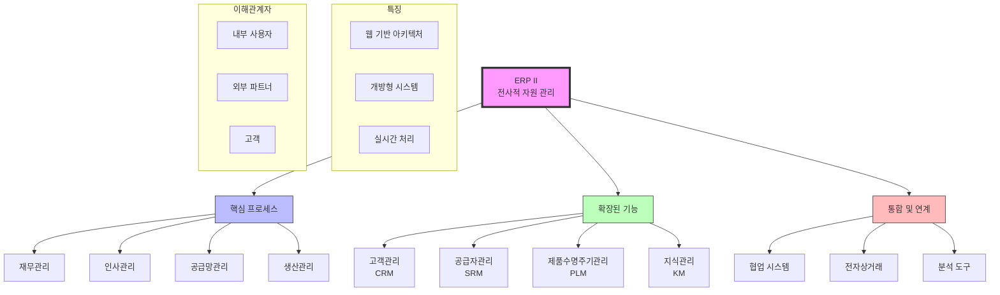

# ERP II: 전사적 자원 관리의 새로운 패러다임

<!-- mtoc-start -->

- [ERP II의 정의와 필요성](#erp-ii의-정의와-필요성)
  - [정의](#정의)
  - [필요성](#필요성)
- [ERP II의 주요 특징](#erp-ii의-주요-특징)
  - [1. 웹 환경 기반](#1-웹-환경-기반)
  - [2. 전 영역 포괄](#2-전-영역-포괄)
  - [3. 컴포넌트 기반의 개방형 구조](#3-컴포넌트-기반의-개방형-구조)
- [ERP II의 기술적 장점](#erp-ii의-기술적-장점)
- [ERP II 시스템 구조도](#erp-ii-시스템-구조도)
- [ERP II의 기대 효과](#erp-ii의-기대-효과)
- [마무리](#마무리)
- [Keywords](#keywords)

<!-- mtoc-end -->

ERP II는 기존의 전사적 자원 관리 시스템(ERP)을 확장하여 웹 환경과 개방형 구조를 기반으로 제조 및 물류를 넘어 전 비즈니스 영역을 포괄하는 혁신적인 시스템입니다. XRP를 기반으로 발전한 ERP II는 기업이 효율적으로 자원을 관리하고, 디지털 환경에서 경쟁력을 유지하는 데 필수적인 도구로 자리 잡고 있습니다. ERP II의 개념, 주요 특징, 기술적 장점, 그리고 기대 효과를 살펴보겠습니다.

## ERP II의 정의와 필요성

### 정의

ERP II는 기업의 전사적 자원 관리를 넘어, 웹 환경에서 통합된 비즈니스 프로세스를 지원하는 개방형 구조의 시스템. 컴포넌트 기반의 설계로 유연성과 확장성을 극대화하며, 다양한 산업 및 업무 영역에서 활용됩니다.

### 필요성

1. **디지털 전환 가속화**

   - 클라우드 및 웹 기술의 발전으로 디지털화된 비즈니스 운영이 필수

2. **통합적 비즈니스 관리**

   - 제조, 물류, 재무뿐만 아니라 인사, 마케팅, 고객 관리까지 포함

3. **글로벌 경쟁력 강화**
   - 글로벌 시장에서의 경쟁력을 유지하기 위해 효율적인 자원 관리 필요

## ERP II의 주요 특징

### 1. 웹 환경 기반

- **클라우드 컴퓨팅 활용**: 언제 어디서나 접근 가능한 유연한 업무 환경 제공
- **실시간 데이터 공유**: 기업 내부와 외부 파트너 간의 정보 교환 효율화

### 2. 전 영역 포괄

- 제조와 물류 외에 고객 관계 관리(CRM), 공급망 관리(SCM), 전자상거래 등 다양한 비즈니스 프로세스 포함

### 3. 컴포넌트 기반의 개방형 구조

- **모듈화 설계**: 기업의 필요에 따라 모듈을 선택적으로 구성 가능
- **확장성**: 새로운 기능과 서비스 추가 용이

## ERP II의 기술적 장점

4. **유연한 통합성**

   - API 및 웹 서비스 기술을 통해 기존 시스템과의 원활한 연동

5. **실시간 데이터 분석**

   - 비즈니스 인텔리전스(BI) 도구와 통합하여 데이터 기반 의사결정 지원

6. **보안 강화**

   - 웹 환경에서의 안전한 데이터 전송 및 저장을 위한 최신 보안 기술 적용

7. **사용자 친화적 인터페이스**
   - 사용자 경험(UX)을 고려한 직관적이고 효율적인 인터페이스 제공

## ERP II 시스템 구조도

8. 핵심 프로세스: 기존 ERP의 핵심 기능인 재무, 인사, 공급망, 생산관리를 포함.

9. 확장된 기능:

   - CRM(고객관리)
   - SRM(공급자관리)
   - PLM(제품수명주기관리)
   - KM(지식관리)

10. 통합 및 연계:
   - 협업 시스템
   - 전자상거래 플랫폼
   - 분석 도구

**ERP II 특징:**

- 웹 기반 아키텍처로 접근성 향상
- 개방형 시스템으로 유연한 확장 가능
- 실시간 처리 지원

## ERP II의 기대 효과

11. **업무 효율성 향상**

   - 전사적 자원 관리를 통합하여 중복 작업 제거 및 프로세스 최적화

12. **비용 절감**

   - 클라우드 기반 운영으로 인프라 비용 감소

13. **고객 만족도 증가**

   - CRM 기능을 통해 고객 요구에 신속히 대응

14. **글로벌 확장성**

   - 다국적 기업 환경에서도 통합 운영 가능

15. **경쟁력 강화**
   - 디지털화된 비즈니스 모델 구축으로 시장 변화에 민첩하게 대응

## 마무리

ERP II는 기존 ERP 시스템을 한 단계 발전시켜 웹 환경과 컴포넌트 기반의 개방형 구조를 통해 비즈니스 전 영역을 포괄하는 혁신적인 도구입니다. 이를 통해 기업은 자원의 효율적 관리는 물론, 디지털 경제에서 경쟁력을 강화할 수 있습니다. ERP II를 도입하여 통합적이고 유연한 비즈니스 운영을 실현해보세요.

## Keywords

ERP II, 전사적 자원 관리, 웹 환경, 개방형 구조, 컴포넌트 기반, 클라우드 컴퓨팅, CRM, SCM, 디지털 전환, 글로벌 경쟁력