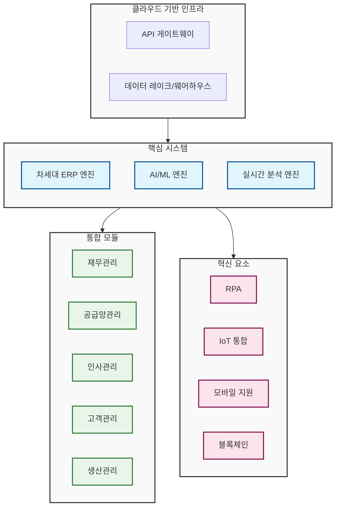

# 차세대 ERP: 통합과 실시간 분석을 통한 경영 혁신

<!-- mtoc-start -->

- [차세대 ERP의 정의와 필요성](#차세대-erp의-정의와-필요성)
  - [정의](#정의)
  - [필요성](#필요성)
- [차세대 ERP의 주요 특징](#차세대-erp의-주요-특징)
  - [1. 통합된 비즈니스 프로세스](#1-통합된-비즈니스-프로세스)
  - [2. 실시간 분석 및 시각화](#2-실시간-분석-및-시각화)
  - [3. 빅데이터 활용](#3-빅데이터-활용)
  - [4. 유연한 확장성](#4-유연한-확장성)
- [차세대 ERP의 기술적 장점](#차세대-erp의-기술적-장점)
- [차세대 ERP 시스템 구조도](#차세대-erp-시스템-구조도)
- [차세대 ERP 도입의 기대 효과](#차세대-erp-도입의-기대-효과)
- [마무리](#마무리)
- [Keywords](#keywords)

<!-- mtoc-end -->

차세대 ERP(Enterprise Resource Planning)는 ERP, CRM, SCM 등 다양한 비즈니스 프로세스를 단일 시스템 내에서 통합하며, 경영계획과 실행계획 간의 실시간 연결과 분석이 가능한 솔루션입니다. 기존 ERP 시스템의 한계를 뛰어넘어 빅데이터와 같은 첨단 기술을 활용하여 기업의 경쟁력을 강화하고, 디지털 전환을 가속화하는 데 중점을 둡니다. 차세대 ERP의 개념, 주요 특징, 기술적 장점, 그리고 기대 효과를 살펴보겠습니다.

## 차세대 ERP의 정의와 필요성

### 정의

차세대 ERP는 전통적인 ERP 시스템의 기능을 확장하여, CRM(고객 관계 관리), SCM(공급망 관리) 등 다양한 업무 시스템을 단일 플랫폼에 통합한 솔루션. 이를 통해 기업은 실시간 데이터 분석과 통합 관리가 가능해집니다.

### 필요성

1. **디지털 환경 대응**

   - 빅데이터와 AI를 활용하여 빠르게 변화하는 시장에 유연하게 대응

2. **효율적인 경영 관리**

   - 경영계획과 실행계획의 실시간 통합으로 신속한 의사결정 지원

3. **비용 절감 및 생산성 향상**
   - 중복된 시스템과 데이터 관리 비용 감소

## 차세대 ERP의 주요 특징

### 1. 통합된 비즈니스 프로세스

- ERP, CRM, SCM 등을 단일 플랫폼에서 통합 운영
- 데이터 흐름의 일관성과 정확성 확보

### 2. 실시간 분석 및 시각화

- 경영계획과 실행계획 데이터를 실시간으로 분석
- 대시보드와 시각화 도구를 통해 중요한 정보를 빠르게 파악

### 3. 빅데이터 활용

- 대규모 데이터를 분석하여 인사이트 도출
- 고객 행동, 시장 트렌드, 공급망 효율성 등을 기반으로 전략 수립

### 4. 유연한 확장성

- 모듈 기반 설계로 기업의 필요에 따라 기능 추가 가능
- 클라우드 및 하이브리드 환경에서 유연하게 운영

## 차세대 ERP의 기술적 장점

4. **빅데이터 통합**

   - 빅데이터 플랫폼과의 연계를 통해 방대한 데이터를 분석 및 활용

5. **AI 및 머신러닝 적용**

   - 예측 분석과 자동화를 통해 프로세스 효율성 극대화

6. **클라우드 기반 운영**

   - 데이터 접근성과 가용성 향상
   - 인프라 관리 비용 절감

7. **모바일 및 IoT 지원**
   - 모바일 디바이스와 IoT 기술을 활용하여 현장 업무 최적화

## 차세대 ERP 시스템 구조도

8. 클라우드 기반 인프라
   - API 게이트웨이를 통한 유연한 시스템 연동
   - 데이터 레이크/웨어하우스를 통한 대규모 데이터 처리
9. 핵심 시스템
   - 차세대 ERP 엔진
   - AI/ML 기반 지능형 처리
   - 실시간 분석 엔진
10. 통합 모듈
   - 재무, 공급망, 인사, 고객, 생산 관리 등 핵심 업무 영역 통합
11. 혁신 요소
   - RPA를 통한 업무 자동화
   - IoT 통합으로 실시간 데이터 수집
   - 모바일 지원으로 접근성 향상
   - 블록체인 기술 적용

## 차세대 ERP 도입의 기대 효과

12. **경영 효율성 극대화**

   - 실시간 데이터 분석과 프로세스 자동화로 의사결정 속도 향상

13. **비용 절감**

   - 시스템 통합과 운영 효율성 향상을 통해 비용 절감

14. **고객 만족도 증대**

   - CRM 기능 강화로 고객 니즈에 신속히 대응

15. **시장 경쟁력 강화**
   - 데이터 기반의 전략 수립과 실행으로 경쟁 우위 확보

## 마무리

차세대 ERP는 단순한 자원 관리 시스템을 넘어 기업의 디지털 전환과 경영 혁신을 이끄는 필수 솔루션입니다. 실시간 통합 관리와 빅데이터 활용을 통해 효율성과 경쟁력을 강화하며, 변화하는 시장에서 성공적인 비즈니스를 지원합니다. 차세대 ERP를 통해 미래 지향적인 경영 환경을 구축하세요.

## Keywords

차세대 ERP, 통합 시스템, 실시간 분석, ERP, CRM, SCM, 빅데이터, AI, 디지털 전환, 경영 혁신, 클라우드 ERP, 데이터 시각화, 비용 절감