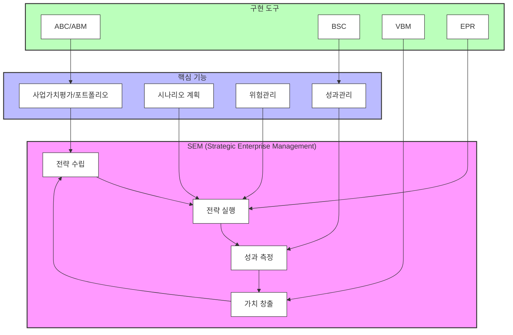

# SEM(Strategic Enterprise Management): 가치 중심 경영의 구현 도구

<!-- mtoc-start -->

- [SEM의 정의와 필요성](#sem의-정의와-필요성)
  - [정의](#정의)
  - [필요성](#필요성)
- [SEM의 주요 기능](#sem의-주요-기능)
  - [1. 재무 성과 관리](#1-재무-성과-관리)
  - [2. 리스크 관리](#2-리스크-관리)
  - [3. 자원 최적화](#3-자원-최적화)
  - [4. 전략적 시뮬레이션](#4-전략적-시뮬레이션)
- [SEM의 기술적 특징](#sem의-기술적-특징)
- [SEM 구조도](#sem-구조도)
- [SEM 도입의 기대 효과](#sem-도입의-기대-효과)
- [마무리](#마무리)
- [Keywords](#keywords)

<!-- mtoc-end -->

SEM(Strategic Enterprise Management)은 기업의 각종 정보를 정확히 분석하고, 이를 통해 경영진이 가치 중심 경영(Value-Based Management)을 전사적으로 구현할 수 있도록 지원하는 시스템입니다. SEM은 재무적, 비재무적 데이터를 통합하여 전략적 의사결정을 돕고, 기업의 장기적 가치를 극대화하는 데 중점을 둡니다. SEM의 정의, 주요 기능, 기술적 특징, 그리고 기대 효과를 살펴보겠습니다.

## SEM의 정의와 필요성

### 정의

SEM은 전략적 목표와 연계된 데이터를 분석하고 경영진에게 통찰력을 제공하여, 기업이 자원을 최적화하고 성과를 극대화할 수 있도록 지원하는 경영 시스템. 이는 단순한 데이터 관리 시스템을 넘어, 전략적 의사결정과 성과 평가를 위한 통합된 플랫폼을 제공합니다.

### 필요성

1. **가치 중심 경영의 중요성 증가**

   - 단기적 수익성보다 기업의 장기적 가치를 중시하는 경영 패러다임 전환

2. **데이터 기반 의사결정 요구**

   - 정확한 데이터 분석을 통해 리스크를 줄이고 전략적 기회를 포착

3. **통합적 관리의 필요성**
   - 재무, 운영, 시장 데이터를 통합하여 전사적 관점에서 경영 관리 가능

## SEM의 주요 기능

### 1. 재무 성과 관리

- KPI(Key Performance Indicator) 기반으로 성과를 측정하고 분석
- 예산 편성과 재무 계획 지원

### 2. 리스크 관리

- 리스크 요소를 식별하고 분석하여 사전 대응 방안 마련
- 시장 변화와 내외부 리스크를 실시간으로 평가

### 3. 자원 최적화

- 인력, 자금, 시간 등 기업 자원을 효율적으로 배분
- 운영 효율성을 극대화

### 4. 전략적 시뮬레이션

- 다양한 시나리오를 기반으로 전략적 의사결정을 지원
- 변화하는 시장 환경에 유연하게 대응

## SEM의 기술적 특징

4. **데이터 통합**

   - ERP, CRM 등 다양한 데이터 소스와의 연계를 통해 전사적 데이터 통합

5. **실시간 분석 및 대시보드**

   - 실시간 데이터를 기반으로 경영 현황을 시각적으로 제공

6. **예측 분석**

   - 빅데이터와 머신러닝을 활용하여 미래 성과를 예측

7. **사용자 친화적 인터페이스**
   - 직관적인 UI/UX로 비전문가도 쉽게 사용 가능

## SEM 구조도

SEM(Strategic Enterprise Management)의 구조와 가치 중심 경영 구현 과정

8. 중앙의 SEM 순환 프로세스
   - 전략 수립 → 전략 실행 → 성과 측정 → 가치 창출의 순환 구조
9. 핵심 기능
   - 사업가치평가/포트폴리오
   - 시나리오 계획
   - 위험관리
   - 성과관리
10. 구현 도구
   - ABC/ABM (활동기준원가관리)
   - BSC (균형성과표)
   - VBM (가치기반경영)
   - ERP (전사적자원관리)

## SEM 도입의 기대 효과

11. **경영 효율성 향상**

   - 데이터를 기반으로 한 신속하고 정확한 의사결정 지원

12. **리스크 감소**

   - 예측 분석을 통해 잠재적 위험을 사전에 감지

13. **가치 창출 극대화**

   - 기업의 자원을 최적화하여 장기적 가치 극대화

14. **조직의 투명성 강화**
   - 통합된 데이터와 실시간 대시보드를 통해 경영 투명성 확보

## 마무리

SEM은 데이터 기반의 가치 중심 경영을 구현하는 데 필수적인 도구입니다. 기업은 SEM을 통해 자원을 효율적으로 관리하고, 전략적 목표를 달성하며, 시장에서 경쟁력을 강화할 수 있습니다. SEM을 적극 활용하여 지속 가능한 경영 혁신을 이루어 보세요.

## Keywords

SEM, 가치 중심 경영, 데이터 통합, 전략적 의사결정, KPI, 리스크 관리, 자원 최적화, 예측 분석, 경영 투명성, ERP 연계