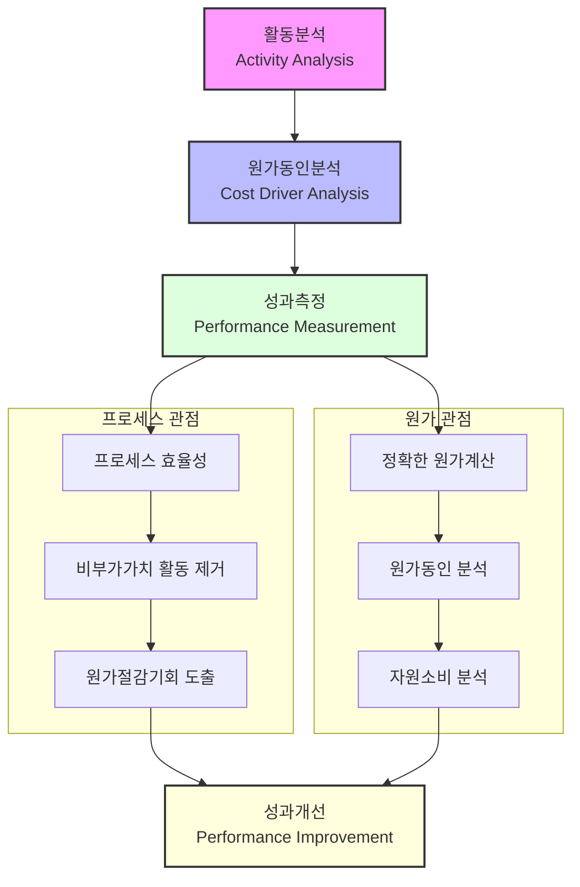

# ABM(Activity Based Management): 성과 관리의 혁신적 접근

<!-- mtoc-start -->

- [ABM의 개요](#abm의-개요)
  - [정의](#정의)
  - [필요성](#필요성)
- [ABM의 주요 특징](#abm의-주요-특징)
  - [1. 활동 중심 접근](#1-활동-중심-접근)
  - [2. 원가 동인 분석](#2-원가-동인-분석)
  - [3. ABC(활동 기반 원가) 정보 활용](#3-abc활동-기반-원가-정보-활용)
- [ABM 구조와 프로세스](#abm-구조와-프로세스)
- [ABM의 기대 효과](#abm의-기대-효과)
- [ABM의 활용 사례](#abm의-활용-사례)
- [마무리](#마무리)
- [Keywords](#keywords)

<!-- mtoc-end -->

ABM(Activity Based Management)은 활동 기반 원가 정보(ABC)를 활용하여 기업의 원가를 절감하고 고객이 느끼는 가치를 향상시켜 이익을 극대화하기 위한 성과 관리 기법입니다. ABM은 원가 동인과 활동을 성과 평가에 연결하여 조직의 효율성과 효과성을 동시에 높이는 데 중점을 둡니다. ABM의 정의, 주요 특징, 그리고 기대 효과를 살펴보겠습니다.

## ABM의 개요

### 정의

ABM은 기업 활동과 원가를 연결하여 각 활동이 기업 성과와 고객 가치에 어떻게 기여하는지 평가하는 성과 관리 기법. 이를 통해 불필요한 비용을 줄이고, 가치를 창출하는 활동에 자원을 집중하도록 지원합니다.

### 필요성

1. **원가 절감의 중요성**

   - 경쟁이 치열한 환경에서 원가를 효율적으로 관리하여 비용 절감

2. **고객 가치 향상**

   - 고객이 느끼는 가치를 분석하고 이를 극대화하기 위한 전략 수립

3. **성과 평가의 정밀화**
   - 활동 기반 데이터를 활용하여 더 정확한 성과 평가 가능

## ABM의 주요 특징

### 1. 활동 중심 접근

- 기업의 모든 활동을 세분화하여 분석
- 각 활동이 원가와 성과에 미치는 영향을 평가

### 2. 원가 동인 분석

- 원가를 발생시키는 주요 요인을 식별
- 비효율적 활동 제거 및 최적화 방안 도출

### 3. ABC(활동 기반 원가) 정보 활용

- ABC 데이터를 활용하여 자원의 사용 패턴과 원가 구조를 이해
- 원가와 활동 간의 상관관계를 명확히 파악

## ABM 구조와 프로세스

4. 핵심 프로세스:

   - 활동분석에서 시작하여 원가동인분석을 거쳐 성과측정으로 이어지는 기본 흐름
   - 최종적으로 성과개선으로 연결되는 구조

5. 두 가지 주요 관점:

   - 프로세스 관점: 효율성 향상과 비부가가치 활동 제거에 초점
   - 원가 관점: 정확한 원가계산과 자원소비 분석에 중점

6. 성과개선:
   - 프로세스 개선과 원가 최적화가 통합되어 최종적인 성과개선 달성

ABM이 단순한 원가관리를 넘어서 전략적 성과관리 도구로 활용

## ABM의 기대 효과

7. **효율성 향상**

   - 불필요한 활동을 제거하여 원가 절감
   - 자원을 효과적으로 배분하여 생산성 증대

8. **고객 만족도 증가**

   - 고객이 중요하게 여기는 활동에 집중하여 가치 제공 극대화

9. **의사결정 지원**

   - 데이터 기반의 통찰력 제공으로 전략적 의사결정 지원

10. **경쟁력 강화**
   - 비용 구조와 성과 간의 상관관계를 이해하여 시장에서의 경쟁 우위 확보

## ABM의 활용 사례

11. **제조업**

   - 생산 과정에서 비효율적 활동 식별 및 제거

12. **서비스업**

   - 고객 서비스 과정에서 가치를 창출하지 않는 활동 최소화

13. **공공 부문**
   - 정부 기관 및 비영리 조직에서 자원 사용의 투명성과 효율성 강화

## 마무리

ABM은 활동 중심의 접근 방식을 통해 원가와 성과를 연결하고, 기업의 자원을 최적화하여 고객 가치를 극대화할 수 있는 강력한 성과 관리 기법입니다. 이를 통해 기업은 비용 절감, 고객 만족도 향상, 그리고 지속 가능한 경쟁력을 확보할 수 있습니다. ABM을 도입하여 성과 관리의 새로운 패러다임을 경험해 보세요.

## Keywords

ABM, Activity Based Management, 활동 관리, ABC 원가, 성과 관리, 원가 동인, 고객 가치, 비용 절감, 성과 평가, 경쟁력 강화